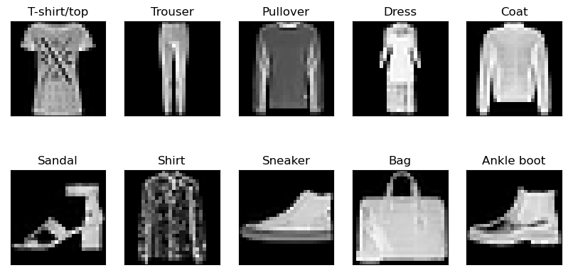

# Assignemnt 2

This assignment uses multi-layer neural networks

## Question 1

In this part, we build a multi-layer neural network from scratch, using only pytorch tensors. The gradient descent algorithm is used to iteratively update the weights of the network. The network is trained on the Fashion-MNIST dataset. Random images from all classes of this datasets are:

The network is trained for 10 epochs, and the accuracy of the network is printed after each epoch. The accuracy of the network is 0.88 after 10 epochs. Two hidden layers are used with size of 128 and 64, respectively. The loss and accuracy plots are:

The confusion matrix of the network is:

Finally, the network is tested on 9 random test images:

## Question 2

In this part, we build a simple multi-layer neural network using pytorch. The model has
3 hidden layers of size 10, 20, 8. The dataset used for this part is of the soccer matches results. The dataset is loaded using the pandas library. The dataset is split into training and testing sets. The features used for training are the home team, away team fifa ranks and points. The target is the home team result. That is whether the home team won, lost or drew. The features correlation matrix is:

The network is trained for 100 epochs, and the accuracy of the network is printed after each epoch. The accuracy of the network is 0.58 after 20 epochs. The loss and accuracy plots are:

## Question 3

The goal of this part, is to build a simple MLP to classify hand sign alphabet. The dataset has 25 classes. Random images from all classes of this datasets are:

The model is trained for 20 epochs for 3 cases.

1) MLP without dropout with Adam optimizer.
2) MLP without dropout with SGD optimizer.
3) MLP with dropout with Adam optimizer.

The loss and accuracy plots are shown below.
Adam optimizer converges faster than SGD optimizer because of its adaptive learning rate and momentum. SGD suffers from slow convergence and high variance.

Dropout is used to prevent overfitting. It is a regularization technique that randomly drops out units (along with their connections) from the neural network during training. It forces the network to learn more robust features that are useful in conjunction with many different random subsets of the other neurons. It is a very effective and simple method for regularization and preventing overfitting in neural networks. As is seen in the plots, the loss and accuracy curves are smoother than the other two cases.

The model with dropout and Adam optimizer is the best model for this dataset. It has the lowest loss and highest accuracy. It is the best model because it has the best trade-off between bias and variance.

