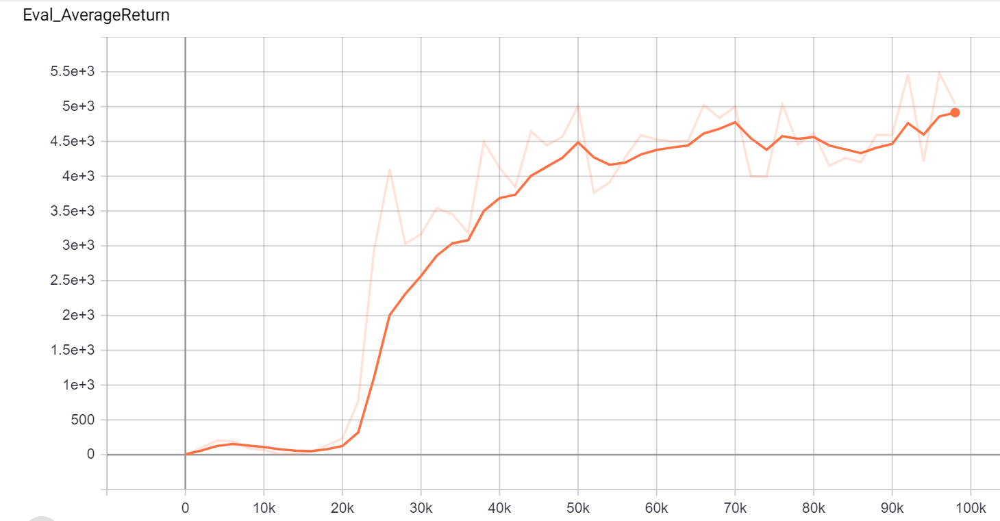
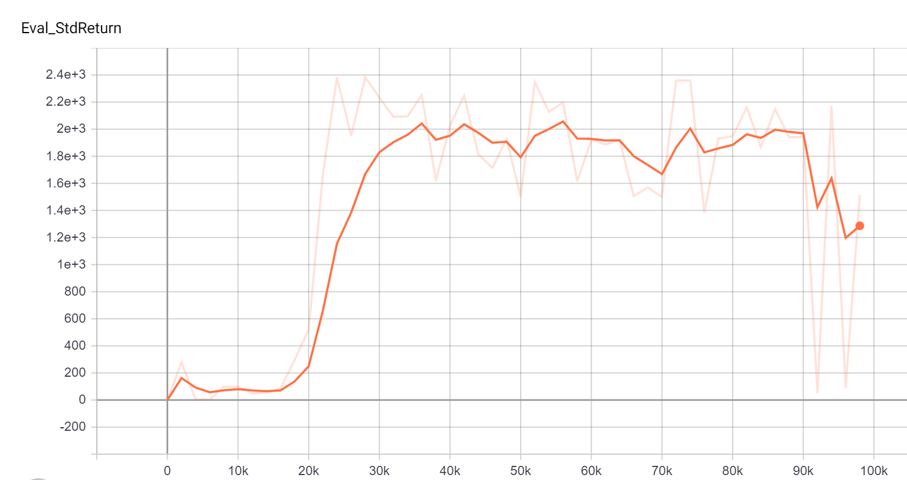
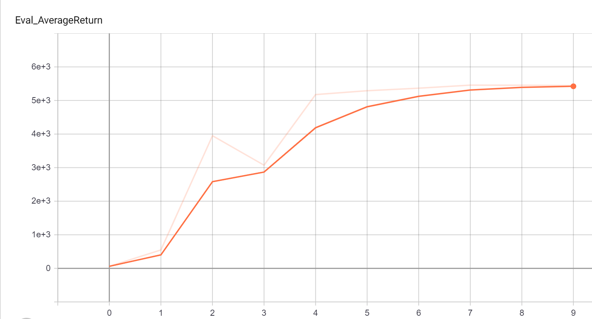
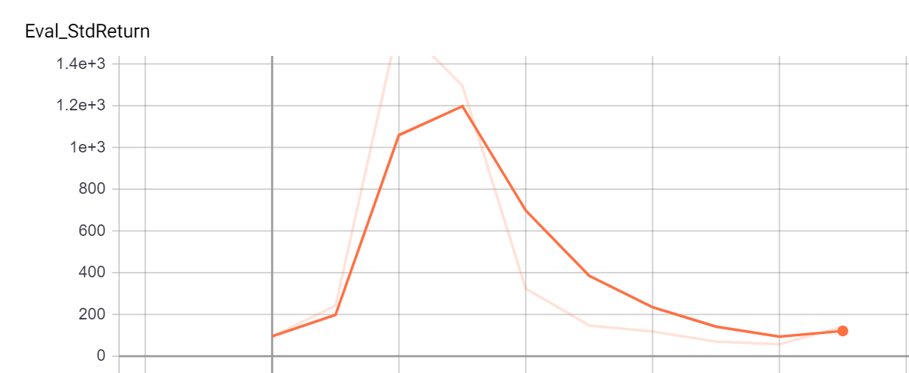

# Section 1 Behavior Cloning

Below is the HW1 report. All data used can be found in the results folder - videos aren't included to save space. To view the tensorboard for a specific part navigate to that part's folder (not the subfolders) and run 
```commandline
tensorboard --logdir .
```

## Question 1.2

The agent was trained on 10,000 steps of expert behavior in each environment. It was then evaluated for >10,000 steps to get an accurate mean performance. The agent itself had an MLP policy consisting of 2 hidden layers of 64 neurons each. 

| Environment |      Expert      | Behavioral Cloning | Mean Percent Performance |
|-------------|:----------------:|:------------------:|:------------------------:|
| Ant         |  4713.65 ± 12.2  |   4696.46 ± 90.39  |          99.64%          |
| HalfCheetah |  4205.78 ± 83.04 |  3521.82 ± 181.00  |          83.74%          |
| Hopper      |  3772.67 ± 1.95  |   660.8 ± 348.67   |          17.52%          |
| Humanoid    | 10344.52 ± 20.98 |   414.05 ± 105.71  |           4.00%          |
| Walker2d    |  5566.84 ± 9.24  |    60.96 ± 94.77   |           1.10%          |

It can be seen that the agent achieved >30% performance in both the ant and the half chettah environment. It failed to reach this benchmark in the other three environments. These environments seem to be harder for behavioral cloning, requiring more training to reach a comparable level of performance.

## Question 1.3

The agent in the Walker2d environment was only able to achieve 1.1% expert performance after 10,000 steps. It seems likely that it could do better with more training. For this question we will graph evaluation performance as a function of training steps. A data point was taken every 2000 training steps, and it was trained for a total of 100,000 steps. The mean returns throughout training are shown below:



It can be seen that the agent was able to improve greatly with more training updates, reaching almost 90 percent of the expert performance. Also notable is the significant initial time it took to actually begin performing.



While average performance seems to be quite good, the standard deviation over the course of training is a bit more telling, as is the min/max returns. The agent continues to have trials where it makes a mistake and is unable to recover, resulting in a terrible rollout and a large standard deviation. If the agent was really learning to perform well in the environment we would see the standard deviation fall as it begins to consistently do well. This perfectly illustrates the weaknesses of behavioral cloning, and leads into question 2.2.

## Question 2.2

For this question dagger learning was done on the Walker2d environment used in question 1.3. In the first 10k steps behavioral cloning was done, after which 9 iterations of dagger were carried out. Thus a total of 100k training steps were done, just like in question 1.3. All other things were kept the same. This allows the usage of dagger to be fairly tested. The average returns are below:



It can be seen that using dagger instead of training behavioral cloning further yielded better average returns. This is good but the real test is the standard deviation:



Unlike in question 1.3 the standard deviation drops dramatically as more dagger iterations are done. This shows that dagger has taught the agent to actually correct its mistakes, instead of failing as soon as it deviates slightly from the experts path. Thus dagger is shown to provide agent robustness that pure behavioral cloning fails to give.
