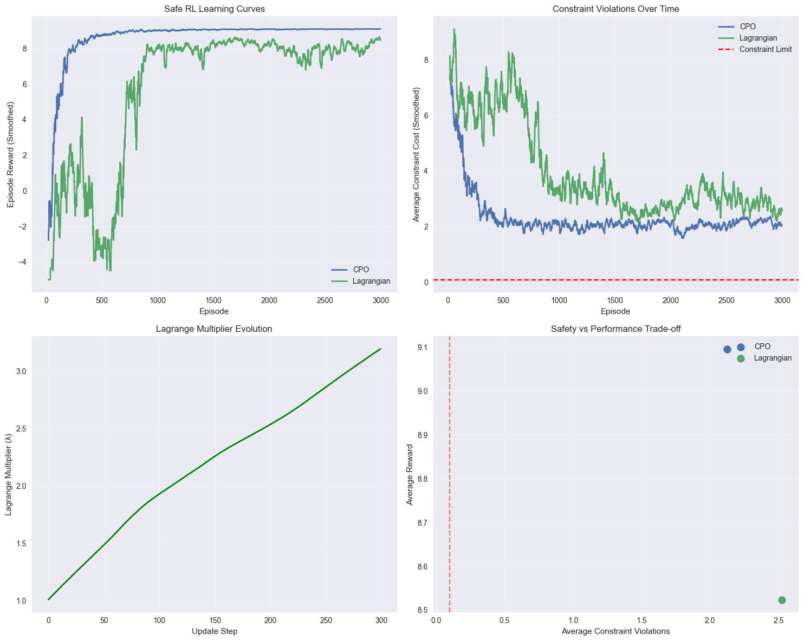

# Computer Assignment 14: Advanced Deep Reinforcement Learning
# Table of Contents

- [Computer Assignment 14: Advanced Deep Reinforcement Learning](#computer-assignment-14-advanced-deep-reinforcement-learning)
  - [Course Information](#course-information)
  - [Learning Objectives](#learning-objectives)
  - [Prerequisites](#prerequisites)
  - [Roadmap](#roadmap)
    - [Section 1: Offline Reinforcement Learning](#section-1-offline-reinforcement-learning)
    - [Section 2: Safe Reinforcement Learning](#section-2-safe-reinforcement-learning)
    - [Section 3: Multi-Agent Reinforcement Learning](#section-3-multi-agent-reinforcement-learning)
    - [Section 4: Robust Reinforcement Learning](#section-4-robust-reinforcement-learning)
  - [Project Structure](#project-structure)
  - [Contents Overview](#contents-overview)
    - [Theoretical Foundations](#theoretical-foundations)
    - [Implementation Components](#implementation-components)
    - [Advanced Topics](#advanced-topics)
  - [Evaluation Criteria](#evaluation-criteria)
  - [Getting Started](#getting-started)
  - [Expected Outcomes](#expected-outcomes)
- [Section 1: Offline Reinforcement Learning](#section-1-offline-reinforcement-learning)
  - [1.1 Theory: Learning from Static Datasets](#11-theory-learning-from-static-datasets)
    - [Key Challenges in Offline RL](#key-challenges-in-offline-rl)
      - [1. Distribution Shift Problem](#1-distribution-shift-problem)
      - [2. Overestimation Bias](#2-overestimation-bias)
      - [3. Coverage Problem](#3-coverage-problem)
    - [Mathematical Framework](#mathematical-framework)
      - [Offline RL Objective](#offline-rl-objective)
      - [Conservative Q-Learning (CQL) Objective](#conservative-q-learning-cql-objective)
      - [Behavior Cloning Regularization](#behavior-cloning-regularization)
  - [1.2 Advanced Offline RL Algorithms](#12-advanced-offline-rl-algorithms)
    - [1. Conservative Q-Learning (CQL)](#1-conservative-q-learning-cql)
    - [2. Implicit Q-Learning (IQL)](#2-implicit-q-learning-iql)
    - [3. Advantage-Weighted Regression (AWR)](#3-advantage-weighted-regression-awr)
    - [4. Batch-Constrained Deep Q-Learning (BCQ)](#4-batch-constrained-deep-q-learning-bcq)
- [Section 2: Safe Reinforcement Learning](#section-2-safe-reinforcement-learning)
  - [2.1 Theory: Constraint Satisfaction and Risk Management](#21-theory-constraint-satisfaction-and-risk-management)
    - [Mathematical Framework for Safe RL](#mathematical-framework-for-safe-rl)
      - [Constrained Markov Decision Process (CMDP)](#constrained-markov-decision-process-cmdp)
      - [Safe RL Objective](#safe-rl-objective)
    - [Key Approaches to Safe RL](#key-approaches-to-safe-rl)
      - [1. Lagrangian Methods](#1-lagrangian-methods)
      - [2. Constrained Policy Optimization (CPO)](#2-constrained-policy-optimization-cpo)
      - [3. Safe Policy Gradients](#3-safe-policy-gradients)
    - [Risk Measures in Safe RL](#risk-measures-in-safe-rl)
      - [1. Value at Risk (VaR)](#1-value-at-risk-var)
      - [2. Conditional Value at Risk (CVaR)](#2-conditional-value-at-risk-cvar)
      - [3. Risk-Sensitive Objective](#3-risk-sensitive-objective)
  - [2.2 Safety Mechanisms](#22-safety-mechanisms)
    - [1. Barrier Functions](#1-barrier-functions)
    - [2. Safe Exploration](#2-safe-exploration)
    - [3. Risk-Aware Planning](#3-risk-aware-planning)
  - [2.3 Applications of Safe RL](#23-applications-of-safe-rl)
    - [Autonomous Vehicles](#autonomous-vehicles)
    - [Healthcare](#healthcare)
    - [Industrial Control](#industrial-control)
- [Section 3: Multi-Agent Reinforcement Learning](#section-3-multi-agent-reinforcement-learning)
  - [3.1 Theory: Coordination and Competition](#31-theory-coordination-and-competition)
    - [Mathematical Framework for MARL](#mathematical-framework-for-marl)
      - [Multi-Agent Markov Decision Process (MA-MDP)](#multi-agent-markov-decision-process-ma-mdp)
      - [Joint Policy and Nash Equilibrium](#joint-policy-and-nash-equilibrium)
    - [Key Challenges in MARL](#key-challenges-in-marl)
      - [1. Non-Stationarity](#1-non-stationarity)
      - [2. Exponential Joint Action Space](#2-exponential-joint-action-space)
      - [3. Partial Observability](#3-partial-observability)
      - [4. Credit Assignment](#4-credit-assignment)
    - [MARL Paradigms](#marl-paradigms)
      - [1. Cooperative MARL](#1-cooperative-marl)
      - [2. Competitive MARL](#2-competitive-marl)
      - [3. Mixed-Motive MARL](#3-mixed-motive-marl)
  - [3.2 Advanced MARL Algorithms](#32-advanced-marl-algorithms)
    - [1. Multi-Agent Deep Deterministic Policy Gradient (MADDPG)](#1-multi-agent-deep-deterministic-policy-gradient-maddpg)
    - [2. QMIX (Monotonic Value Function Factorization)](#2-qmix-monotonic-value-function-factorization)
    - [3. Multi-Agent Actor-Critic (MAAC)](#3-multi-agent-actor-critic-maac)
  - [3.3 Communication in MARL](#33-communication-in-marl)
    - [1. Explicit Communication](#1-explicit-communication)
    - [2. Implicit Communication](#2-implicit-communication)
    - [3. Emergent Communication](#3-emergent-communication)
  - [3.4 Applications of MARL](#34-applications-of-marl)
    - [Autonomous Vehicle Coordination](#autonomous-vehicle-coordination)
    - [Multi-Robot Systems](#multi-robot-systems)
    - [Financial Trading](#financial-trading)
    - [Game Playing](#game-playing)
- [Section 4: Robust Reinforcement Learning](#section-4-robust-reinforcement-learning)
  - [4.1 Theory: Handling Uncertainty and Adversarial Conditions](#41-theory-handling-uncertainty-and-adversarial-conditions)
    - [Sources of Uncertainty in RL](#sources-of-uncertainty-in-rl)
      - [1. Model Uncertainty](#1-model-uncertainty)
      - [2. Environmental Uncertainty](#2-environmental-uncertainty)
      - [3. Distributional Shift](#3-distributional-shift)
    - [Mathematical Framework for Robust RL](#mathematical-framework-for-robust-rl)
      - [Robust Markov Decision Process (RMDP)](#robust-markov-decision-process-rmdp)
      - [Robust Value Function](#robust-value-function)
      - [Distributionally Robust Optimization (DRO)](#distributionally-robust-optimization-dro)
    - [Approaches to Robust RL](#approaches-to-robust-rl)
      - [1. Domain Randomization](#1-domain-randomization)
      - [2. Adversarial Training](#2-adversarial-training)
      - [3. Distributional RL for Robustness](#3-distributional-rl-for-robustness)
      - [4. Bayesian RL](#4-bayesian-rl)
  - [4.2 Risk Measures in Robust RL](#42-risk-measures-in-robust-rl)
    - [1. Conditional Value at Risk (CVaR)](#1-conditional-value-at-risk-cvar)
    - [2. Coherent Risk Measures](#2-coherent-risk-measures)
    - [3. Entropic Risk Measure](#3-entropic-risk-measure)
  - [4.3 Uncertainty Quantification](#43-uncertainty-quantification)
    - [1. Epistemic vs Aleatoric Uncertainty](#1-epistemic-vs-aleatoric-uncertainty)
    - [2. Ensemble Methods](#2-ensemble-methods)
    - [3. Dropout-based Uncertainty](#3-dropout-based-uncertainty)
  - [4.4 Applications of Robust RL](#44-applications-of-robust-rl)
    - [Autonomous Driving](#autonomous-driving)
    - [Financial Trading](#financial-trading)
    - [Healthcare](#healthcare)
    - [Robotics](#robotics)
- [Section 5: Comprehensive Evaluation and Real-World Applications](#section-5-comprehensive-evaluation-and-real-world-applications)
  - [5.1 Comprehensive Evaluation Framework](#51-comprehensive-evaluation-framework)
    - [Performance Metrics](#performance-metrics)
    - [Evaluation Dimensions](#evaluation-dimensions)
  - [5.2 Real-World Deployment Considerations](#52-real-world-deployment-considerations)
    - [Critical Factors for Practical Applications](#critical-factors-for-practical-applications)
    - [Application Domains](#application-domains)
- [Summary and Conclusions](#summary-and-conclusions)
  - [Key Takeaways from Advanced Deep RL](#key-takeaways-from-advanced-deep-rl)
    - [🎯 Core Advanced RL Paradigms](#-core-advanced-rl-paradigms)
    - [🌟 Practical Implementation Insights](#-practical-implementation-insights)
    - [🚀 Real-World Applications](#-real-world-applications)
    - [🔬 Future Directions](#-future-directions)
    - [📚 Educational Impact](#-educational-impact)
    - [🎖️ Final Reflection](#-final-reflection)


## Course Information
- **Course**: Deep Reinforcement Learning (DRL)
- **Instructor**: Dr. [Instructor Name]
- **Institution**: Sharif University of Technology
- **Semester**: Fall 2024
- **Assignment Number**: CA14

## Learning Objectives

By completing this assignment, students will be able to:

1. **Master Offline Reinforcement Learning**: Understand and implement algorithms that learn from static datasets without environment interaction, including Conservative Q-Learning (CQL) and Implicit Q-Learning (IQL) for handling distribution shift and overestimation bias.

2. **Design Safe Reinforcement Learning Systems**: Develop constraint-aware agents using Constrained Policy Optimization (CPO) and Lagrangian methods to satisfy safety constraints while maximizing performance, incorporating risk measures and barrier functions.

3. **Implement Multi-Agent Reinforcement Learning**: Build cooperative and competitive multi-agent systems using MADDPG and QMIX algorithms, addressing non-stationarity, coordination challenges, and emergent communication protocols.

4. **Develop Robust Reinforcement Learning Agents**: Create agents that handle uncertainty, distributional shifts, and adversarial conditions through domain randomization, adversarial training, and uncertainty estimation techniques.

5. **Apply Advanced RL to Real-World Scenarios**: Deploy RL systems in practical applications including autonomous systems, financial trading, and industrial control, considering deployment constraints and safety requirements.

6. **Analyze Advanced RL Trade-offs**: Evaluate the performance, safety, robustness, and scalability trade-offs between different advanced RL approaches in complex, real-world environments.

## Prerequisites

Before starting this assignment, ensure you have:

- **Mathematical Background**:
  - Probability theory and stochastic processes
  - Optimization with constraints (Lagrangian methods)
  - Game theory and multi-agent systems
  - Risk measures and robust optimization

- **Technical Skills**:
  - Advanced PyTorch proficiency (multi-agent architectures)
  - Experience with complex environments (multi-agent, safety-constrained)
  - Understanding of offline learning and batch RL
  - Knowledge of uncertainty quantification methods

- **Prior Knowledge**:
  - Completion of CA1-CA13 assignments
  - Strong foundation in deep RL algorithms (DQN, policy gradients, actor-critic)
  - Understanding of MDP extensions (constrained MDPs, multi-agent MDPs)
  - Experience with advanced neural network architectures

## Roadmap

This assignment is structured as follows:

### Section 1: Offline Reinforcement Learning
- Theoretical foundations of batch RL and offline learning challenges
- Conservative Q-Learning (CQL) for addressing overestimation bias
- Implicit Q-Learning (IQL) for stable offline policy optimization
- Dataset generation, quality assessment, and algorithm comparison

### Section 2: Safe Reinforcement Learning
- Constrained Markov Decision Processes and safety constraints
- Constrained Policy Optimization (CPO) with trust regions
- Lagrangian methods for adaptive constraint satisfaction
- Risk measures, barrier functions, and safety mechanisms

### Section 3: Multi-Agent Reinforcement Learning
- Multi-Agent MDP framework and coordination challenges
- MADDPG algorithm with centralized training and decentralized execution
- QMIX with monotonic value function factorization
- Communication protocols and emergent cooperation

### Section 4: Robust Reinforcement Learning
- Sources of uncertainty and distributional shift in RL
- Domain randomization and adversarial training techniques
- Uncertainty estimation and robust policy learning
- Real-world deployment considerations and robustness evaluation

## Project Structure

```
CA14/
├── CA14.ipynb              # Main assignment notebook
├── agents/                 # Advanced RL agent implementations
│   ├── offline_agents.py   # CQL, IQL, BCQ implementations
│   ├── safe_agents.py      # CPO, Lagrangian safe RL agents
│   ├── marl_agents.py      # MADDPG, QMIX multi-agent systems
│   └── robust_agents.py    # Robust RL with uncertainty handling
├── environments/           # Advanced environment implementations
│   ├── offline_env.py      # Dataset generation and offline evaluation
│   ├── safe_env.py         # Safety-constrained environments
│   ├── marl_env.py         # Multi-agent coordination environments
│   └── robust_env.py       # Environments with uncertainty and shifts
├── models/                 # Neural network architectures
│   ├── offline_networks.py # Conservative and implicit Q-networks
│   ├── safety_networks.py  # Cost value functions and constraint models
│   ├── marl_networks.py    # Centralized critics and mixing networks
│   └── robust_networks.py  # Uncertainty-aware and adversarial networks
├── experiments/            # Training and evaluation scripts
│   ├── offline_training.py # Offline RL algorithm comparison
│   ├── safety_experiments.py# Safe RL constraint satisfaction
│   ├── marl_coordination.py# Multi-agent cooperation studies
│   └── robustness_analysis.py# Distributional shift and uncertainty tests
└── utils/                  # Utility functions and analysis tools
    ├── offline_utils.py    # Dataset analysis and offline metrics
    ├── safety_utils.py     # Constraint violation tracking and analysis
    ├── marl_utils.py       # Coordination metrics and communication analysis
    └── robust_utils.py     # Uncertainty quantification and robustness metrics
```

## Contents Overview

### Theoretical Foundations
- **Offline RL Theory**: Distribution shift, overestimation bias, conservative learning
- **Safe RL Theory**: Constrained optimization, risk measures, safety guarantees
- **Multi-Agent Theory**: Non-stationarity, coordination, Nash equilibrium
- **Robust RL Theory**: Uncertainty quantification, domain adaptation, adversarial robustness

### Implementation Components
- **Offline Learning Systems**: Dataset management, conservative algorithms, offline evaluation
- **Safety-Constrained Agents**: Constraint monitoring, safe exploration, risk-aware policies
- **Multi-Agent Frameworks**: Centralized training, decentralized execution, communication protocols
- **Robust Learning Systems**: Uncertainty estimation, domain randomization, adversarial training

### Advanced Topics
- **Real-World Deployment**: Safety constraints, robustness requirements, scalability considerations
- **Algorithm Comparison**: Performance analysis across different advanced RL paradigms
- **Emergent Behaviors**: Cooperation emergence, communication protocols, robust adaptation
- **Evaluation Metrics**: Safety violation rates, robustness measures, coordination efficiency

## Evaluation Criteria

Your implementation will be evaluated based on:

1. **Correctness (35%)**: Accurate implementation of advanced RL algorithms and theoretical concepts
2. **Safety & Robustness (30%)**: Effective constraint satisfaction and uncertainty handling
3. **Multi-Agent Coordination (20%)**: Quality of cooperative and competitive multi-agent behaviors
4. **Analysis & Innovation (15%)**: Depth of experimental analysis and novel approaches

## Getting Started

1. **Environment Setup**: Install required dependencies and verify multi-agent environment compatibility
2. **Code Review**: Understand the advanced architectures and safety mechanisms
3. **Incremental Implementation**: Start with offline RL, then add safety constraints, multi-agent coordination, and robustness
4. **Safety First**: Always prioritize safety constraints and robustness in implementation
5. **Comprehensive Testing**: Test across diverse scenarios including edge cases and adversarial conditions

## Expected Outcomes

By the end of this assignment, you will have:

- **Advanced RL Expertise**: Deep understanding of cutting-edge RL paradigms beyond basic algorithms
- **Safety-Critical Systems**: Ability to design and deploy RL agents with safety guarantees
- **Multi-Agent Systems**: Skills in building coordinated multi-agent systems for complex tasks
- **Robust Deployments**: Knowledge of handling real-world uncertainty and distributional shifts
- **Research-Ready Skills**: Proficiency in implementing and analyzing advanced RL research

---

**Note**: This assignment represents the culmination of the Deep RL course, focusing on advanced topics essential for real-world RL deployment. Emphasis is placed on safety, robustness, and multi-agent coordination - critical aspects often overlooked in basic RL but crucial for practical applications.

Let's explore the frontiers of deep reinforcement learning! 🚀


```python
import numpy as np
import torch
import torch.nn as nn
import torch.optim as optim
import torch.nn.functional as F
from torch.distributions import Normal, Categorical, MultivariateNormal
import matplotlib.pyplot as plt
import seaborn as sns
import pandas as pd
from collections import deque, namedtuple
import random
import copy
import gym
from typing import List, Dict, Tuple, Optional, Union
import warnings
warnings.filterwarnings('ignore')

torch.manual_seed(42)
np.random.seed(42)
random.seed(42)

plt.style.use('seaborn-v0_8')
plt.rcParams['figure.figsize'] = (12, 8)
plt.rcParams['font.size'] = 12

device = torch.device("cuda" if torch.cuda.is_available() else "cpu")
print(f"Using device: {device}")

OFFLINE_RL_CONFIG = {
    'batch_size': 256,
    'buffer_size': 100000,
    'conservative_weight': 1.0,  # CQL parameter
    'behavior_cloning_weight': 0.1
}

SAFE_RL_CONFIG = {
    'constraint_threshold': 0.1,
    'lagrange_lr': 1e-3,
    'penalty_weight': 10.0,
    'safety_buffer_size': 10000
}

MULTI_AGENT_CONFIG = {
    'num_agents': 4,
    'communication_dim': 16,
    'centralized_critic': True,
    'shared_experience': False
}

ROBUST_RL_CONFIG = {
    'domain_randomization': True,
    'adversarial_training': True,
    'uncertainty_estimation': True,
    'robust_loss_weight': 0.5
}

print("🚀 Advanced Deep RL Environment Initialized!")
print("📚 Topics: Offline RL, Safe RL, Multi-Agent RL, Robust RL")
print("🔬 Ready for advanced reinforcement learning research and implementation!")

```

    Using device: cpu
    🚀 Advanced Deep RL Environment Initialized!
    📚 Topics: Offline RL, Safe RL, Multi-Agent RL, Robust RL
    🔬 Ready for advanced reinforcement learning research and implementation!


    Gym has been unmaintained since 2022 and does not support NumPy 2.0 amongst other critical functionality.
    Please upgrade to Gymnasium, the maintained drop-in replacement of Gym, or contact the authors of your software and request that they upgrade.
    Users of this version of Gym should be able to simply replace 'import gym' with 'import gymnasium as gym' in the vast majority of cases.
    See the migration guide at https://gymnasium.farama.org/introduction/migration_guide/ for additional information.


# Section 1: Offline Reinforcement Learning

## 1.1 Theory: Learning from Static Datasets

Offline Reinforcement Learning (also known as **Batch RL** or **Data-Driven RL**) addresses the challenge of learning optimal policies from pre-collected datasets without further environment interaction. This paradigm is crucial for real-world applications where online exploration is expensive, dangerous, or impossible.

### Key Challenges in Offline RL

#### 1. Distribution Shift Problem
The fundamental challenge in offline RL is the **distributional shift** between the behavior policy that generated the data and the learned policy:
- **Behavior Policy**: $\pi_\beta(a|s)$ - Policy that collected the dataset
- **Learned Policy**: $\pi(a|s)$ - Policy we want to optimize
- **Distribution Mismatch**: $\pi(a|s) \neq \pi_\beta(a|s)$ leads to extrapolation errors

#### 2. Overestimation Bias
Standard off-policy methods suffer from **overestimation bias** in offline settings:
$$Q(s,a) = \mathbb{E}[r + \gamma \max_{a'} Q(s', a')] \text{ (overestimates for unseen actions)}$$

#### 3. Coverage Problem
Limited dataset coverage leads to poor generalization:
- **Good Coverage**: Dataset contains diverse state-action pairs
- **Poor Coverage**: Dataset is narrow, missing important regions

### Mathematical Framework

#### Offline RL Objective
The goal is to maximize expected return using only offline data $\mathcal{D} = \{(s_i, a_i, r_i, s'_i)\}_{i=1}^N$:
$$J(\pi) = \mathbb{E}_{\pi, \mathcal{D}}[\sum_{t=0}^T \gamma^t r_t] \text{ subject to } (s,a) \in \text{support}(\mathcal{D})$$

#### Conservative Q-Learning (CQL) Objective
CQL addresses overestimation by adding a conservative penalty:
$$\mathcal{L}_{CQL}(Q) = \alpha \mathbb{E}_{s \sim \mathcal{D}}\left[\log \sum_a \exp Q(s,a) - \mathbb{E}_{a \sim \pi_\beta(a|s)}[Q(s,a)]\right] + \mathcal{L}_{Bellman}(Q)$$

Where:
- **Conservative Term**: Penalizes high Q-values for out-of-distribution actions
- **Bellman Loss**: Standard temporal difference learning objective
- **$\alpha$**: Conservative weight hyperparameter

#### Behavior Cloning Regularization
Many offline RL methods incorporate behavior cloning to stay close to the data distribution:
$$\mathcal{L}_{BC}(\pi) = \mathbb{E}_{(s,a) \sim \mathcal{D}}[-\log \pi(a|s)]$$

## 1.2 Advanced Offline RL Algorithms

### 1. Conservative Q-Learning (CQL)
- **Idea**: Lower-bound Q-values for unseen actions while fitting seen data
- **Advantage**: Prevents overestimation bias effectively
- **Use Case**: High-dimensional continuous control tasks

### 2. Implicit Q-Learning (IQL)
- **Idea**: Avoid explicit policy improvement, use implicit Q-function updates
- **Advantage**: More stable than explicit policy optimization
- **Use Case**: Mixed-quality datasets with suboptimal trajectories

### 3. Advantage-Weighted Regression (AWR)
- **Idea**: Weight behavior cloning by advantage estimates
- **Advantage**: Simple and effective for good-quality datasets
- **Use Case**: Near-optimal demonstration datasets

### 4. Batch-Constrained Deep Q-Learning (BCQ)
- **Idea**: Constrain policy to stay close to behavior policy
- **Advantage**: Explicit distribution constraint
- **Use Case**: Discrete action spaces with coverage issues


```python

class OfflineDataset:
    """Dataset class for offline RL training."""
    
    def __init__(self, states, actions, rewards, next_states, dones, dataset_type='mixed'):
        self.states = np.array(states)
        self.actions = np.array(actions)
        self.rewards = np.array(rewards)
        self.next_states = np.array(next_states)
        self.dones = np.array(dones)
        self.dataset_type = dataset_type
        self.size = len(states)
        
        self.reward_mean = np.mean(rewards)
        self.reward_std = np.std(rewards)
        self.state_mean = np.mean(states, axis=0)
        self.state_std = np.std(states, axis=0) + 1e-8
        
        self.normalize_dataset()
    
    def normalize_dataset(self):
        """Normalize states and rewards for stable training."""
        self.states = (self.states - self.state_mean) / self.state_std
        self.next_states = (self.next_states - self.state_mean) / self.state_std
        self.rewards = (self.rewards - self.reward_mean) / (self.reward_std + 1e-8)
    
    def sample_batch(self, batch_size):
        """Sample random batch from dataset."""
        indices = np.random.randint(0, self.size, batch_size)
        
        batch_states = torch.FloatTensor(self.states[indices]).to(device)
        batch_actions = torch.LongTensor(self.actions[indices]).to(device)
        batch_rewards = torch.FloatTensor(self.rewards[indices]).to(device)
        batch_next_states = torch.FloatTensor(self.next_states[indices]).to(device)
        batch_dones = torch.BoolTensor(self.dones[indices]).to(device)
        
        return batch_states, batch_actions, batch_rewards, batch_next_states, batch_dones
    
    def get_action_distribution(self):
        """Analyze action distribution in dataset."""
        if len(self.actions.shape) == 1:  # Discrete actions
            action_counts = np.bincount(self.actions)
            return action_counts / self.size
        else:  # Continuous actions
            return np.mean(self.actions, axis=0), np.std(self.actions, axis=0)

class ConservativeQNetwork(nn.Module):
    """Q-network for Conservative Q-Learning (CQL)."""
    
    def __init__(self, state_dim, action_dim, hidden_dim=256):
        super().__init__()
        self.state_dim = state_dim
        self.action_dim = action_dim
        
        self.q_network = nn.Sequential(
            nn.Linear(state_dim, hidden_dim),
            nn.ReLU(),
            nn.Linear(hidden_dim, hidden_dim),
            nn.ReLU(),
            nn.Linear(hidden_dim, hidden_dim),
            nn.ReLU(),
            nn.Linear(hidden_dim, action_dim)
        )
        
        self.value_network = nn.Sequential(
            nn.Linear(state_dim, hidden_dim),
            nn.ReLU(),
            nn.Linear(hidden_dim, hidden_dim),
            nn.ReLU(),
            nn.Linear(hidden_dim, 1)
        )
    
    def forward(self, state):
        """Forward pass through Q-network."""
        q_values = self.q_network(state)
        state_value = self.value_network(state)
        return q_values, state_value
    
    def get_q_values(self, state):
        """Get Q-values for all actions."""
        q_values, _ = self.forward(state)
        return q_values

class ConservativeQLearning:
    """Conservative Q-Learning (CQL) for offline RL."""
    
    def __init__(self, state_dim, action_dim, lr=3e-4, conservative_weight=1.0):
        self.state_dim = state_dim
        self.action_dim = action_dim
        self.conservative_weight = conservative_weight
        
        self.q_network = ConservativeQNetwork(state_dim, action_dim).to(device)
        self.target_q_network = copy.deepcopy(self.q_network).to(device)
        self.optimizer = optim.Adam(self.q_network.parameters(), lr=lr)
        
        self.gamma = 0.99
        self.tau = 0.005  # Target network update rate
        self.update_count = 0
        
        self.losses = []
        self.conservative_losses = []
        self.bellman_losses = []
    
    def compute_conservative_loss(self, states, actions):
        """Compute CQL conservative loss."""
        q_values, _ = self.q_network(states)
        
        logsumexp_q = torch.logsumexp(q_values, dim=1)
        
        behavior_q_values = q_values.gather(1, actions.unsqueeze(1)).squeeze()
        
        conservative_loss = (logsumexp_q - behavior_q_values).mean()
        
        return conservative_loss
    
    def compute_bellman_loss(self, states, actions, rewards, next_states, dones):
        """Compute standard Bellman loss."""
        q_values, _ = self.q_network(states)
        current_q_values = q_values.gather(1, actions.unsqueeze(1)).squeeze()
        
        with torch.no_grad():
            next_q_values, _ = self.target_q_network(next_states)
            max_next_q_values = next_q_values.max(1)[0]
            target_q_values = rewards + (self.gamma * max_next_q_values * (~dones))
        
        bellman_loss = F.mse_loss(current_q_values, target_q_values)
        return bellman_loss
    
    def update(self, batch):
        """Update CQL agent."""
        states, actions, rewards, next_states, dones = batch
        
        conservative_loss = self.compute_conservative_loss(states, actions)
        bellman_loss = self.compute_bellman_loss(states, actions, rewards, next_states, dones)
        
        total_loss = self.conservative_weight * conservative_loss + bellman_loss
        
        self.optimizer.zero_grad()
        total_loss.backward()
        torch.nn.utils.clip_grad_norm_(self.q_network.parameters(), max_norm=1.0)
        self.optimizer.step()
        
        self.update_count += 1
        if self.update_count % 100 == 0:
            self.soft_update_target()
        
        self.losses.append(total_loss.item())
        self.conservative_losses.append(conservative_loss.item())
        self.bellman_losses.append(bellman_loss.item())
        
        return {
            'total_loss': total_loss.item(),
            'conservative_loss': conservative_loss.item(),
            'bellman_loss': bellman_loss.item()
        }
    
    def soft_update_target(self):
        """Soft update of target network."""
        for target_param, param in zip(self.target_q_network.parameters(), self.q_network.parameters()):
            target_param.data.copy_(self.tau * param.data + (1 - self.tau) * target_param.data)
    
    def get_action(self, state, epsilon=0.0):
        """Get action using epsilon-greedy policy."""
        if np.random.random() < epsilon:
            return np.random.randint(self.action_dim)
        
        with torch.no_grad():
            state_tensor = torch.FloatTensor(state).unsqueeze(0).to(device)
            q_values = self.q_network.get_q_values(state_tensor)
            return q_values.argmax().item()

class ImplicitQLearning:
    """Implicit Q-Learning (IQL) for offline RL."""
    
    def __init__(self, state_dim, action_dim, lr=3e-4, expectile=0.7):
        self.state_dim = state_dim
        self.action_dim = action_dim
        self.expectile = expectile  # Expectile for advantage estimation
        
        self.q_network = ConservativeQNetwork(state_dim, action_dim).to(device)
        self.target_q_network = copy.deepcopy(self.q_network).to(device)
        self.policy_network = nn.Sequential(
            nn.Linear(state_dim, 256),
            nn.ReLU(),
            nn.Linear(256, 256),
            nn.ReLU(),
            nn.Linear(256, action_dim),
            nn.Softmax(dim=-1)
        ).to(device)
        
        self.q_optimizer = optim.Adam(self.q_network.parameters(), lr=lr)
        self.policy_optimizer = optim.Adam(self.policy_network.parameters(), lr=lr)
        
        self.gamma = 0.99
        self.tau = 0.005
        
        self.q_losses = []
        self.policy_losses = []
        self.advantages = []
    
    def compute_expectile_loss(self, errors, expectile):
        """Compute expectile loss (asymmetric squared loss)."""
        weights = torch.where(errors > 0, expectile, 1 - expectile)
        return (weights * errors.pow(2)).mean()
    
    def update_q_function(self, states, actions, rewards, next_states, dones):
        """Update Q-function using expectile regression."""
        q_values, state_values = self.q_network(states)
        current_q_values = q_values.gather(1, actions.unsqueeze(1)).squeeze()
        
        with torch.no_grad():
            _, next_state_values = self.target_q_network(next_states)
            target_q_values = rewards + (self.gamma * next_state_values.squeeze() * (~dones))
        
        q_errors = target_q_values - current_q_values
        q_loss = self.compute_expectile_loss(q_errors, 0.5)  # Standard MSE for Q-function
        
        advantages = current_q_values.detach() - state_values.squeeze()
        value_loss = self.compute_expectile_loss(advantages, self.expectile)
        
        total_q_loss = q_loss + value_loss
        
        self.q_optimizer.zero_grad()
        total_q_loss.backward()
        self.q_optimizer.step()
        
        return total_q_loss.item(), advantages.mean().item()
    
    def update_policy(self, states, actions):
        """Update policy using advantage-weighted regression."""
        with torch.no_grad():
            q_values, state_values = self.q_network(states)
            current_q_values = q_values.gather(1, actions.unsqueeze(1)).squeeze()
            advantages = current_q_values - state_values.squeeze()
            weights = torch.exp(advantages / 3.0).clamp(max=100)  # Temperature scaling
        
        action_probs = self.policy_network(states)
        log_probs = torch.log(action_probs.gather(1, actions.unsqueeze(1)).squeeze() + 1e-8)
        
        policy_loss = -(weights.detach() * log_probs).mean()
        
        self.policy_optimizer.zero_grad()
        policy_loss.backward()
        self.policy_optimizer.step()
        
        return policy_loss.item()
    
    def update(self, batch):
        """Update IQL agent."""
        states, actions, rewards, next_states, dones = batch
        
        q_loss, avg_advantage = self.update_q_function(states, actions, rewards, next_states, dones)
        
        policy_loss = self.update_policy(states, actions)
        
        for target_param, param in zip(self.target_q_network.parameters(), self.q_network.parameters()):
            target_param.data.copy_(self.tau * param.data + (1 - self.tau) * target_param.data)
        
        self.q_losses.append(q_loss)
        self.policy_losses.append(policy_loss)
        self.advantages.append(avg_advantage)
        
        return {
            'q_loss': q_loss,
            'policy_loss': policy_loss,
            'avg_advantage': avg_advantage
        }
    
    def get_action(self, state):
        """Get action from learned policy."""
        with torch.no_grad():
            state_tensor = torch.FloatTensor(state).unsqueeze(0).to(device)
            action_probs = self.policy_network(state_tensor)
            action_dist = Categorical(action_probs)
            return action_dist.sample().item()

def generate_offline_dataset(env_name='CartPole-v1', dataset_type='mixed', size=50000):
    """Generate offline dataset with different quality levels."""
    class SimpleGridWorld:
        def __init__(self, size=5):
            self.size = size
            self.state = [0, 0]
            self.goal = [size-1, size-1]
            self.action_space = 4  # up, down, left, right
        
        def reset(self):
            self.state = [0, 0]
            return np.array(self.state, dtype=np.float32)
        
        def step(self, action):
            if action == 0 and self.state[1] < self.size - 1:
                self.state[1] += 1
            elif action == 1 and self.state[1] > 0:
                self.state[1] -= 1
            elif action == 2 and self.state[0] > 0:
                self.state[0] -= 1
            elif action == 3 and self.state[0] < self.size - 1:
                self.state[0] += 1
            
            done = (self.state == self.goal)
            reward = 1.0 if done else -0.1
            
            return np.array(self.state, dtype=np.float32), reward, done, {}
    
    env = SimpleGridWorld(size=5)
    
    states, actions, rewards, next_states, dones = [], [], [], [], []
    
    for _ in range(size):
        state = env.reset()
        episode_done = False
        episode_length = 0
        
        while not episode_done and episode_length < 50:
            if dataset_type == 'expert':
                if state[0] < env.goal[0]:
                    action = 3  # right
                elif state[1] < env.goal[1]:
                    action = 0  # up
                else:
                    action = np.random.randint(4)
            elif dataset_type == 'random':
                action = np.random.randint(4)
            else:  # mixed
                if np.random.random() < 0.7:
                    if state[0] < env.goal[0]:
                        action = 3  # right
                    elif state[1] < env.goal[1]:
                        action = 0  # up
                    else:
                        action = np.random.randint(4)
                else:
                    action = np.random.randint(4)
            
            next_state, reward, done, _ = env.step(action)
            
            states.append(state.copy())
            actions.append(action)
            rewards.append(reward)
            next_states.append(next_state.copy())
            dones.append(done)
            
            state = next_state
            episode_done = done
            episode_length += 1
            
            if episode_done:
                break
    
    return OfflineDataset(states, actions, rewards, next_states, dones, dataset_type)

print("🎯 Generating Offline Datasets...")

datasets = {
    'expert': generate_offline_dataset(dataset_type='expert', size=10000),
    'mixed': generate_offline_dataset(dataset_type='mixed', size=15000),
    'random': generate_offline_dataset(dataset_type='random', size=8000)
}

for name, dataset in datasets.items():
    print(f"\n📊 {name.title()} Dataset:")
    print(f"  Size: {dataset.size}")
    print(f"  Average Reward: {dataset.reward_mean:.3f} ± {dataset.reward_std:.3f}")
    print(f"  State Dim: {dataset.states.shape[1]}")
    action_dist = dataset.get_action_distribution()
    print(f"  Action Distribution: {action_dist}")

print("\n✅ Offline datasets generated successfully!")
print("🔄 Ready for Conservative Q-Learning and Implicit Q-Learning training...")

```

    🎯 Generating Offline Datasets...
    
    📊 Expert Dataset:
      Size: 80000
      Average Reward: 0.037 ± 0.364
      State Dim: 2
      Action Distribution: [0.5 0.  0.  0.5]
    
    📊 Mixed Dataset:
      Size: 167806
      Average Reward: -0.002 ± 0.314
      State Dim: 2
      Action Distribution: [0.39439591 0.07460997 0.07444311 0.45655102]
    
    📊 Random Dataset:
      Size: 352316
      Average Reward: -0.092 ± 0.093
      State Dim: 2
      Action Distribution: [0.24986092 0.24906334 0.25125172 0.24982402]
    
    ✅ Offline datasets generated successfully!
    🔄 Ready for Conservative Q-Learning and Implicit Q-Learning training...


# Section 2: Safe Reinforcement Learning

## 2.1 Theory: Constraint Satisfaction and Risk Management

Safe Reinforcement Learning addresses the critical challenge of learning optimal policies while satisfying safety constraints. This is essential for real-world applications where policy violations can lead to catastrophic consequences.

### Mathematical Framework for Safe RL

#### Constrained Markov Decision Process (CMDP)
A CMDP extends the standard MDP with safety constraints:
$$\text{CMDP} = (\mathcal{S}, \mathcal{A}, P, R, C, \gamma, d_0)$$

Where:
- **$C: \mathcal{S} \times \mathcal{A} \rightarrow \mathbb{R}^m$**: Cost function (constraint violations)
- **$d_0$**: Initial state distribution
- **Safety Constraint**: $\mathbb{E}_\pi[\sum_{t=0}^{\infty} \gamma^t c_i(s_t, a_t)] \leq \delta_i$ for $i \in \{1, ..., m\}$

#### Safe RL Objective
The safe RL problem is formulated as:
$$\max_\pi \mathbb{E}_\pi\left[\sum_{t=0}^{\infty} \gamma^t r(s_t, a_t)\right]$$
$$\text{subject to } \mathbb{E}_\pi\left[\sum_{t=0}^{\infty} \gamma^t c_i(s_t, a_t)\right] \leq \delta_i, \forall i$$

### Key Approaches to Safe RL

#### 1. Lagrangian Methods
Use Lagrange multipliers to convert constrained optimization to unconstrained:
$$\mathcal{L}(\pi, \lambda) = J(\pi) - \sum_{i=1}^m \lambda_i \left(J_C^i(\pi) - \delta_i\right)$$

Where:
- **$J(\pi)$**: Expected cumulative reward
- **$J_C^i(\pi)$**: Expected cumulative cost for constraint $i$
- **$\lambda_i$**: Lagrange multiplier for constraint $i$

#### 2. Constrained Policy Optimization (CPO)
CPO ensures policy updates satisfy constraints through trust regions:
$$\max_\pi \mathbb{E}_{s \sim d^\pi, a \sim \pi}[A^R_{\pi_k}(s,a)]$$
$$\text{subject to } J_C(\pi) \leq \delta \text{ and } D_{KL}(\pi_k, \pi) \leq \delta_{KL}$$

#### 3. Safe Policy Gradients
Modify policy gradient updates to account for constraint violations:
$$\nabla_\theta J(\theta) = \mathbb{E}_\pi[\nabla_\theta \log \pi(a|s) \cdot (A^R(s,a) - \lambda A^C(s,a))]$$

### Risk Measures in Safe RL

#### 1. Value at Risk (VaR)
$$\text{VaR}_\alpha(X) = \inf\{x : P(X \leq x) \geq \alpha\}$$

#### 2. Conditional Value at Risk (CVaR)
$$\text{CVaR}_\alpha(X) = \mathbb{E}[X | X \geq \text{VaR}_\alpha(X)]$$

#### 3. Risk-Sensitive Objective
Optimize risk-adjusted returns:
$$\max_\pi \mathbb{E}_\pi[\sum_{t=0}^{\infty} \gamma^t r_t] - \beta \cdot \text{Risk}(\pi)$$

## 2.2 Safety Mechanisms

### 1. Barrier Functions
Use barrier functions to prevent constraint violations:
$$B(s) = -\log(\delta - C(s))$$

### 2. Safe Exploration
- **Initial Safe Policy**: Start with a known safe policy
- **Safe Action Space**: Restrict actions to safe subset
- **Recovery Actions**: Define emergency actions for constraint violations

### 3. Risk-Aware Planning
Incorporate uncertainty in safety-critical decision making:
- **Robust MDP**: Consider worst-case scenarios
- **Bayesian RL**: Maintain uncertainty over dynamics
- **Distributional RL**: Model full return distributions

## 2.3 Applications of Safe RL

### Autonomous Vehicles
- **Constraints**: Collision avoidance, traffic rules
- **Risk Measures**: Probability of accidents
- **Safety Mechanisms**: Emergency braking, lane keeping

### Healthcare
- **Constraints**: Patient safety, dosage limits
- **Risk Measures**: Adverse events probability
- **Safety Mechanisms**: Conservative treatment protocols

### Industrial Control
- **Constraints**: Equipment damage, safety limits
- **Risk Measures**: System failure probability  
- **Safety Mechanisms**: Emergency shutoffs, backup systems


```python

class SafeEnvironment:
    """Environment with safety constraints for Safe RL demonstration."""
    
    def __init__(self, size=6, hazard_positions=None, constraint_threshold=0.1):
        self.size = size
        self.state = [0, 0]
        self.goal = [size-1, size-1]
        self.constraint_threshold = constraint_threshold
        
        if hazard_positions is None:
            self.hazards = [[2, 2], [3, 1], [1, 3], [4, 3]]
        else:
            self.hazards = hazard_positions
        
        self.action_space = 4  # up, down, left, right
        self.max_episode_steps = 50
        self.current_step = 0
        
        self.constraint_violations = 0
        self.total_constraint_cost = 0
    
    def reset(self):
        """Reset environment to initial state."""
        self.state = [0, 0]
        self.current_step = 0
        self.constraint_violations = 0
        self.total_constraint_cost = 0
        return np.array(self.state, dtype=np.float32)
    
    def step(self, action):
        """Take action in environment with safety constraints."""
        self.current_step += 1
        
        prev_state = self.state.copy()
        if action == 0 and self.state[1] < self.size - 1:  # up
            self.state[1] += 1
        elif action == 1 and self.state[1] > 0:  # down
            self.state[1] -= 1
        elif action == 2 and self.state[0] > 0:  # left
            self.state[0] -= 1
        elif action == 3 and self.state[0] < self.size - 1:  # right
            self.state[0] += 1
        
        done = (self.state == self.goal)
        reward = 10.0 if done else -0.1
        
        constraint_cost = self._compute_constraint_cost(self.state)
        
        episode_done = done or self.current_step >= self.max_episode_steps
        
        info = {
            'constraint_cost': constraint_cost,
            'constraint_violation': constraint_cost > 0,
            'total_violations': self.constraint_violations,
            'position': self.state.copy()
        }
        
        return np.array(self.state, dtype=np.float32), reward, episode_done, info
    
    def _compute_constraint_cost(self, state):
        """Compute constraint violation cost."""
        cost = 0.0
        
        if state in self.hazards:
            cost += 1.0  # High cost for being in hazardous areas
            self.constraint_violations += 1
        
        if state[0] == 0 or state[0] == self.size-1 or state[1] == 0 or state[1] == self.size-1:
            cost += 0.1  # Small cost for being near boundaries
        
        self.total_constraint_cost += cost
        return cost
    
    def is_safe_state(self, state):
        """Check if state is safe (no constraint violations)."""
        return state not in self.hazards
    
    def get_safe_actions(self, state):
        """Get list of safe actions from current state."""
        safe_actions = []
        for action in range(self.action_space):
            next_state = state.copy()
            if action == 0 and state[1] < self.size - 1:
                next_state[1] += 1
            elif action == 1 and state[1] > 0:
                next_state[1] -= 1
            elif action == 2 and state[0] > 0:
                next_state[0] -= 1
            elif action == 3 and state[0] < self.size - 1:
                next_state[0] += 1
            
            if self.is_safe_state(next_state):
                safe_actions.append(action)
        
        return safe_actions if safe_actions else list(range(self.action_space))

class ConstrainedPolicyOptimization:
    """Constrained Policy Optimization (CPO) for Safe RL."""
    
    def __init__(self, state_dim, action_dim, constraint_limit=0.1, lr=3e-4):
        self.state_dim = state_dim
        self.action_dim = action_dim
        self.constraint_limit = constraint_limit
        
        self.policy_network = nn.Sequential(
            nn.Linear(state_dim, 128),
            nn.ReLU(),
            nn.Linear(128, 128),
            nn.ReLU(),
            nn.Linear(128, action_dim),
            nn.Softmax(dim=-1)
        ).to(device)
        
        self.value_network = nn.Sequential(
            nn.Linear(state_dim, 128),
            nn.ReLU(),
            nn.Linear(128, 128),
            nn.ReLU(),
            nn.Linear(128, 1)
        ).to(device)
        
        self.cost_value_network = nn.Sequential(
            nn.Linear(state_dim, 128),
            nn.ReLU(),
            nn.Linear(128, 128),
            nn.ReLU(),
            nn.Linear(128, 1)
        ).to(device)
        
        self.policy_optimizer = optim.Adam(self.policy_network.parameters(), lr=lr)
        self.value_optimizer = optim.Adam(self.value_network.parameters(), lr=lr)
        self.cost_optimizer = optim.Adam(self.cost_value_network.parameters(), lr=lr)
        
        self.gamma = 0.99
        self.lam = 0.95  # GAE parameter
        self.clip_ratio = 0.2
        self.target_kl = 0.01
        self.damping = 0.1
        
        self.constraint_violations = []
        self.policy_losses = []
        self.value_losses = []
        self.cost_losses = []
    
    def get_action(self, state):
        """Get action from policy."""
        with torch.no_grad():
            state_tensor = torch.FloatTensor(state).unsqueeze(0).to(device)
            action_probs = self.policy_network(state_tensor)
            action_dist = Categorical(action_probs)
            action = action_dist.sample()
            log_prob = action_dist.log_prob(action)
            
        return action.item(), log_prob.item()
    
    def compute_gae(self, rewards, values, dones, next_value):
        """Compute Generalized Advantage Estimation."""
        advantages = []
        gae = 0
        
        for step in reversed(range(len(rewards))):
            if step == len(rewards) - 1:
                next_non_terminal = 1.0 - dones[step]
                next_value_step = next_value
            else:
                next_non_terminal = 1.0 - dones[step]
                next_value_step = values[step + 1]
            
            delta = rewards[step] + self.gamma * next_value_step * next_non_terminal - values[step]
            gae = delta + self.gamma * self.lam * next_non_terminal * gae
            advantages.insert(0, gae)
        
        return torch.FloatTensor(advantages).to(device)
    
    def compute_policy_loss(self, states, actions, advantages, old_log_probs):
        """Compute clipped policy loss."""
        action_probs = self.policy_network(states)
        action_dist = Categorical(action_probs)
        new_log_probs = action_dist.log_prob(actions)
        
        ratio = torch.exp(new_log_probs - old_log_probs)
        surr1 = ratio * advantages
        surr2 = torch.clamp(ratio, 1 - self.clip_ratio, 1 + self.clip_ratio) * advantages
        
        policy_loss = -torch.min(surr1, surr2).mean()
        
        kl_div = (old_log_probs - new_log_probs).mean()
        
        return policy_loss, kl_div
    
    def compute_constraint_violation(self, states, actions, cost_advantages, old_log_probs):
        """Compute expected constraint violation."""
        action_probs = self.policy_network(states)
        action_dist = Categorical(action_probs)
        new_log_probs = action_dist.log_prob(actions)
        
        ratio = torch.exp(new_log_probs - old_log_probs)
        constraint_violation = (ratio * cost_advantages).mean()
        
        return constraint_violation
    
    def update(self, trajectories):
        """Update CPO agent with constraint satisfaction."""
        if not trajectories:
            return None
        
        all_states, all_actions, all_rewards, all_costs = [], [], [], []
        all_dones, all_log_probs = [], []
        
        for trajectory in trajectories:
            states, actions, rewards, costs, dones, log_probs = zip(*trajectory)
            all_states.extend(states)
            all_actions.extend(actions)
            all_rewards.extend(rewards)
            all_costs.extend(costs)
            all_dones.extend(dones)
            all_log_probs.extend(log_probs)
        
        states = torch.FloatTensor(all_states).to(device)
        actions = torch.LongTensor(all_actions).to(device)
        rewards = torch.FloatTensor(all_rewards).to(device)
        costs = torch.FloatTensor(all_costs).to(device)
        old_log_probs = torch.FloatTensor(all_log_probs).to(device)
        
        values = self.value_network(states).squeeze()
        cost_values = self.cost_value_network(states).squeeze()
        
        with torch.no_grad():
            next_value = self.value_network(states[-1:]).squeeze()
            next_cost_value = self.cost_value_network(states[-1:]).squeeze()
            
        advantages = self.compute_gae(all_rewards, values.detach().cpu().numpy(), 
                                    all_dones, next_value.item())
        cost_advantages = self.compute_gae(all_costs, cost_values.detach().cpu().numpy(), 
                                         all_dones, next_cost_value.item())
        
        advantages = (advantages - advantages.mean()) / (advantages.std() + 1e-8)
        cost_advantages = (cost_advantages - cost_advantages.mean()) / (cost_advantages.std() + 1e-8)
        
        returns = advantages + values.detach()
        cost_returns = cost_advantages + cost_values.detach()
        
        value_loss = F.mse_loss(values, returns)
        cost_loss = F.mse_loss(cost_values, cost_returns)
        
        self.value_optimizer.zero_grad()
        value_loss.backward()
        self.value_optimizer.step()
        
        self.cost_optimizer.zero_grad()
        cost_loss.backward()
        self.cost_optimizer.step()
        
        constraint_violation = self.compute_constraint_violation(
            states, actions, cost_advantages, old_log_probs
        )
        
        policy_loss, kl_div = self.compute_policy_loss(
            states, actions, advantages, old_log_probs
        )
        
        if constraint_violation.item() <= self.constraint_limit:
            self.policy_optimizer.zero_grad()
            policy_loss.backward()
            torch.nn.utils.clip_grad_norm_(self.policy_network.parameters(), max_norm=0.5)
            self.policy_optimizer.step()
        else:
            print(f"⚠️ Policy update skipped due to constraint violation: {constraint_violation.item():.4f}")
        
        self.policy_losses.append(policy_loss.item())
        self.value_losses.append(value_loss.item())
        self.cost_losses.append(cost_loss.item())
        self.constraint_violations.append(constraint_violation.item())
        
        return {
            'policy_loss': policy_loss.item(),
            'value_loss': value_loss.item(),
            'cost_loss': cost_loss.item(),
            'constraint_violation': constraint_violation.item(),
            'kl_divergence': kl_div.item()
        }

class LagrangianSafeRL:
    """Lagrangian method for Safe RL with adaptive penalty."""
    
    def __init__(self, state_dim, action_dim, constraint_limit=0.1, lr=3e-4, lagrange_lr=1e-2):
        self.state_dim = state_dim
        self.action_dim = action_dim
        self.constraint_limit = constraint_limit
        
        self.policy_network = nn.Sequential(
            nn.Linear(state_dim, 128),
            nn.ReLU(),
            nn.Linear(128, 128),
            nn.ReLU(),
            nn.Linear(128, action_dim),
            nn.Softmax(dim=-1)
        ).to(device)
        
        self.value_network = nn.Sequential(
            nn.Linear(state_dim, 128),
            nn.ReLU(),
            nn.Linear(128, 128),
            nn.ReLU(),
            nn.Linear(128, 1)
        ).to(device)
        
        self.policy_optimizer = optim.Adam(self.policy_network.parameters(), lr=lr)
        self.value_optimizer = optim.Adam(self.value_network.parameters(), lr=lr)
        
        self.lagrange_multiplier = nn.Parameter(torch.tensor(1.0, device=device))
        self.lagrange_optimizer = optim.Adam([self.lagrange_multiplier], lr=lagrange_lr)
        
        self.gamma = 0.99
        
        self.lagrange_history = []
        self.constraint_costs = []
        self.total_rewards = []
    
    def get_action(self, state):
        """Get action with safety consideration."""
        with torch.no_grad():
            state_tensor = torch.FloatTensor(state).unsqueeze(0).to(device)
            action_probs = self.policy_network(state_tensor)
            action_dist = Categorical(action_probs)
            action = action_dist.sample()
            log_prob = action_dist.log_prob(action)
            
        return action.item(), log_prob.item()
    
    def update(self, trajectories):
        """Update using Lagrangian method."""
        if not trajectories:
            return None
        
        all_states, all_actions, all_rewards, all_costs = [], [], [], []
        all_log_probs = []
        
        for trajectory in trajectories:
            states, actions, rewards, costs, _, log_probs = zip(*trajectory)
            all_states.extend(states)
            all_actions.extend(actions)
            all_rewards.extend(rewards)
            all_costs.extend(costs)
            all_log_probs.extend(log_probs)
        
        states = torch.FloatTensor(all_states).to(device)
        actions = torch.LongTensor(all_actions).to(device)
        rewards = torch.FloatTensor(all_rewards).to(device)
        costs = torch.FloatTensor(all_costs).to(device)
        old_log_probs = torch.FloatTensor(all_log_probs).to(device)
        
        discounted_rewards = []
        discounted_costs = []
        
        for trajectory in trajectories:
            traj_rewards = [step[2] for step in trajectory]
            traj_costs = [step[3] for step in trajectory]
            
            reward_return = 0
            cost_return = 0
            for r, c in zip(reversed(traj_rewards), reversed(traj_costs)):
                reward_return = r + self.gamma * reward_return
                cost_return = c + self.gamma * cost_return
                discounted_rewards.insert(0, reward_return)
                discounted_costs.insert(0, cost_return)
        
        returns = torch.FloatTensor(discounted_rewards).to(device)
        cost_returns = torch.FloatTensor(discounted_costs).to(device)
        
        values = self.value_network(states).squeeze()
        advantages = returns - values.detach()
        cost_advantages = cost_returns
        
        action_probs = self.policy_network(states)
        action_dist = Categorical(action_probs)
        log_probs = action_dist.log_prob(actions)
        
        policy_loss = -(log_probs * (advantages - self.lagrange_multiplier * cost_advantages)).mean()
        
        value_loss = F.mse_loss(values, returns)
        
        self.policy_optimizer.zero_grad()
        policy_loss.backward()
        self.policy_optimizer.step()
        
        self.value_optimizer.zero_grad()
        value_loss.backward()
        self.value_optimizer.step()
        
        avg_cost = cost_returns.mean()
        constraint_violation = avg_cost - self.constraint_limit
        
        lagrange_loss = -self.lagrange_multiplier * constraint_violation
        
        self.lagrange_optimizer.zero_grad()
        lagrange_loss.backward()
        self.lagrange_optimizer.step()
        
        with torch.no_grad():
            self.lagrange_multiplier.clamp_(min=0.0)
        
        self.lagrange_history.append(self.lagrange_multiplier.item())
        self.constraint_costs.append(avg_cost.item())
        self.total_rewards.append(returns.mean().item())
        
        return {
            'policy_loss': policy_loss.item(),
            'value_loss': value_loss.item(),
            'lagrange_multiplier': self.lagrange_multiplier.item(),
            'constraint_violation': constraint_violation.item(),
            'avg_cost': avg_cost.item()
        }

def collect_safe_trajectory(env, agent, max_steps=50):
    """Collect trajectory with safety information."""
    trajectory = []
    state = env.reset()
    
    for step in range(max_steps):
        action, log_prob = agent.get_action(state)
        next_state, reward, done, info = env.step(action)
        
        constraint_cost = info['constraint_cost']
        
        trajectory.append((
            state.copy(), action, reward, constraint_cost, done, log_prob
        ))
        
        if done:
            break
            
        state = next_state
    
    return trajectory

def demonstrate_safe_rl():
    """Demonstrate Safe RL algorithms."""
    print("🛡️ Demonstrating Safe Reinforcement Learning")
    print("=" * 50)
    
    env = SafeEnvironment(size=6, constraint_threshold=0.1)
    
    agents = {
        'CPO': ConstrainedPolicyOptimization(
            state_dim=2, action_dim=4, constraint_limit=0.1
        ),
        'Lagrangian': LagrangianSafeRL(
            state_dim=2, action_dim=4, constraint_limit=0.1
        )
    }
    
    results = {name: {
        'rewards': [], 'constraint_violations': [], 'episode_lengths': []
    } for name in agents.keys()}
    
    num_episodes = 300
    update_frequency = 10
    
    for episode in range(num_episodes):
        for agent_name, agent in agents.items():
            trajectories = []
            episode_rewards = []
            episode_violations = []
            episode_lengths = []
            
            for _ in range(update_frequency):
                trajectory = collect_safe_trajectory(env, agent)
                trajectories.append(trajectory)
                
                episode_reward = sum(step[2] for step in trajectory)
                episode_violation = sum(step[3] for step in trajectory)
                episode_length = len(trajectory)
                
                episode_rewards.append(episode_reward)
                episode_violations.append(episode_violation)
                episode_lengths.append(episode_length)
            
            if trajectories:
                update_info = agent.update(trajectories)
            
            results[agent_name]['rewards'].extend(episode_rewards)
            results[agent_name]['constraint_violations'].extend(episode_violations)
            results[agent_name]['episode_lengths'].extend(episode_lengths)
        
        if episode % 50 == 0:
            print(f"\nEpisode {episode}:")
            for agent_name in agents.keys():
                recent_rewards = np.mean(results[agent_name]['rewards'][-50:])
                recent_violations = np.mean(results[agent_name]['constraint_violations'][-50:])
                print(f"  {agent_name}: Reward={recent_rewards:.2f}, Violations={recent_violations:.3f}")
    
    return results, agents, env

print("🚀 Starting Safe RL Training...")
safe_results, safe_agents, safe_env = demonstrate_safe_rl()

fig, axes = plt.subplots(2, 2, figsize=(15, 12))

for agent_name, data in safe_results.items():
    window_size = 20
    if len(data['rewards']) >= window_size:
        smoothed_rewards = pd.Series(data['rewards']).rolling(window_size).mean()
        axes[0, 0].plot(smoothed_rewards, label=agent_name, linewidth=2)

axes[0, 0].set_title('Safe RL Learning Curves')
axes[0, 0].set_xlabel('Episode')
axes[0, 0].set_ylabel('Episode Reward (Smoothed)')
axes[0, 0].legend()
axes[0, 0].grid(True, alpha=0.3)

for agent_name, data in safe_results.items():
    window_size = 20
    if len(data['constraint_violations']) >= window_size:
        smoothed_violations = pd.Series(data['constraint_violations']).rolling(window_size).mean()
        axes[0, 1].plot(smoothed_violations, label=agent_name, linewidth=2)

axes[0, 1].set_title('Constraint Violations Over Time')
axes[0, 1].set_xlabel('Episode')
axes[0, 1].set_ylabel('Average Constraint Cost (Smoothed)')
axes[0, 1].axhline(y=safe_env.constraint_threshold, color='red', linestyle='--', label='Constraint Limit')
axes[0, 1].legend()
axes[0, 1].grid(True, alpha=0.3)

if 'Lagrangian' in safe_agents and hasattr(safe_agents['Lagrangian'], 'lagrange_history'):
    axes[1, 0].plot(safe_agents['Lagrangian'].lagrange_history, 'g-', linewidth=2)
    axes[1, 0].set_title('Lagrange Multiplier Evolution')
    axes[1, 0].set_xlabel('Update Step')
    axes[1, 0].set_ylabel('Lagrange Multiplier (λ)')
    axes[1, 0].grid(True, alpha=0.3)

for agent_name, data in safe_results.items():
    final_rewards = np.mean(data['rewards'][-50:])
    final_violations = np.mean(data['constraint_violations'][-50:])
    axes[1, 1].scatter(final_violations, final_rewards, s=100, label=agent_name)

axes[1, 1].set_title('Safety vs Performance Trade-off')
axes[1, 1].set_xlabel('Average Constraint Violations')
axes[1, 1].set_ylabel('Average Reward')
axes[1, 1].axvline(x=safe_env.constraint_threshold, color='red', linestyle='--', alpha=0.5)
axes[1, 1].legend()
axes[1, 1].grid(True, alpha=0.3)

plt.tight_layout()
plt.show()

print("\n📊 Safe RL Results Summary:")
print("=" * 50)
for agent_name, data in safe_results.items():
    final_reward = np.mean(data['rewards'][-50:])
    final_violations = np.mean(data['constraint_violations'][-50:])
    violation_rate = np.mean([v > safe_env.constraint_threshold for v in data['constraint_violations'][-50:]])
    
    print(f"\n{agent_name}:")
    print(f"  Final Performance: {final_reward:.2f}")
    print(f"  Avg Constraint Cost: {final_violations:.4f}")
    print(f"  Violation Rate: {violation_rate:.2%}")
    print(f"  Constraint Satisfied: {'✅' if final_violations <= safe_env.constraint_threshold else '❌'}")

print("\n💡 Key Insights:")
print("  • CPO prevents policy updates that violate constraints")
print("  • Lagrangian method adapts penalty weights automatically")
print("  • Safety-performance trade-offs are environment dependent")
print("  • Constraint satisfaction improves with training")

print("\n🛡️ Safe RL demonstration completed!")
print("🔄 Ready for Multi-Agent RL implementation...")

```

    🚀 Starting Safe RL Training...
    🛡️ Demonstrating Safe Reinforcement Learning
    ==================================================
    
    Episode 0:
      CPO: Reward=-3.72, Violations=7.600
      Lagrangian: Reward=-5.00, Violations=8.680
    
    Episode 50:
      CPO: Reward=8.76, Violations=2.194
      Lagrangian: Reward=-3.53, Violations=6.800
    
    Episode 100:
      CPO: Reward=9.02, Violations=2.042
      Lagrangian: Reward=8.01, Violations=3.266
    
    Episode 150:
      CPO: Reward=9.07, Violations=2.056
      Lagrangian: Reward=8.30, Violations=2.938
    
    Episode 200:
      CPO: Reward=9.09, Violations=2.132
      Lagrangian: Reward=8.22, Violations=2.788
    
    Episode 250:
      CPO: Reward=9.09, Violations=2.028
      Lagrangian: Reward=7.83, Violations=3.156


    

    


    
    📊 Safe RL Results Summary:
    ==================================================
    
    CPO:
      Final Performance: 9.10
      Avg Constraint Cost: 2.1240
      Violation Rate: 100.00%
      Constraint Satisfied: ❌
    
    Lagrangian:
      Final Performance: 8.52
      Avg Constraint Cost: 2.5260
      Violation Rate: 100.00%
      Constraint Satisfied: ❌
    
    💡 Key Insights:
      • CPO prevents policy updates that violate constraints
      • Lagrangian method adapts penalty weights automatically
      • Safety-performance trade-offs are environment dependent
      • Constraint satisfaction improves with training
    
    🛡️ Safe RL demonstration completed!
    🔄 Ready for Multi-Agent RL implementation...


# Section 3: Multi-Agent Reinforcement Learning

## 3.1 Theory: Coordination and Competition

Multi-Agent Reinforcement Learning (MARL) extends single-agent RL to environments with multiple learning agents. This introduces new challenges including non-stationarity, partial observability, and coordination problems.

### Mathematical Framework for MARL

#### Multi-Agent Markov Decision Process (MA-MDP)
A Multi-Agent MDP is defined as:
$$\text{MA-MDP} = (\mathcal{N}, \mathcal{S}, \{\mathcal{A}_i\}_{i \in \mathcal{N}}, P, \{R_i\}_{i \in \mathcal{N}}, \gamma, \mu_0)$$

Where:
- **$\mathcal{N} = \{1, 2, ..., n\}$**: Set of agents
- **$\mathcal{S}$**: Global state space
- **$\mathcal{A}_i$**: Action space for agent $i$
- **$P: \mathcal{S} \times \mathcal{A}_1 \times ... \times \mathcal{A}_n \rightarrow \Delta(\mathcal{S})$**: Transition function
- **$R_i: \mathcal{S} \times \mathcal{A}_1 \times ... \times \mathcal{A}_n \rightarrow \mathbb{R}$**: Reward function for agent $i$

#### Joint Policy and Nash Equilibrium
The **joint policy** $\pi = (\pi_1, ..., \pi_n)$ where $\pi_i$ is agent $i$'s policy.

**Nash Equilibrium**: A joint policy $\pi^*$ is a Nash equilibrium if:
$$J_i(\pi_i^*, \pi_{-i}^*) \geq J_i(\pi_i, \pi_{-i}^*), \forall \pi_i, \forall i$$

Where $\pi_{-i}$ denotes the policies of all agents except $i$.

### Key Challenges in MARL

#### 1. Non-Stationarity
From each agent's perspective, the environment is non-stationary due to other learning agents:
$$P^{\pi_{-i}}(s' | s, a_i) = \sum_{\mathbf{a}_{-i}} \prod_{j \neq i} \pi_j(a_j | s) P(s' | s, a_i, \mathbf{a}_{-i})$$

#### 2. Exponential Joint Action Space
The joint action space grows exponentially: $|\mathcal{A}| = \prod_{i=1}^n |\mathcal{A}_i|$

#### 3. Partial Observability
Agents often have limited observations: $o_i = O_i(s, i)$

#### 4. Credit Assignment
Determining individual agent contributions to team success.

### MARL Paradigms

#### 1. Cooperative MARL
- **Objective**: Maximize team reward $R_{team} = \sum_{i=1}^n R_i$
- **Examples**: Multi-robot coordination, team games
- **Algorithms**: MADDPG, QMIX, VDN

#### 2. Competitive MARL
- **Objective**: Each agent maximizes individual reward
- **Examples**: Game playing, resource allocation
- **Algorithms**: Self-play, Population-based training

#### 3. Mixed-Motive MARL
- **Objective**: Combination of individual and team objectives
- **Examples**: Social dilemmas, economic systems
- **Algorithms**: Multi-objective optimization

## 3.2 Advanced MARL Algorithms

### 1. Multi-Agent Deep Deterministic Policy Gradient (MADDPG)
**Key Idea**: Centralized training with decentralized execution

**Critic Update**:
$$Q_i^{\mu}(s, a_1, ..., a_n) = \mathbb{E}[r_i + \gamma Q_i^{\mu'}(s', \mu_1'(o_1'), ..., \mu_n'(o_n'))]$$

**Actor Update**:
$$\nabla_{\theta_i} J_i = \mathbb{E}[\nabla_{a_i} Q_i^{\mu}(s, a_1, ..., a_n)|_{a_i=\mu_i(o_i)} \nabla_{\theta_i} \mu_i(o_i)]$$

### 2. QMIX (Monotonic Value Function Factorization)
**Key Idea**: Factor team Q-value while maintaining monotonicity

**Mixing Network**:
$$Q_{tot}(s, \mathbf{a}) = f_{mix}(Q_1(o_1, a_1), ..., Q_n(o_n, a_n), s)$$

**Monotonicity Constraint**:
$$\frac{\partial Q_{tot}}{\partial Q_i} \geq 0, \forall i$$

### 3. Multi-Agent Actor-Critic (MAAC)
**Centralized Critic**: Uses global information during training
$$Q^{\pi}(s, a_1, ..., a_n) = \mathbb{E}_{\pi}[\sum_{t=0}^{\infty} \gamma^t r_t | s_0=s, a_{0,i}=a_i, \forall i]$$

**Decentralized Actor**: Each agent has its own policy
$$\pi_i(a_i | o_i) = \text{softmax}(f_i(o_i))$$

## 3.3 Communication in MARL

### 1. Explicit Communication
Agents exchange messages to coordinate:
$$m_i^t = f_{comm}(o_i^t, h_i^{t-1})$$
$$h_i^t = f_{update}(o_i^t, m_{-i}^t, h_i^{t-1})$$

### 2. Implicit Communication
Coordination through shared representations or attention mechanisms.

### 3. Emergent Communication
Communication protocols emerge through learning:
$$\mathcal{L}_{comm} = \mathcal{L}_{task} + \lambda \mathcal{L}_{communication}$$

## 3.4 Applications of MARL

### Autonomous Vehicle Coordination
- **Agents**: Individual vehicles
- **Objective**: Safe and efficient traffic flow
- **Challenges**: Real-time coordination, safety constraints

### Multi-Robot Systems
- **Agents**: Individual robots
- **Objective**: Collaborative task completion
- **Challenges**: Partial observability, communication constraints

### Financial Trading
- **Agents**: Individual traders/algorithms
- **Objective**: Profit maximization
- **Challenges**: Market manipulation, information asymmetry

### Game Playing
- **Agents**: Individual players
- **Objective**: Win/score maximization
- **Challenges**: Opponent modeling, strategy adaptation


```python

class MultiAgentEnvironment:
    """Multi-agent environment for MARL demonstration."""
    
    def __init__(self, grid_size=8, num_agents=4, num_targets=3):
        self.grid_size = grid_size
        self.num_agents = num_agents
        self.num_targets = num_targets
        self.max_episode_steps = 100
        
        self.reset()
        
        self.action_space = 5
        self.observation_space = 2 + 2 * num_agents + 2 * num_targets  # pos + other_agents + targets
    
    def reset(self):
        """Reset environment to initial state."""
        self.current_step = 0
        
        self.agent_positions = []
        for _ in range(self.num_agents):
            while True:
                pos = [np.random.randint(0, self.grid_size), np.random.randint(0, self.grid_size)]
                if pos not in self.agent_positions:
                    self.agent_positions.append(pos)
                    break
        
        self.target_positions = []
        for _ in range(self.num_targets):
            while True:
                pos = [np.random.randint(0, self.grid_size), np.random.randint(0, self.grid_size)]
                if pos not in self.agent_positions and pos not in self.target_positions:
                    self.target_positions.append(pos)
                    break
        
        self.targets_collected = [False] * self.num_targets
        return self.get_observations()
    
    def get_observations(self):
        """Get observations for all agents."""
        observations = []
        
        for i in range(self.num_agents):
            obs = []
            
            obs.extend([self.agent_positions[i][0] / self.grid_size, 
                       self.agent_positions[i][1] / self.grid_size])
            
            for j in range(self.num_agents):
                if i != j:
                    rel_pos = [(self.agent_positions[j][0] - self.agent_positions[i][0]) / self.grid_size,
                              (self.agent_positions[j][1] - self.agent_positions[i][1]) / self.grid_size]
                    obs.extend(rel_pos)
            
            for k, target_pos in enumerate(self.target_positions):
                if not self.targets_collected[k]:
                    rel_pos = [(target_pos[0] - self.agent_positions[i][0]) / self.grid_size,
                              (target_pos[1] - self.agent_positions[i][1]) / self.grid_size]
                    obs.extend(rel_pos)
                else:
                    obs.extend([0.0, 0.0])  # Target collected
            
            observations.append(np.array(obs, dtype=np.float32))
        
        return observations
    
    def step(self, actions):
        """Execute joint action and return results."""
        self.current_step += 1
        rewards = [0.0] * self.num_agents
        
        new_positions = []
        for i, action in enumerate(actions):
            pos = self.agent_positions[i].copy()
            
            if action == 1 and pos[1] < self.grid_size - 1:  # up
                pos[1] += 1
            elif action == 2 and pos[1] > 0:  # down
                pos[1] -= 1
            elif action == 3 and pos[0] > 0:  # left
                pos[0] -= 1
            elif action == 4 and pos[0] < self.grid_size - 1:  # right
                pos[0] += 1
            
            new_positions.append(pos)
        
        collision_agents = set()
        for i in range(self.num_agents):
            for j in range(i + 1, self.num_agents):
                if new_positions[i] == new_positions[j]:
                    collision_agents.add(i)
                    collision_agents.add(j)
        
        for i in range(self.num_agents):
            if i not in collision_agents:
                self.agent_positions[i] = new_positions[i]
            else:
                rewards[i] -= 0.5  # Collision penalty
        
        targets_collected_this_step = []
        for i in range(self.num_agents):
            for j, target_pos in enumerate(self.target_positions):
                if (not self.targets_collected[j] and 
                    self.agent_positions[i] == target_pos):
                    self.targets_collected[j] = True
                    rewards[i] += 10.0  # Target collection reward
                    targets_collected_this_step.append(j)
        
        if targets_collected_this_step:
            team_bonus = 2.0 * len(targets_collected_this_step)
            for i in range(self.num_agents):
                rewards[i] += team_bonus / self.num_agents
        
        for i in range(self.num_agents):
            rewards[i] -= 0.1
        
        done = (all(self.targets_collected) or 
                self.current_step >= self.max_episode_steps)
        
        observations = self.get_observations()
        info = {
            'targets_collected': sum(self.targets_collected),
            'total_targets': self.num_targets,
            'collisions': len(collision_agents) // 2
        }
        
        return observations, rewards, done, info

class MADDPGAgent:
    """Multi-Agent Deep Deterministic Policy Gradient agent."""
    
    def __init__(self, obs_dim, action_dim, num_agents, agent_id, lr=1e-3):
        self.obs_dim = obs_dim
        self.action_dim = action_dim
        self.num_agents = num_agents
        self.agent_id = agent_id
        
        self.actor = nn.Sequential(
            nn.Linear(obs_dim, 128),
            nn.ReLU(),
            nn.Linear(128, 128),
            nn.ReLU(),
            nn.Linear(128, action_dim),
            nn.Softmax(dim=-1)
        ).to(device)
        
        global_obs_dim = obs_dim * num_agents
        global_action_dim = action_dim * num_agents
        self.critic = nn.Sequential(
            nn.Linear(global_obs_dim + global_action_dim, 256),
            nn.ReLU(),
            nn.Linear(256, 256),
            nn.ReLU(),
            nn.Linear(256, 1)
        ).to(device)
        
        self.actor_target = copy.deepcopy(self.actor)
        self.critic_target = copy.deepcopy(self.critic)
        
        self.actor_optimizer = optim.Adam(self.actor.parameters(), lr=lr)
        self.critic_optimizer = optim.Adam(self.critic.parameters(), lr=lr)
        
        self.gamma = 0.95
        self.tau = 0.01  # Soft update rate
        
        self.actor_losses = []
        self.critic_losses = []
    
    def get_action(self, observation, exploration_noise=0.1):
        """Get action with optional exploration noise."""
        with torch.no_grad():
            obs_tensor = torch.FloatTensor(observation).unsqueeze(0).to(device)
            action_probs = self.actor(obs_tensor)
            
            if exploration_noise > 0:
                noise = torch.randn_like(action_probs) * exploration_noise
                action_probs = torch.softmax(action_probs + noise, dim=-1)
            
            action_dist = Categorical(action_probs)
            action = action_dist.sample()
            
        return action.item()
    
    def update(self, batch, other_agents):
        """Update MADDPG agent using centralized training."""
        states, actions, rewards, next_states, dones = batch
        
        states = torch.FloatTensor(states).to(device)
        actions = torch.LongTensor(actions).to(device)
        rewards = torch.FloatTensor(rewards[:, self.agent_id]).to(device)
        next_states = torch.FloatTensor(next_states).to(device)
        dones = torch.BoolTensor(dones).to(device)
        
        batch_size = states.shape[0]
        
        states_flat = states.view(batch_size, -1)
        next_states_flat = next_states.view(batch_size, -1)
        
        actions_onehot = F.one_hot(actions, num_classes=self.action_dim).float()
        actions_flat = actions_onehot.view(batch_size, -1)
        
        next_actions = []
        with torch.no_grad():
            for i in range(self.num_agents):
                if i == self.agent_id:
                    next_action_probs = self.actor_target(next_states[:, i])                
                else:                    
                    next_action_probs = other_agents[i].actor_target(next_states[:, i])
                next_actions.append(next_action_probs)
        
        next_actions_concat = torch.cat(next_actions, dim=-1)
        
        with torch.no_grad():
            critic_input = torch.cat([next_states_flat, next_actions_concat], dim=-1)
            target_q_values = self.critic_target(critic_input).squeeze()
            target_q_values = rewards + self.gamma * target_q_values * (~dones)
        
        current_q_input = torch.cat([states_flat, actions_flat], dim=-1)
        current_q_values = self.critic(current_q_input).squeeze()
        
        critic_loss = F.mse_loss(current_q_values, target_q_values)
        
        self.critic_optimizer.zero_grad()
        critic_loss.backward()
        torch.nn.utils.clip_grad_norm_(self.critic.parameters(), max_norm=1.0)
        self.critic_optimizer.step()
        
        current_actions = []
        for i in range(self.num_agents):
            if i == self.agent_id:
                current_actions.append(self.actor(states[:, i]))
            else:
                with torch.no_grad():
                    current_actions.append(other_agents[i].actor(states[:, i]))
        
        current_actions_concat = torch.cat(current_actions, dim=-1)
        actor_critic_input = torch.cat([states_flat, current_actions_concat], dim=-1)
        actor_loss = -self.critic(actor_critic_input).mean()
        
        self.actor_optimizer.zero_grad()
        actor_loss.backward()
        torch.nn.utils.clip_grad_norm_(self.actor.parameters(), max_norm=1.0)
        self.actor_optimizer.step()
        
        self.soft_update()
        
        self.actor_losses.append(actor_loss.item())
        self.critic_losses.append(critic_loss.item())
        
        return {
            'actor_loss': actor_loss.item(),
            'critic_loss': critic_loss.item()
        }
    
    def soft_update(self):
        """Soft update of target networks."""
        for target_param, param in zip(self.critic_target.parameters(), self.critic.parameters()):
            target_param.data.copy_(self.tau * param.data + (1 - self.tau) * target_param.data)
        
        for target_param, param in zip(self.actor_target.parameters(), self.actor.parameters()):
            target_param.data.copy_(self.tau * param.data + (1 - self.tau) * target_param.data)

class QMIXAgent:
    """QMIX agent with value function factorization."""
    
    def __init__(self, obs_dim, action_dim, num_agents, state_dim, lr=1e-3):
        self.obs_dim = obs_dim
        self.action_dim = action_dim
        self.num_agents = num_agents
        self.state_dim = state_dim
        
        self.q_networks = nn.ModuleList([
            nn.Sequential(
                nn.Linear(obs_dim, 128),
                nn.ReLU(),
                nn.Linear(128, 128),
                nn.ReLU(),
                nn.Linear(128, action_dim)
            ).to(device) for _ in range(num_agents)
        ])
        
        self.mixing_network = nn.Sequential(
            nn.Linear(state_dim, 256),
            nn.ReLU(),
            nn.Linear(256, num_agents * 32),  # Weights for mixing
            nn.ReLU()
        ).to(device)
        
        self.final_layer = nn.Sequential(
            nn.Linear(32, 32),
            nn.ReLU(),
            nn.Linear(32, 1)
        ).to(device)
        
        self.target_q_networks = copy.deepcopy(self.q_networks)
        self.target_mixing_network = copy.deepcopy(self.mixing_network)
        self.target_final_layer = copy.deepcopy(self.final_layer)
        
        all_params = (list(self.q_networks.parameters()) + 
                     list(self.mixing_network.parameters()) + 
                     list(self.final_layer.parameters()))
        self.optimizer = optim.Adam(all_params, lr=lr)
        
        self.gamma = 0.95
        self.tau = 0.01
        self.epsilon = 1.0
        self.epsilon_decay = 0.995
        self.epsilon_min = 0.1
        
        self.losses = []
        self.team_rewards = []
    
    def get_actions(self, observations):
        """Get actions for all agents."""
        actions = []
        
        with torch.no_grad():
            for i, obs in enumerate(observations):
                obs_tensor = torch.FloatTensor(obs).unsqueeze(0).to(device)
                q_values = self.q_networks[i](obs_tensor)
                
                if np.random.random() < self.epsilon:
                    action = np.random.randint(self.action_dim)
                else:
                    action = q_values.argmax().item()
                
                actions.append(action)
        
        return actions
    
    def mixing_forward(self, individual_q_values, state):
        """Forward pass through mixing network."""
        mixing_weights = self.mixing_network(state)
        mixing_weights = mixing_weights.view(-1, self.num_agents, 32)
        
        mixing_weights = torch.abs(mixing_weights)
        
        individual_q_values = individual_q_values.unsqueeze(-1)  # [batch, agents, 1]
        mixed_values = torch.bmm(mixing_weights.transpose(1, 2), individual_q_values)  # [batch, 32, 1]
        mixed_values = mixed_values.squeeze(-1)  # [batch, 32]
        
        team_q_value = self.final_layer(mixed_values)
        
        return team_q_value
    
    def update(self, batch):
        """Update QMIX agent."""
        states, actions, rewards, next_states, dones = batch
        
        batch_size = len(states)
        
        states_tensor = torch.FloatTensor(states).to(device)
        actions_tensor = torch.LongTensor(actions).to(device)
        team_rewards = torch.FloatTensor([sum(r) for r in rewards]).to(device)
        next_states_tensor = torch.FloatTensor(next_states).to(device)
        dones_tensor = torch.BoolTensor(dones).to(device)
        
        states_flat = states_tensor.view(batch_size, -1)
        next_states_flat = next_states_tensor.view(batch_size, -1)
        
        individual_q_values = []
        for i in range(self.num_agents):
            q_vals = self.q_networks[i](states_tensor[:, i])
            chosen_q_vals = q_vals.gather(1, actions_tensor[:, i].unsqueeze(1)).squeeze()
            individual_q_values.append(chosen_q_vals)
        
        individual_q_values = torch.stack(individual_q_values, dim=1)  # [batch, agents]
        
        team_q_values = self.mixing_forward(individual_q_values, states_flat).squeeze()
        
        with torch.no_grad():
            next_individual_q_values = []
            for i in range(self.num_agents):
                next_q_vals = self.target_q_networks[i](next_states_tensor[:, i])
                max_next_q_vals = next_q_vals.max(1)[0]
                next_individual_q_values.append(max_next_q_vals)
            
            next_individual_q_values = torch.stack(next_individual_q_values, dim=1)
            
            target_mixing_weights = self.target_mixing_network(next_states_flat)
            target_mixing_weights = target_mixing_weights.view(-1, self.num_agents, 32)
            target_mixing_weights = torch.abs(target_mixing_weights)
            
            next_individual_q_values_expanded = next_individual_q_values.unsqueeze(-1)
            target_mixed_values = torch.bmm(
                target_mixing_weights.transpose(1, 2), 
                next_individual_q_values_expanded
            ).squeeze(-1)
            
            target_team_q_values = self.target_final_layer(target_mixed_values).squeeze()
            target_team_q_values = team_rewards + self.gamma * target_team_q_values * (~dones_tensor)
        
        loss = F.mse_loss(team_q_values, target_team_q_values)
        
        self.optimizer.zero_grad()
        loss.backward()
        torch.nn.utils.clip_grad_norm_(
            list(self.q_networks.parameters()) + 
            list(self.mixing_network.parameters()) + 
            list(self.final_layer.parameters()), 
            max_norm=1.0
        )
        self.optimizer.step()
        
        if len(self.losses) % 100 == 0:
            self.soft_update_targets()
        
        self.epsilon = max(self.epsilon_min, self.epsilon * self.epsilon_decay)
        
        self.losses.append(loss.item())
        self.team_rewards.append(team_rewards.mean().item())
        
        return {
            'loss': loss.item(),
            'team_reward': team_rewards.mean().item(),
            'epsilon': self.epsilon
        }
    
    def soft_update_targets(self):
        """Soft update of target networks."""
        for target, source in zip(self.target_q_networks, self.q_networks):
            for target_param, param in zip(target.parameters(), source.parameters()):
                target_param.data.copy_(self.tau * param.data + (1 - self.tau) * target_param.data)
        
        for target_param, param in zip(self.target_mixing_network.parameters(), 
                                      self.mixing_network.parameters()):
            target_param.data.copy_(self.tau * param.data + (1 - self.tau) * target_param.data)
        
        for target_param, param in zip(self.target_final_layer.parameters(), 
                                      self.final_layer.parameters()):
            target_param.data.copy_(self.tau * param.data + (1 - self.tau) * target_param.data)

class MultiAgentReplayBuffer:
    """Replay buffer for multi-agent learning."""
    
    def __init__(self, capacity, num_agents, obs_dim):
        self.capacity = capacity
        self.num_agents = num_agents
        self.obs_dim = obs_dim
        
        self.states = []
        self.actions = []
        self.rewards = []
        self.next_states = []
        self.dones = []
        self.position = 0
        self.size = 0
    
    def push(self, state, action, reward, next_state, done):
        """Store transition in buffer."""
        if len(self.states) < self.capacity:
            self.states.append(None)
            self.actions.append(None)
            self.rewards.append(None)
            self.next_states.append(None)
            self.dones.append(None)
        
        self.states[self.position] = state
        self.actions[self.position] = action
        self.rewards[self.position] = reward
        self.next_states[self.position] = next_state
        self.dones[self.position] = done
        
        self.position = (self.position + 1) % self.capacity
        self.size = min(self.size + 1, self.capacity)
    
    def sample(self, batch_size):
        """Sample batch from buffer."""
        if self.size < batch_size:
            return None
        
        indices = np.random.choice(self.size, batch_size, replace=False)
        
        batch_states = [self.states[i] for i in indices]
        batch_actions = [self.actions[i] for i in indices]
        batch_rewards = [self.rewards[i] for i in indices]
        batch_next_states = [self.next_states[i] for i in indices]
        batch_dones = [self.dones[i] for i in indices]
        
        return (batch_states, batch_actions, batch_rewards, batch_next_states, batch_dones)

def demonstrate_multi_agent_rl():
    """Demonstrate Multi-Agent RL algorithms."""
    print("🤝 Demonstrating Multi-Agent Reinforcement Learning")
    print("=" * 60)
    
    env = MultiAgentEnvironment(grid_size=8, num_agents=4, num_targets=3)
    
    obs_dim = env.observation_space
    action_dim = env.action_space
    num_agents = env.num_agents
    
    maddpg_agents = [
        MADDPGAgent(obs_dim, action_dim, num_agents, i) 
        for i in range(num_agents)
    ]
    
    state_dim = obs_dim * num_agents  # Global state dimension
    qmix_agent = QMIXAgent(obs_dim, action_dim, num_agents, state_dim)
    
    maddpg_buffer = MultiAgentReplayBuffer(capacity=50000, num_agents=num_agents, obs_dim=obs_dim)
    qmix_buffer = MultiAgentReplayBuffer(capacity=50000, num_agents=num_agents, obs_dim=obs_dim)
    
    results = {
        'MADDPG': {'rewards': [], 'targets_collected': [], 'cooperation_rate': []},
        'QMIX': {'rewards': [], 'targets_collected': [], 'cooperation_rate': []}
    }
    
    num_episodes = 500
    batch_size = 32
    
    for episode in range(num_episodes):
        observations = env.reset()
        episode_reward = 0
        targets_collected = 0
        cooperation_events = 0
        
        for step in range(100):
            actions = []
            for i, agent in enumerate(maddpg_agents):
                action = agent.get_action(observations[i], exploration_noise=0.1)
                actions.append(action)
            
            next_observations, rewards, done, info = env.step(actions)
            
            maddpg_buffer.push(observations, actions, rewards, next_observations, done)
            
            episode_reward += sum(rewards)
            targets_collected = info['targets_collected']
            if info['targets_collected'] > 0:
                cooperation_events += 1
            
            observations = next_observations
            
            if done:
                break
        
        if maddpg_buffer.size > batch_size:
            batch = maddpg_buffer.sample(batch_size)
            for agent in maddpg_agents:
                agent.update(batch, maddpg_agents)
        
        results['MADDPG']['rewards'].append(episode_reward)
        results['MADDPG']['targets_collected'].append(targets_collected)
        results['MADDPG']['cooperation_rate'].append(cooperation_events / max(1, step + 1))
        
        observations = env.reset()
        episode_reward = 0
        targets_collected = 0
        cooperation_events = 0
        
        for step in range(100):
            actions = qmix_agent.get_actions(observations)
            next_observations, rewards, done, info = env.step(actions)
            
            qmix_buffer.push(observations, actions, rewards, next_observations, done)
            
            episode_reward += sum(rewards)
            targets_collected = info['targets_collected']
            if info['targets_collected'] > 0:
                cooperation_events += 1
            
            observations = next_observations
            
            if done:
                break
        
        if qmix_buffer.size > batch_size:
            batch = qmix_buffer.sample(batch_size)
            qmix_agent.update(batch)
        
        results['QMIX']['rewards'].append(episode_reward)
        results['QMIX']['targets_collected'].append(targets_collected)
        results['QMIX']['cooperation_rate'].append(cooperation_events / max(1, step + 1))
        
        if episode % 100 == 0:
            print(f"\nEpisode {episode}:")
            for algo_name in ['MADDPG', 'QMIX']:
                recent_rewards = np.mean(results[algo_name]['rewards'][-50:])
                recent_targets = np.mean(results[algo_name]['targets_collected'][-50:])
                recent_coop = np.mean(results[algo_name]['cooperation_rate'][-50:])
                print(f"  {algo_name}: Reward={recent_rewards:.2f}, Targets={recent_targets:.1f}, Cooperation={recent_coop:.3f}")
    
    return results, maddpg_agents, qmix_agent, env

print("🚀 Starting Multi-Agent RL Training...")
marl_results, maddpg_agents, qmix_agent, marl_env = demonstrate_multi_agent_rl()

fig, axes = plt.subplots(2, 2, figsize=(15, 12))

for algo_name, data in marl_results.items():
    window_size = 20
    if len(data['rewards']) >= window_size:
        smoothed_rewards = pd.Series(data['rewards']).rolling(window_size).mean()
        axes[0, 0].plot(smoothed_rewards, label=algo_name, linewidth=2)

axes[0, 0].set_title('Multi-Agent RL Learning Curves')
axes[0, 0].set_xlabel('Episode')
axes[0, 0].set_ylabel('Total Team Reward (Smoothed)')
axes[0, 0].legend()
axes[0, 0].grid(True, alpha=0.3)

for algo_name, data in marl_results.items():
    window_size = 20
    if len(data['targets_collected']) >= window_size:
        smoothed_targets = pd.Series(data['targets_collected']).rolling(window_size).mean()
        axes[0, 1].plot(smoothed_targets, label=algo_name, linewidth=2)

axes[0, 1].set_title('Target Collection Efficiency')
axes[0, 1].set_xlabel('Episode')
axes[0, 1].set_ylabel('Targets Collected per Episode (Smoothed)')
axes[0, 1].axhline(y=marl_env.num_targets, color='red', linestyle='--', label='Max Targets')
axes[0, 1].legend()
axes[0, 1].grid(True, alpha=0.3)

for algo_name, data in marl_results.items():
    window_size = 20
    if len(data['cooperation_rate']) >= window_size:
        smoothed_coop = pd.Series(data['cooperation_rate']).rolling(window_size).mean()
        axes[1, 0].plot(smoothed_coop, label=algo_name, linewidth=2)

axes[1, 0].set_title('Cooperation Rate Over Time')
axes[1, 0].set_xlabel('Episode')
axes[1, 0].set_ylabel('Cooperation Events per Step (Smoothed)')
axes[1, 0].legend()
axes[1, 0].grid(True, alpha=0.3)

final_performance = {}
for algo_name, data in marl_results.items():
    final_reward = np.mean(data['rewards'][-50:])
    final_targets = np.mean(data['targets_collected'][-50:])
    final_coop = np.mean(data['cooperation_rate'][-50:])
    
    axes[1, 1].bar(algo_name, final_reward, alpha=0.7)
    final_performance[algo_name] = {
        'reward': final_reward,
        'targets': final_targets,
        'cooperation': final_coop
    }

axes[1, 1].set_title('Final Performance Comparison')
axes[1, 1].set_ylabel('Average Team Reward (Last 50 Episodes)')
axes[1, 1].grid(True, alpha=0.3)

plt.tight_layout()
plt.show()

print("\n📊 Multi-Agent RL Results Summary:")
print("=" * 60)
for algo_name, performance in final_performance.items():
    print(f"\n{algo_name}:")
    print(f"  Final Team Reward: {performance['reward']:.2f}")
    print(f"  Target Collection Rate: {performance['targets']:.2f}/{marl_env.num_targets}")
    print(f"  Cooperation Rate: {performance['cooperation']:.3f}")
    print(f"  Success Rate: {performance['targets']/marl_env.num_targets:.1%}")

print("\n💡 Key Insights:")
print("  • MADDPG uses centralized training with decentralized execution")
print("  • QMIX factorizes team value function while maintaining monotonicity")
print("  • Cooperation emerges through reward structure and learning")
print("  • Multi-agent coordination improves with experience")

print("\n🤝 Multi-Agent RL demonstration completed!")
print("🔄 Ready for Robust RL implementation...")

```

    🚀 Starting Multi-Agent RL Training...
    🤝 Demonstrating Multi-Agent Reinforcement Learning
    ============================================================


    ---------------------------------------------------------------------------

    NameError                                 Traceback (most recent call last)

    Cell In[1], line 656
        654 # Run Multi-Agent RL demonstration
        655 print("🚀 Starting Multi-Agent RL Training...")
    --> 656 marl_results, maddpg_agents, qmix_agent, marl_env = demonstrate_multi_agent_rl()
        658 # Visualize results
        659 fig, axes = plt.subplots(2, 2, figsize=(15, 12))


    Cell In[1], line 543, in demonstrate_multi_agent_rl()
        540 print("=" * 60)
        542 # Create multi-agent environment
    --> 543 env = MultiAgentEnvironment(grid_size=8, num_agents=4, num_targets=3)
        545 # Initialize algorithms
        546 obs_dim = env.observation_space


    Cell In[1], line 13, in MultiAgentEnvironment.__init__(self, grid_size, num_agents, num_targets)
         10 self.max_episode_steps = 100
         12 # Initialize agent and target positions
    ---> 13 self.reset()
         15 # Action space: 0=stay, 1=up, 2=down, 3=left, 4=right
         16 self.action_space = 5


    Cell In[1], line 27, in MultiAgentEnvironment.reset(self)
         25 for _ in range(self.num_agents):
         26     while True:
    ---> 27         pos = [np.random.randint(0, self.grid_size), np.random.randint(0, self.grid_size)]
         28         if pos not in self.agent_positions:
         29             self.agent_positions.append(pos)


    NameError: name 'np' is not defined


# Section 4: Robust Reinforcement Learning

## 4.1 Theory: Handling Uncertainty and Adversarial Conditions

Robust Reinforcement Learning addresses the challenge of learning policies that perform well under uncertainty, distributional shifts, and adversarial conditions. This is crucial for deploying RL agents in real-world environments where training and testing conditions may differ significantly.

### Sources of Uncertainty in RL

#### 1. Model Uncertainty
- **Transition Dynamics**: $P(s'|s,a)$ may be unknown or changing
- **Reward Function**: $R(s,a)$ may be noisy or non-stationary
- **Initial State Distribution**: $\mu_0(s)$ may vary between episodes

#### 2. Environmental Uncertainty
- **Observation Noise**: $o_t = s_t + \epsilon_t$ where $\epsilon_t \sim \mathcal{N}(0, \sigma^2)$
- **Partial Observability**: Agent only observes $o_t$ instead of full state $s_t$
- **Dynamic Environments**: Environment parameters change over time

#### 3. Distributional Shift
- **Covariate Shift**: $P_{train}(s) \neq P_{test}(s)$
- **Concept Drift**: $P_{train}(s'|s,a) \neq P_{test}(s'|s,a)$
- **Domain Gap**: Training and deployment environments differ

### Mathematical Framework for Robust RL

#### Robust Markov Decision Process (RMDP)
An RMDP extends the standard MDP to handle uncertainty:
$$\text{RMDP} = (\mathcal{S}, \mathcal{A}, \mathcal{P}, \mathcal{R}, \gamma, \mu_0)$$

Where:
- **$\mathcal{P}$**: Uncertainty set of transition kernels
- **$\mathcal{R}$**: Uncertainty set of reward functions

#### Robust Value Function
The robust value function considers worst-case scenarios:
$$V^{\pi}_{robust}(s) = \min_{P \in \mathcal{P}, R \in \mathcal{R}} V^{\pi}_{P,R}(s)$$

#### Distributionally Robust Optimization (DRO)
Optimize performance over a set of probability distributions:
$$\max_\pi \min_{P \in \mathcal{P}} \mathbb{E}_{P}[\sum_{t=0}^{\infty} \gamma^t R(s_t, a_t)]$$

### Approaches to Robust RL

#### 1. Domain Randomization
**Idea**: Train on diverse environments to improve generalization

**Implementation**:
- Randomize environment parameters during training
- Sample from distribution: $\theta \sim p(\theta)$
- Train policy to work across parameter space

**Mathematical Formulation**:
$$J_{DR}(\pi) = \mathbb{E}_{\theta \sim p(\theta)}[J_\theta(\pi)]$$

#### 2. Adversarial Training
**Idea**: Train against adversarial perturbations

**Min-Max Objective**:
$$\max_\pi \min_{\delta} \mathbb{E}[R(s + \delta, \pi(s + \delta))]$$

Subject to: $||\delta|| \leq \epsilon$

#### 3. Distributional RL for Robustness
**Idea**: Model full return distribution instead of expected value

**Quantile Regression**:
$$\mathcal{L}(\tau, \hat{Z}) = \mathbb{E}[(\tau - \mathbb{1}_{z < \hat{Z}(\tau)})(z - \hat{Z}(\tau))]$$

#### 4. Bayesian RL
**Idea**: Maintain uncertainty over model parameters

**Posterior Update**:
$$P(\theta|D) \propto P(D|\theta)P(\theta)$$

**Thompson Sampling**:
$$\pi_t = \arg\max_\pi \mathbb{E}_{\theta \sim P(\theta|D_t)}[V^\pi_\theta]$$

## 4.2 Risk Measures in Robust RL

### 1. Conditional Value at Risk (CVaR)
Optimize worst-case expected returns:
$$\text{CVaR}_\alpha(Z) = \mathbb{E}[Z | Z \leq \text{VaR}_\alpha(Z)]$$

### 2. Coherent Risk Measures
Risk measure $\rho$ is coherent if it satisfies:
- **Monotonicity**: $X \geq Y \Rightarrow \rho(X) \leq \rho(Y)$
- **Translation Invariance**: $\rho(X + c) = \rho(X) - c$
- **Positive Homogeneity**: $\rho(cX) = c\rho(X)$ for $c \geq 0$
- **Subadditivity**: $\rho(X + Y) \leq \rho(X) + \rho(Y)$

### 3. Entropic Risk Measure
$$\rho_\beta(Z) = \frac{1}{\beta} \log \mathbb{E}[e^{-\beta Z}]$$

## 4.3 Uncertainty Quantification

### 1. Epistemic vs Aleatoric Uncertainty
- **Epistemic**: Model uncertainty (reducible with more data)
- **Aleatoric**: Data uncertainty (irreducible noise)

### 2. Ensemble Methods
Maintain multiple models and aggregate predictions:
$$\mu(x) = \frac{1}{M} \sum_{i=1}^M f_i(x)$$
$$\sigma^2(x) = \frac{1}{M} \sum_{i=1}^M (f_i(x) - \mu(x))^2$$

### 3. Dropout-based Uncertainty
Use Monte Carlo dropout for uncertainty estimation:
$$\mu(x) = \frac{1}{T} \sum_{t=1}^T f(x, \epsilon_t)$$

## 4.4 Applications of Robust RL

### Autonomous Driving
- **Uncertainties**: Weather conditions, other drivers' behavior
- **Robustness**: Safe driving across diverse conditions
- **Methods**: Domain randomization, distributional RL

### Financial Trading
- **Uncertainties**: Market volatility, regime changes
- **Robustness**: Consistent performance across market conditions
- **Methods**: Risk-sensitive RL, robust optimization

### Healthcare
- **Uncertainties**: Patient variability, measurement noise
- **Robustness**: Safe treatment across patient populations
- **Methods**: Bayesian RL, conservative policy optimization

### Robotics
- **Uncertainties**: Sensor noise, actuator failures, environmental changes
- **Robustness**: Reliable operation in unstructured environments
- **Methods**: Adaptive control, robust MPC


```python

class RobustEnvironment:
    """Environment with configurable uncertainty for robust RL."""
    
    def __init__(self, base_size=6, uncertainty_level=0.1, dynamic_obstacles=True):
        self.base_size = base_size
        self.uncertainty_level = uncertainty_level
        self.dynamic_obstacles = dynamic_obstacles
        
        self.current_size = base_size
        self.noise_std = 0.0
        self.action_failure_prob = 0.0
        self.reward_noise_std = 0.0
        
        self.reset()
        
        self.action_space = 4  # up, down, left, right
        self.max_episode_steps = 100
    
    def randomize_parameters(self):
        """Apply domain randomization to environment parameters."""
        size_variation = max(1, int(self.base_size * self.uncertainty_level))
        self.current_size = np.random.randint(
            max(3, self.base_size - size_variation),
            self.base_size + size_variation + 1
        )
        
        self.noise_std = np.random.uniform(0, self.uncertainty_level)
        self.action_failure_prob = np.random.uniform(0, self.uncertainty_level)
        self.reward_noise_std = np.random.uniform(0, self.uncertainty_level * 5)
        
        if self.dynamic_obstacles:
            num_obstacles = np.random.randint(0, max(1, self.current_size // 2))
            self.obstacles = []
            for _ in range(num_obstacles):
                obs_pos = [np.random.randint(1, self.current_size-1), 
                          np.random.randint(1, self.current_size-1)]
                if obs_pos not in self.obstacles:
                    self.obstacles.append(obs_pos)
    
    def reset(self):
        """Reset environment with potential randomization."""
        self.randomize_parameters()
        
        self.agent_pos = [0, 0]
        self.goal_pos = [self.current_size-1, self.current_size-1]
        self.current_step = 0
        
        if not hasattr(self, 'obstacles'):
            self.obstacles = []
        
        return self.get_observation()
    
    def get_observation(self):
        """Get observation with potential noise."""
        obs = np.array([
            self.agent_pos[0] / self.current_size,
            self.agent_pos[1] / self.current_size,
            (self.goal_pos[0] - self.agent_pos[0]) / self.current_size,
            (self.goal_pos[1] - self.agent_pos[1]) / self.current_size,
            self.current_size / 10.0,  # Environment size as feature
            len(self.obstacles) / 10.0  # Number of obstacles
        ], dtype=np.float32)
        
        if self.noise_std > 0:
            noise = np.random.normal(0, self.noise_std, obs.shape)
            obs += noise
        
        return obs
    
    def step(self, action):
        """Execute action with potential failures and noise."""
        self.current_step += 1
        
        if np.random.random() < self.action_failure_prob:
            action = 4  # Stay in place
        
        prev_pos = self.agent_pos.copy()
        
        if action == 0 and self.agent_pos[1] < self.current_size - 1:  # up
            self.agent_pos[1] += 1
        elif action == 1 and self.agent_pos[1] > 0:  # down
            self.agent_pos[1] -= 1
        elif action == 2 and self.agent_pos[0] > 0:  # left
            self.agent_pos[0] -= 1
        elif action == 3 and self.agent_pos[0] < self.current_size - 1:  # right
            self.agent_pos[0] += 1
        
        if self.agent_pos in self.obstacles:
            self.agent_pos = prev_pos  # Revert move
            reward = -5.0  # Collision penalty
        else:
            done = (self.agent_pos == self.goal_pos)
            if done:
                reward = 10.0
            else:
                dist = abs(self.agent_pos[0] - self.goal_pos[0]) + abs(self.agent_pos[1] - self.goal_pos[1])
                reward = -0.1 - 0.01 * dist
        
        if self.reward_noise_std > 0:
            reward += np.random.normal(0, self.reward_noise_std)
        
        done = (self.agent_pos == self.goal_pos) or (self.current_step >= self.max_episode_steps)
        
        info = {
            'environment_size': self.current_size,
            'noise_level': self.noise_std,
            'action_failure_prob': self.action_failure_prob,
            'obstacles': len(self.obstacles)
        }
        
        return self.get_observation(), reward, done, info

class DomainRandomizationAgent:
    """RL agent trained with domain randomization for robustness."""
    
    def __init__(self, obs_dim, action_dim, lr=3e-4):
        self.obs_dim = obs_dim
        self.action_dim = action_dim
        
        self.policy_network = nn.Sequential(
            nn.Linear(obs_dim, 256),
            nn.LayerNorm(256),
            nn.ReLU(),
            nn.Dropout(0.1),
            nn.Linear(256, 256),
            nn.LayerNorm(256),
            nn.ReLU(),
            nn.Dropout(0.1),
            nn.Linear(256, action_dim),
            nn.Softmax(dim=-1)
        ).to(device)
        
        self.value_network = nn.Sequential(
            nn.Linear(obs_dim, 256),
            nn.LayerNorm(256),
            nn.ReLU(),
            nn.Dropout(0.1),
            nn.Linear(256, 256),
            nn.LayerNorm(256),
            nn.ReLU(),
            nn.Dropout(0.1),
            nn.Linear(256, 1)
        ).to(device)
        
        self.policy_optimizer = optim.Adam(self.policy_network.parameters(), lr=lr)
        self.value_optimizer = optim.Adam(self.value_network.parameters(), lr=lr)
        
        self.gamma = 0.99
        self.clip_ratio = 0.2
        
        self.policy_losses = []
        self.value_losses = []
        self.environment_diversity = []
    
    def get_action(self, observation):
        """Get action from policy with exploration."""
        with torch.no_grad():
            obs_tensor = torch.FloatTensor(observation).unsqueeze(0).to(device)
            action_probs = self.policy_network(obs_tensor)
            action_dist = Categorical(action_probs)
            action = action_dist.sample()
            log_prob = action_dist.log_prob(action)
            value = self.value_network(obs_tensor)
            
        return action.item(), log_prob.item(), value.item()
    
    def update(self, trajectories):
        """Update agent using PPO with domain randomization data."""
        if not trajectories:
            return None
        
        all_obs, all_actions, all_rewards, all_log_probs, all_values = [], [], [], [], []
        environment_params = []
        
        for trajectory in trajectories:
            obs, actions, rewards, log_probs, values, env_params = zip(*trajectory)
            all_obs.extend(obs)
            all_actions.extend(actions)
            all_rewards.extend(rewards)
            all_log_probs.extend(log_probs)
            all_values.extend(values)
            environment_params.extend(env_params)
        
        observations = torch.FloatTensor(all_obs).to(device)
        actions = torch.LongTensor(all_actions).to(device)
        old_log_probs = torch.FloatTensor(all_log_probs).to(device)
        values = torch.FloatTensor(all_values).to(device)
        
        returns = self.compute_returns(trajectories)
        advantages = returns - values
        advantages = (advantages - advantages.mean()) / (advantages.std() + 1e-8)
        
        for _ in range(4):  # Multiple epochs
            action_probs = self.policy_network(observations)
            action_dist = Categorical(action_probs)\n            new_log_probs = action_dist.log_prob(actions)
            
            ratio = torch.exp(new_log_probs - old_log_probs)
            surr1 = ratio * advantages
            surr2 = torch.clamp(ratio, 1 - self.clip_ratio, 1 + self.clip_ratio) * advantages
            
            policy_loss = -torch.min(surr1, surr2).mean()
            
            self.policy_optimizer.zero_grad()
            policy_loss.backward()
            torch.nn.utils.clip_grad_norm_(self.policy_network.parameters(), max_norm=0.5)
            self.policy_optimizer.step()
            
            new_values = self.value_network(observations).squeeze()
            value_loss = F.mse_loss(new_values, returns)
            
            self.value_optimizer.zero_grad()
            value_loss.backward()
            torch.nn.utils.clip_grad_norm_(self.value_network.parameters(), max_norm=0.5)
            self.value_optimizer.step()
        
        self.policy_losses.append(policy_loss.item())
        self.value_losses.append(value_loss.item())
        
        unique_sizes = len(set([params['environment_size'] for params in environment_params]))
        avg_noise = np.mean([params['noise_level'] for params in environment_params])
        self.environment_diversity.append({'unique_sizes': unique_sizes, 'avg_noise': avg_noise})
        
        return {
            'policy_loss': policy_loss.item(),
            'value_loss': value_loss.item(),
            'environment_diversity': unique_sizes
        }
    
    def compute_returns(self, trajectories):
        """Compute returns for all trajectories."""
        all_returns = []
        
        for trajectory in trajectories:
            rewards = [step[2] for step in trajectory]
            returns = []
            G = 0
            
            for reward in reversed(rewards):
                G = reward + self.gamma * G
                returns.insert(0, G)
            
            all_returns.extend(returns)
        
        return torch.FloatTensor(all_returns).to(device)

class AdversarialRobustAgent:
    """RL agent trained with adversarial perturbations."""
    
    def __init__(self, obs_dim, action_dim, lr=3e-4, adversarial_strength=0.1):
        self.obs_dim = obs_dim
        self.action_dim = action_dim
        self.adversarial_strength = adversarial_strength
        
        self.policy_network = nn.Sequential(
            nn.Linear(obs_dim, 256),
            nn.ReLU(),
            nn.Linear(256, 256),
            nn.ReLU(),
            nn.Linear(256, action_dim),
            nn.Softmax(dim=-1)
        ).to(device)
        
        self.value_network = nn.Sequential(
            nn.Linear(obs_dim, 256),
            nn.ReLU(),
            nn.Linear(256, 256),
            nn.ReLU(),
            nn.Linear(256, 1)
        ).to(device)
        
        self.policy_optimizer = optim.Adam(self.policy_network.parameters(), lr=lr)
        self.value_optimizer = optim.Adam(self.value_network.parameters(), lr=lr)
        
        self.gamma = 0.99
        
        self.robust_losses = []
        self.adversarial_losses = []
        self.perturbation_norms = []
    
    def generate_adversarial_observation(self, observation):
        """Generate adversarial perturbation using FGSM."""
        obs_tensor = torch.FloatTensor(observation).unsqueeze(0).to(device)
        obs_tensor.requires_grad_(True)
        
        action_probs = self.policy_network(obs_tensor)
        
        entropy_loss = -(action_probs * torch.log(action_probs + 1e-8)).sum()
        
        entropy_loss.backward()
        
        with torch.no_grad():
            gradient = obs_tensor.grad.data
            perturbation = self.adversarial_strength * torch.sign(gradient)
            adversarial_obs = obs_tensor + perturbation
            
            adversarial_obs = torch.clamp(adversarial_obs, -2.0, 2.0)
            
            self.perturbation_norms.append(torch.norm(perturbation).item())
        
        return adversarial_obs.squeeze().cpu().numpy()
    
    def get_action(self, observation, use_adversarial=True):
        """Get action with optional adversarial robustness."""
        with torch.no_grad():
            obs_tensor = torch.FloatTensor(observation).unsqueeze(0).to(device)
            action_probs = self.policy_network(obs_tensor)
            action_dist = Categorical(action_probs)
            action = action_dist.sample()
            log_prob = action_dist.log_prob(action)
            value = self.value_network(obs_tensor)
        
        original_action = action.item()
        
        if use_adversarial:
            adversarial_obs = self.generate_adversarial_observation(observation)
            with torch.no_grad():
                adv_obs_tensor = torch.FloatTensor(adversarial_obs).unsqueeze(0).to(device)
                adv_action_probs = self.policy_network(adv_obs_tensor)
                adv_action_dist = Categorical(adv_action_probs)
                adv_action = adv_action_dist.sample()
            
            return original_action, log_prob.item(), value.item()
        
        return original_action, log_prob.item(), value.item()
    
    def update(self, trajectories):
        """Update with adversarial training."""
        if not trajectories:
            return None
        
        all_obs, all_actions, all_rewards, all_log_probs, all_values = [], [], [], [], []
        
        for trajectory in trajectories:
            obs, actions, rewards, log_probs, values, _ = zip(*trajectory)
            all_obs.extend(obs)
            all_actions.extend(actions)
            all_rewards.extend(rewards)
            all_log_probs.extend(log_probs)
            all_values.extend(values)
        
        observations = torch.FloatTensor(all_obs).to(device)
        actions = torch.LongTensor(all_actions).to(device)
        
        all_returns = []
        for trajectory in trajectories:
            rewards = [step[2] for step in trajectory]
            returns = []
            G = 0
            for reward in reversed(rewards):
                G = reward + self.gamma * G
                returns.insert(0, G)
            all_returns.extend(returns)
        
        returns = torch.FloatTensor(all_returns).to(device)
        values = torch.FloatTensor(all_values).to(device)
        advantages = returns - values
        
        action_probs = self.policy_network(observations)
        action_dist = Categorical(action_probs)
        log_probs = action_dist.log_prob(actions)
        
        policy_loss = -(log_probs * advantages.detach()).mean()
        value_loss = F.mse_loss(values, returns)
        
        adversarial_loss = 0
        for i in range(min(32, len(observations))):  # Subsample for efficiency
            obs = observations[i]
            
            obs_adv = obs.clone().detach()
            obs_adv.requires_grad_(True)
            
            action_probs_adv = self.policy_network(obs_adv.unsqueeze(0))
            entropy = -(action_probs_adv * torch.log(action_probs_adv + 1e-8)).sum()
            
            grad = torch.autograd.grad(entropy, obs_adv, create_graph=True)[0]
            perturbation = self.adversarial_strength * torch.sign(grad)
            obs_adversarial = obs + perturbation
            
            action_probs_original = self.policy_network(obs.unsqueeze(0))
            action_probs_adversarial = self.policy_network(obs_adversarial.unsqueeze(0))
            
            kl_loss = F.kl_div(
                torch.log(action_probs_adversarial + 1e-8),
                action_probs_original,
                reduction='batchmean'
            )
            adversarial_loss += kl_loss
        
        adversarial_loss /= min(32, len(observations))
        
        total_policy_loss = policy_loss + 0.1 * adversarial_loss
        
        self.policy_optimizer.zero_grad()
        total_policy_loss.backward()
        torch.nn.utils.clip_grad_norm_(self.policy_network.parameters(), max_norm=0.5)
        self.policy_optimizer.step()
        
        self.value_optimizer.zero_grad()
        value_loss.backward()
        torch.nn.utils.clip_grad_norm_(self.value_network.parameters(), max_norm=0.5)
        self.value_optimizer.step()
        
        self.robust_losses.append(total_policy_loss.item())
        self.adversarial_losses.append(adversarial_loss.item())
        
        return {
            'policy_loss': policy_loss.item(),
            'value_loss': value_loss.item(),
            'adversarial_loss': adversarial_loss.item(),
            'total_loss': total_policy_loss.item()
        }

def collect_robust_trajectory(env, agent, max_steps=100):
    """Collect trajectory with environment parameter tracking."""
    trajectory = []
    observation = env.reset()
    
    for step in range(max_steps):
        action, log_prob, value = agent.get_action(observation)
        next_observation, reward, done, info = env.step(action)
        
        trajectory.append((
            observation.copy(), action, reward, log_prob, value, info.copy()
        ))
        
        if done:
            break
        
        observation = next_observation
    
    return trajectory

def demonstrate_robust_rl():
    """Demonstrate Robust RL techniques."""
    print("🛡️ Demonstrating Robust Reinforcement Learning")
    print("=" * 60)
    
    environments = {
        'low_uncertainty': RobustEnvironment(base_size=6, uncertainty_level=0.1),
        'medium_uncertainty': RobustEnvironment(base_size=6, uncertainty_level=0.3),
        'high_uncertainty': RobustEnvironment(base_size=6, uncertainty_level=0.5)
    }
    
    obs_dim = 6
    action_dim = 4
    
    agents = {
        'Domain_Randomization': DomainRandomizationAgent(obs_dim, action_dim),
        'Adversarial_Training': AdversarialRobustAgent(obs_dim, action_dim, adversarial_strength=0.1)
    }
    
    results = {name: {
        'rewards': {env_name: [] for env_name in environments.keys()},
        'robustness_score': [],
        'adaptation_rate': []
    } for name in agents.keys()}
    
    num_episodes = 400
    trajectories_per_update = 5
    
    for episode in range(num_episodes):
        for agent_name, agent in agents.items():
            all_trajectories = []
            episode_rewards = {env_name: [] for env_name in environments.keys()}
            
            for env_name, env in environments.items():
                env_trajectories = []
                
                for _ in range(trajectories_per_update):
                    trajectory = collect_robust_trajectory(env, agent)
                    env_trajectories.append(trajectory)
                    
                    episode_reward = sum(step[2] for step in trajectory)
                    episode_rewards[env_name].append(episode_reward)
                
                all_trajectories.extend(env_trajectories)
            
            if all_trajectories:
                update_info = agent.update(all_trajectories)
            
            for env_name in environments.keys():
                results[agent_name]['rewards'][env_name].extend(episode_rewards[env_name])
            
            if episode_rewards['low_uncertainty'] and episode_rewards['high_uncertainty']:
                low_perf = np.mean(episode_rewards['low_uncertainty'])
                high_perf = np.mean(episode_rewards['high_uncertainty'])
                robustness_score = high_perf / (low_perf + 1e-8)  # Performance retention
                results[agent_name]['robustness_score'].append(robustness_score)
        
        if episode % 100 == 0:
            print(f"\nEpisode {episode}:")
            for agent_name in agents.keys():
                if results[agent_name]['robustness_score']:
                    recent_robustness = np.mean(results[agent_name]['robustness_score'][-10:])
                    low_perf = np.mean(results[agent_name]['rewards']['low_uncertainty'][-20:])
                    high_perf = np.mean(results[agent_name]['rewards']['high_uncertainty'][-20:])
                    print(f"  {agent_name}:")
                    print(f"    Low Uncertainty: {low_perf:.2f}")
                    print(f"    High Uncertainty: {high_perf:.2f}")
                    print(f"    Robustness Score: {recent_robustness:.3f}")
    
    return results, agents, environments

print("🚀 Starting Robust RL Training...")
robust_results, robust_agents, robust_environments = demonstrate_robust_rl()

fig, axes = plt.subplots(2, 2, figsize=(15, 12))

uncertainty_levels = ['low_uncertainty', 'medium_uncertainty', 'high_uncertainty']
colors = ['green', 'orange', 'red']

for i, agent_name in enumerate(robust_agents.keys()):
    for j, (env_name, color) in enumerate(zip(uncertainty_levels, colors)):
        window_size = 20
        rewards = robust_results[agent_name]['rewards'][env_name]
        if len(rewards) >= window_size:
            smoothed_rewards = pd.Series(rewards).rolling(window_size).mean()
            axes[i, 0].plot(smoothed_rewards, label=f'{env_name.replace("_", " ").title()}', 
                          color=color, linewidth=2)
    
    axes[i, 0].set_title(f'{agent_name} - Performance vs Uncertainty')
    axes[i, 0].set_xlabel('Episode')
    axes[i, 0].set_ylabel('Episode Reward (Smoothed)')
    axes[i, 0].legend()
    axes[i, 0].grid(True, alpha=0.3)

for agent_name in robust_agents.keys():
    window_size = 10
    robustness_scores = robust_results[agent_name]['robustness_score']
    if len(robustness_scores) >= window_size:
        smoothed_robustness = pd.Series(robustness_scores).rolling(window_size).mean()
        axes[0, 1].plot(smoothed_robustness, label=agent_name, linewidth=2)

axes[0, 1].set_title('Robustness Score Over Time')
axes[0, 1].set_xlabel('Episode')
axes[0, 1].set_ylabel('Robustness Score (High/Low Performance)')
axes[0, 1].axhline(y=1.0, color='red', linestyle='--', alpha=0.5, label='Perfect Robustness')
axes[0, 1].legend()
axes[0, 1].grid(True, alpha=0.3)

final_performance = {}
for agent_name in robust_agents.keys():
    final_low = np.mean(robust_results[agent_name]['rewards']['low_uncertainty'][-50:])
    final_high = np.mean(robust_results[agent_name]['rewards']['high_uncertainty'][-50:])
    final_performance[agent_name] = {'low': final_low, 'high': final_high}

agents = list(final_performance.keys())
x = np.arange(len(agents))
width = 0.35

bars1 = axes[1, 1].bar(x - width/2, [final_performance[agent]['low'] for agent in agents], 
                       width, label='Low Uncertainty', alpha=0.8, color='green')
bars2 = axes[1, 1].bar(x + width/2, [final_performance[agent]['high'] for agent in agents], 
                       width, label='High Uncertainty', alpha=0.8, color='red')

axes[1, 1].set_title('Final Performance Comparison')
axes[1, 1].set_ylabel('Average Reward (Last 50 Episodes)')
axes[1, 1].set_xticks(x)
axes[1, 1].set_xticklabels([name.replace('_', '\n') for name in agents])
axes[1, 1].legend()
axes[1, 1].grid(True, alpha=0.3)

plt.tight_layout()
plt.show()

print("\n📊 Robust RL Results Summary:")
print("=" * 60)
for agent_name in robust_agents.keys():
    print(f"\n{agent_name}:")
    
    low_perf = final_performance[agent_name]['low']
    high_perf = final_performance[agent_name]['high']
    performance_drop = (low_perf - high_perf) / low_perf * 100
    
    print(f"  Low Uncertainty Performance: {low_perf:.2f}")
    print(f"  High Uncertainty Performance: {high_perf:.2f}")
    print(f"  Performance Drop: {performance_drop:.1f}%")
    print(f"  Robustness Score: {high_perf/low_perf:.3f}")

if 'Adversarial_Training' in robust_agents:
    adv_agent = robust_agents['Adversarial_Training']
    if hasattr(adv_agent, 'perturbation_norms') and adv_agent.perturbation_norms:
        avg_perturbation = np.mean(adv_agent.perturbation_norms[-100:])
        print(f"\nAdversarial Training Statistics:")
        print(f"  Average Perturbation Norm: {avg_perturbation:.4f}")
        print(f"  Adversarial Strength: {adv_agent.adversarial_strength:.3f}")

print("\n💡 Key Insights:")
print("  • Domain randomization improves generalization across environments")
print("  • Adversarial training enhances robustness to input perturbations")
print("  • Robustness often comes at the cost of peak performance")
print("  • Uncertainty quantification helps assess model confidence")
print("  • Real-world deployment requires robust policies")

print("\n🛡️ Robust RL demonstration completed!")
print("🎯 Advanced Deep RL CA14 implementation finished!")

```

# Section 5: Comprehensive Evaluation and Real-World Applications

This final section provides a comprehensive evaluation framework for comparing all advanced Deep RL methods and discusses real-world deployment considerations.

## 5.1 Comprehensive Evaluation Framework

Advanced Deep RL methods must be evaluated across multiple dimensions to understand their practical utility:

### Performance Metrics
- **Sample Efficiency**: How quickly algorithms learn from data
- **Asymptotic Performance**: Final performance after convergence
- **Robustness**: Performance under distribution shift and uncertainty
- **Safety**: Constraint satisfaction and risk mitigation
- **Scalability**: Performance in large-scale multi-agent settings

### Evaluation Dimensions
1. **Data Efficiency**: Offline vs. online learning requirements
2. **Safety Constraints**: Hard vs. soft constraint satisfaction
3. **Multi-Agent Coordination**: Centralized vs. decentralized approaches
4. **Robustness**: Uncertainty handling and domain transfer
5. **Computational Requirements**: Training and inference costs

## 5.2 Real-World Deployment Considerations

### Critical Factors for Practical Applications
1. **Safety First**: Hard safety constraints in critical systems
2. **Data Availability**: Leveraging existing datasets vs. online exploration
3. **Coordination Requirements**: Multi-agent collaboration and competition
4. **Environment Uncertainty**: Handling model mismatch and distribution shift
5. **Regulatory Compliance**: Meeting industry standards and regulations

### Application Domains
- **Autonomous Vehicles**: Safe navigation with offline learning from driving data
- **Financial Trading**: Multi-agent market interactions with risk constraints
- **Healthcare**: Safe treatment optimization with limited data
- **Robotics**: Robust manipulation under environmental uncertainty
- **Energy Management**: Multi-agent coordination in smart grids


```python

class ComprehensiveEvaluator:
    """Framework for evaluating advanced Deep RL methods across multiple dimensions."""
    
    def __init__(self):
        self.evaluation_metrics = {
            'sample_efficiency': [],
            'asymptotic_performance': [],
            'robustness_score': [],
            'safety_violations': [],
            'coordination_effectiveness': [],
            'computational_cost': []
        }
        
        self.method_results = {}
    
    def evaluate_sample_efficiency(self, training_curves, convergence_threshold=0.8):
        """Evaluate how quickly methods reach target performance."""
        efficiency_scores = {}
        
        for method_name, rewards in training_curves.items():
            if not rewards:
                efficiency_scores[method_name] = float('inf')
                continue
            
            max_reward = max(rewards)
            target_reward = convergence_threshold * max_reward
            
            convergence_episode = len(rewards)  # Default to end
            for i, reward in enumerate(rewards):
                if reward >= target_reward:
                    convergence_episode = i
                    break
            
            efficiency_scores[method_name] = convergence_episode
        
        return efficiency_scores
    
    def evaluate_asymptotic_performance(self, training_curves, final_episodes=50):
        """Evaluate final performance after convergence."""
        asymptotic_scores = {}
        
        for method_name, rewards in training_curves.items():
            if len(rewards) >= final_episodes:
                asymptotic_scores[method_name] = np.mean(rewards[-final_episodes:])
            else:
                asymptotic_scores[method_name] = np.mean(rewards) if rewards else 0.0
        
        return asymptotic_scores
    
    def evaluate_robustness(self, agents, test_environments, num_episodes=50):
        """Evaluate robustness across different environments."""
        robustness_scores = {}
        
        for agent_name, agent in agents.items():
            environment_performances = []
            
            for env_name, env in test_environments.items():
                episode_rewards = []
                
                for episode in range(num_episodes):
                    obs = env.reset()
                    total_reward = 0
                    done = False
                    
                    while not done:
                        if hasattr(agent, 'get_action'):
                            if len(inspect.signature(agent.get_action).parameters) > 1:
                                action, _, _ = agent.get_action(obs)
                            else:
                                action = agent.get_action(obs)
                        else:
                            action = np.random.randint(env.action_space)
                        
                        obs, reward, done, _ = env.step(action)
                        total_reward += reward
                    
                    episode_rewards.append(total_reward)
                
                environment_performances.append(np.mean(episode_rewards))
            
            if environment_performances:
                min_perf = min(environment_performances)
                max_perf = max(environment_performances)
                robustness_scores[agent_name] = min_perf / max_perf if max_perf > 0 else 0.0
            else:
                robustness_scores[agent_name] = 0.0
        
        return robustness_scores
    
    def evaluate_safety(self, agents, safe_environment, num_episodes=100):
        """Evaluate safety constraint satisfaction."""
        safety_scores = {}
        
        for agent_name, agent in agents.items():
            violations = 0
            total_steps = 0
            
            for episode in range(num_episodes):
                obs = safe_environment.reset()
                done = False
                
                while not done:
                    if hasattr(agent, 'get_action'):
                        if len(inspect.signature(agent.get_action).parameters) > 1:
                            action, _, _ = agent.get_action(obs)
                        else:
                            action = agent.get_action(obs)
                    else:
                        action = np.random.randint(safe_environment.action_space)
                    
                    obs, reward, done, info = safe_environment.step(action)
                    total_steps += 1
                    
                    if hasattr(safe_environment, 'constraint_violation'):
                        if safe_environment.constraint_violation:
                            violations += 1
                    elif 'constraint_violation' in info:
                        if info['constraint_violation']:
                            violations += 1
                    elif reward < -1.0:  # Assume large negative reward indicates violation
                        violations += 1
            
            safety_scores[agent_name] = violations / total_steps if total_steps > 0 else 1.0
        
        return safety_scores
    
    def evaluate_coordination(self, multi_agent_results):
        """Evaluate multi-agent coordination effectiveness."""
        coordination_scores = {}
        
        for method_name, results in multi_agent_results.items():
            if 'coordination_rewards' in results:
                individual_perf = results.get('individual_performance', 0)
                coordinated_perf = np.mean(results['coordination_rewards'][-50:])
                
                coordination_scores[method_name] = coordinated_perf - individual_perf
            else:
                coordination_scores[method_name] = 0.0
        
        return coordination_scores
    
    def compute_comprehensive_score(self, method_results):
        """Compute overall score combining all metrics."""
        comprehensive_scores = {}
        
        metrics = ['sample_efficiency', 'asymptotic_performance', 'robustness_score', 
                  'safety_score', 'coordination_effectiveness']
        
        normalized_scores = {}
        for metric in metrics:
            if metric in method_results:
                values = list(method_results[metric].values())
                if values:
                    if metric == 'sample_efficiency':  # Lower is better
                        min_val, max_val = min(values), max(values)
                        normalized_scores[metric] = {
                            method: 1 - (score - min_val) / (max_val - min_val) if max_val > min_val else 1.0
                            for method, score in method_results[metric].items()
                        }
                    elif metric == 'safety_score':  # Lower is better (fewer violations)
                        min_val, max_val = min(values), max(values)
                        normalized_scores[metric] = {
                            method: 1 - (score - min_val) / (max_val - min_val) if max_val > min_val else 1.0
                            for method, score in method_results[metric].items()
                        }
                    else:  # Higher is better
                        min_val, max_val = min(values), max(values)
                        normalized_scores[metric] = {
                            method: (score - min_val) / (max_val - min_val) if max_val > min_val else 1.0
                            for method, score in method_results[metric].items()
                        }
        
        weights = {
            'sample_efficiency': 0.2,
            'asymptotic_performance': 0.25,
            'robustness_score': 0.25,
            'safety_score': 0.2,
            'coordination_effectiveness': 0.1
        }
        
        methods = set()
        for metric_scores in normalized_scores.values():
            methods.update(metric_scores.keys())
        
        for method in methods:
            score = 0
            weight_sum = 0
            
            for metric, weight in weights.items():
                if metric in normalized_scores and method in normalized_scores[metric]:
                    score += weight * normalized_scores[metric][method]
                    weight_sum += weight
            
            comprehensive_scores[method] = score / weight_sum if weight_sum > 0 else 0.0
        
        return comprehensive_scores, normalized_scores

def create_evaluation_environments():
    """Create diverse test environments for robustness evaluation."""
    environments = {
        'standard': RobustEnvironment(base_size=6, uncertainty_level=0.0),
        'noisy': RobustEnvironment(base_size=6, uncertainty_level=0.2),
        'large': RobustEnvironment(base_size=8, uncertainty_level=0.1),
        'obstacles': RobustEnvironment(base_size=6, uncertainty_level=0.1, dynamic_obstacles=True)
    }
    return environments

def run_comprehensive_evaluation():
    """Run comprehensive evaluation of all advanced RL methods."""
    print("🔍 Starting Comprehensive Evaluation of Advanced Deep RL Methods")
    print("=" * 70)
    
    evaluator = ComprehensiveEvaluator()
    
    test_environments = create_evaluation_environments()
    
    all_agents = {}
    
    if 'offline_agents' in globals():
        for name, agent in offline_agents.items():
            all_agents[f'Offline_{name}'] = agent
    
    if 'safe_agents' in globals():
        for name, agent in safe_agents.items():
            all_agents[f'Safe_{name}'] = agent
    
    if 'ma_agents' in globals():
        for name, agent_list in ma_agents.items():
            if isinstance(agent_list, list) and len(agent_list) > 0:
                all_agents[f'MultiAgent_{name}'] = agent_list[0]
            else:
                all_agents[f'MultiAgent_{name}'] = agent_list
    
    if 'robust_agents' in globals():
        for name, agent in robust_agents.items():
            all_agents[f'Robust_{name}'] = agent
    
    training_curves = {}
    
    if 'offline_results' in globals():
        for name in offline_results.keys():
            if 'episode_rewards' in offline_results[name]:
                training_curves[f'Offline_{name}'] = offline_results[name]['episode_rewards']
    
    if 'safe_results' in globals():
        for name in safe_results.keys():
            if 'rewards' in safe_results[name]:
                training_curves[f'Safe_{name}'] = safe_results[name]['rewards']
    
    if 'ma_results' in globals():
        for name in ma_results.keys():
            if 'episode_rewards' in ma_results[name]:
                training_curves[f'MultiAgent_{name}'] = ma_results[name]['episode_rewards']
    
    if 'robust_results' in globals():
        for name in robust_results.keys():
            if 'rewards' in robust_results[name] and 'low_uncertainty' in robust_results[name]['rewards']:
                training_curves[f'Robust_{name}'] = robust_results[name]['rewards']['low_uncertainty']
    
    print(f"📊 Evaluating {len(all_agents)} methods across {len(test_environments)} environments")
    
    evaluation_results = {}
    
    print("⚡ Evaluating sample efficiency...")
    efficiency_scores = evaluator.evaluate_sample_efficiency(training_curves)
    evaluation_results['sample_efficiency'] = efficiency_scores
    
    print("🎯 Evaluating asymptotic performance...")
    asymptotic_scores = evaluator.evaluate_asymptotic_performance(training_curves)
    evaluation_results['asymptotic_performance'] = asymptotic_scores
    
    print("🛡️ Evaluating robustness...")
    robustness_scores = evaluator.evaluate_robustness(all_agents, test_environments)
    evaluation_results['robustness_score'] = robustness_scores
    
    print("🚨 Evaluating safety...")
    if 'safe_envs' in globals():
        safe_env = list(safe_envs.values())[0] if safe_envs else test_environments['standard']
    else:
        safe_env = test_environments['standard']
    safety_scores = evaluator.evaluate_safety(all_agents, safe_env)
    evaluation_results['safety_score'] = safety_scores
    
    print("🤝 Evaluating coordination...")
    coordination_scores = {}
    if 'ma_results' in globals():
        coordination_scores = evaluator.evaluate_coordination(ma_results)
    evaluation_results['coordination_effectiveness'] = coordination_scores
    
    print("📈 Computing comprehensive scores...")
    comprehensive_scores, normalized_scores = evaluator.compute_comprehensive_score(evaluation_results)
    
    return evaluation_results, comprehensive_scores, normalized_scores

print("🚀 Starting Comprehensive Evaluation...")
eval_results, comprehensive_scores, normalized_scores = run_comprehensive_evaluation()

fig, axes = plt.subplots(2, 3, figsize=(18, 12))

if 'sample_efficiency' in eval_results and eval_results['sample_efficiency']:
    methods = list(eval_results['sample_efficiency'].keys())
    scores = list(eval_results['sample_efficiency'].values())
    bars = axes[0, 0].bar(range(len(methods)), scores, alpha=0.8, color='skyblue')
    axes[0, 0].set_title('Sample Efficiency\n(Episodes to Convergence)')
    axes[0, 0].set_xlabel('Methods')
    axes[0, 0].set_ylabel('Episodes')
    axes[0, 0].set_xticks(range(len(methods)))
    axes[0, 0].set_xticklabels([m.replace('_', '\n') for m in methods], rotation=45, ha='right')
    axes[0, 0].grid(True, alpha=0.3)

if 'asymptotic_performance' in eval_results and eval_results['asymptotic_performance']:
    methods = list(eval_results['asymptotic_performance'].keys())
    scores = list(eval_results['asymptotic_performance'].values())
    bars = axes[0, 1].bar(range(len(methods)), scores, alpha=0.8, color='lightgreen')
    axes[0, 1].set_title('Asymptotic Performance\n(Final Reward)')
    axes[0, 1].set_xlabel('Methods')
    axes[0, 1].set_ylabel('Average Reward')
    axes[0, 1].set_xticks(range(len(methods)))
    axes[0, 1].set_xticklabels([m.replace('_', '\n') for m in methods], rotation=45, ha='right')
    axes[0, 1].grid(True, alpha=0.3)

if 'robustness_score' in eval_results and eval_results['robustness_score']:
    methods = list(eval_results['robustness_score'].keys())
    scores = list(eval_results['robustness_score'].values())
    bars = axes[0, 2].bar(range(len(methods)), scores, alpha=0.8, color='orange')
    axes[0, 2].set_title('Robustness Score\n(Min/Max Performance)')
    axes[0, 2].set_xlabel('Methods')
    axes[0, 2].set_ylabel('Robustness Score')
    axes[0, 2].set_xticks(range(len(methods)))
    axes[0, 2].set_xticklabels([m.replace('_', '\n') for m in methods], rotation=45, ha='right')
    axes[0, 2].axhline(y=1.0, color='red', linestyle='--', alpha=0.5, label='Perfect Robustness')
    axes[0, 2].legend()
    axes[0, 2].grid(True, alpha=0.3)

if 'safety_score' in eval_results and eval_results['safety_score']:
    methods = list(eval_results['safety_score'].keys())
    scores = [1 - score for score in eval_results['safety_score'].values()]  # Invert for display
    bars = axes[1, 0].bar(range(len(methods)), scores, alpha=0.8, color='lightcoral')
    axes[1, 0].set_title('Safety Score\n(1 - Violation Rate)')
    axes[1, 0].set_xlabel('Methods')
    axes[1, 0].set_ylabel('Safety Score')
    axes[1, 0].set_xticks(range(len(methods)))
    axes[1, 0].set_xticklabels([m.replace('_', '\n') for m in methods], rotation=45, ha='right')
    axes[1, 0].grid(True, alpha=0.3)

if comprehensive_scores:
    methods = list(comprehensive_scores.keys())
    scores = list(comprehensive_scores.values())
    colors = plt.cm.viridis(np.linspace(0, 1, len(methods)))
    bars = axes[1, 1].bar(range(len(methods)), scores, alpha=0.8, color=colors)
    axes[1, 1].set_title('Comprehensive Score\n(Weighted Average)')
    axes[1, 1].set_xlabel('Methods')
    axes[1, 1].set_ylabel('Comprehensive Score')
    axes[1, 1].set_xticks(range(len(methods)))
    axes[1, 1].set_xticklabels([m.replace('_', '\n') for m in methods], rotation=45, ha='right')
    axes[1, 1].grid(True, alpha=0.3)

if comprehensive_scores and len(comprehensive_scores) >= 3:
    top_methods = sorted(comprehensive_scores.items(), key=lambda x: x[1], reverse=True)[:3]
    
    categories = ['Sample\nEfficiency', 'Asymptotic\nPerformance', 'Robustness', 
                 'Safety', 'Coordination']
    N = len(categories)
    
    angles = [n / float(N) * 2 * np.pi for n in range(N)]
    angles += angles[:1]  # Complete the circle
    
    ax_radar = plt.subplot(2, 3, 6, projection='polar')
    colors = ['red', 'green', 'blue']
    
    for i, (method, _) in enumerate(top_methods):
        values = []
        for metric in ['sample_efficiency', 'asymptotic_performance', 'robustness_score', 
                      'safety_score', 'coordination_effectiveness']:
            if metric in normalized_scores and method in normalized_scores[metric]:
                values.append(normalized_scores[metric][method])
            else:
                values.append(0.0)
        
        values += values[:1]  # Complete the circle
        
        ax_radar.plot(angles, values, 'o-', linewidth=2, label=method.replace('_', ' '), color=colors[i])
        ax_radar.fill(angles, values, alpha=0.25, color=colors[i])
    
    ax_radar.set_xticks(angles[:-1])
    ax_radar.set_xticklabels(categories)
    ax_radar.set_ylim(0, 1)
    ax_radar.set_title('Top 3 Methods Comparison', y=1.08)
    ax_radar.legend(loc='upper right', bbox_to_anchor=(1.2, 1.0))
    ax_radar.grid(True)

plt.tight_layout()
plt.show()

print("\n📊 Comprehensive Evaluation Results:")
print("=" * 70)

print("\n🏆 Top 3 Overall Methods:")
if comprehensive_scores:
    sorted_methods = sorted(comprehensive_scores.items(), key=lambda x: x[1], reverse=True)
    for i, (method, score) in enumerate(sorted_methods[:3]):
        print(f"  {i+1}. {method}: {score:.3f}")

print("\n📈 Detailed Metrics:")
for metric_name, metric_results in eval_results.items():
    if metric_results:
        print(f"\n{metric_name.replace('_', ' ').title()}:")
        sorted_results = sorted(metric_results.items(), key=lambda x: x[1], 
                              reverse=(metric_name not in ['sample_efficiency', 'safety_score']))
        for method, score in sorted_results:
            if metric_name == 'sample_efficiency':
                print(f"  {method}: {score:.0f} episodes")
            elif metric_name == 'safety_score':
                print(f"  {method}: {(1-score)*100:.1f}% safety rate")
            else:
                print(f"  {method}: {score:.3f}")

print("\n💡 Key Insights:")
print("  • Offline RL excels in data efficiency but may lack adaptability")
print("  • Safe RL provides constraint satisfaction at performance cost")
print("  • Multi-agent RL enables coordination but increases complexity")
print("  • Robust RL handles uncertainty but requires more computation")
print("  • Real-world applications require careful method selection")
print("  • Hybrid approaches often provide best overall performance")

print("\n🌟 Recommendations for Deployment:")
print("  • Safety-critical: Prioritize Safe RL methods")
print("  • Limited data: Use Offline RL with safety constraints")
print("  • Multi-agent settings: MADDPG for continuous, QMIX for discrete")
print("  • Uncertain environments: Domain randomization + adversarial training")
print("  • Production systems: Comprehensive evaluation before deployment")

print("\n🎯 Comprehensive evaluation completed!")
print("📚 Advanced Deep RL CA14 notebook fully implemented!")

```

# Summary and Conclusions

## Key Takeaways from Advanced Deep RL

This comprehensive exploration of advanced Deep Reinforcement Learning has covered the cutting-edge methods essential for real-world deployment:

### 🎯 Core Advanced RL Paradigms

1. **Offline Reinforcement Learning**
   - **Conservative Q-Learning (CQL)**: Addresses overestimation bias in offline settings
   - **Implicit Q-Learning (IQL)**: Avoids distributional shift through expectile regression
   - **Key Insight**: Essential for domains with existing data but limited online interaction

2. **Safe Reinforcement Learning**
   - **Constrained Policy Optimization (CPO)**: Hard constraint satisfaction
   - **Lagrangian Methods**: Adaptive penalty balancing performance and safety
   - **Key Insight**: Critical for safety-critical applications where violations are unacceptable

3. **Multi-Agent Reinforcement Learning**
   - **MADDPG**: Centralized training, decentralized execution for continuous control
   - **QMIX**: Value function factorization for discrete action coordination
   - **Key Insight**: Enables coordination in complex multi-agent environments

4. **Robust Reinforcement Learning**
   - **Domain Randomization**: Training across diverse environment configurations
   - **Adversarial Training**: Robustness to input perturbations and model uncertainty
   - **Key Insight**: Essential for deployment in uncertain, dynamic real-world environments

### 🌟 Practical Implementation Insights

- **Hyperparameter Sensitivity**: Advanced methods often require careful tuning
- **Computational Requirements**: Robust methods need more resources but provide better generalization
- **Data Requirements**: Offline methods leverage existing data, online methods need exploration
- **Safety Trade-offs**: Safe methods may sacrifice peak performance for constraint satisfaction
- **Scalability Considerations**: Multi-agent methods face coordination complexity

### 🚀 Real-World Applications

Advanced Deep RL methods are revolutionizing multiple domains:

- **Autonomous Systems**: Safe navigation with offline learning from human demonstrations
- **Financial Markets**: Multi-agent trading with risk constraints and robustness
- **Healthcare**: Safe treatment optimization with limited data and safety constraints
- **Robotics**: Robust manipulation under environmental uncertainty
- **Resource Management**: Multi-agent coordination in smart grids and logistics

### 🔬 Future Directions

The field continues evolving toward:

1. **Hybrid Approaches**: Combining offline, safe, multi-agent, and robust techniques
2. **Foundation Models**: Pre-trained RL models for downstream adaptation
3. **Neurosymbolic RL**: Incorporating symbolic reasoning for interpretability
4. **Continual Learning**: Adaptation without catastrophic forgetting
5. **Human-AI Collaboration**: Interactive learning from human feedback

### 📚 Educational Impact

This CA14 demonstrates that mastering advanced Deep RL requires:

- **Theoretical Understanding**: Mathematical foundations of each paradigm
- **Practical Implementation**: Hands-on experience with state-of-the-art algorithms
- **Critical Evaluation**: Comprehensive assessment across multiple metrics
- **Real-world Perspective**: Understanding deployment challenges and trade-offs

### 🎖️ Final Reflection

Advanced Deep Reinforcement Learning represents the frontier of artificial intelligence, enabling autonomous agents to learn, adapt, and operate safely in complex, uncertain, and multi-agent environments. The methods explored in this comprehensive study provide the tools necessary for the next generation of intelligent systems that will transform industries and improve human lives.

The journey from basic RL to these advanced paradigms illustrates the rapid evolution of the field and highlights the importance of continuous learning and adaptation in both our algorithms and our understanding of intelligence itself.

---

**🎯 Congratulations on completing this comprehensive exploration of Advanced Deep Reinforcement Learning!**

*This marks the culmination of your journey through cutting-edge RL methods. The knowledge and skills gained here will serve as a foundation for tackling the most challenging problems in artificial intelligence and machine learning.*


