# CA2: Markov Decision Processes and Dynamic Programming
# Table of Contents

- [CA2: Markov Decision Processes and Dynamic Programming](#ca2-markov-decision-processes-and-dynamic-programming)
  - [Fundamental Concepts of Sequential Decision Making](#fundamental-concepts-of-sequential-decision-making)
    - [Learning Objectives](#learning-objectives)
    - [Prerequisites](#prerequisites)
    - [Roadmap](#roadmap)
- [Setup and imports](#setup-and-imports)
- [Import RL modules](#import-rl-modules)
- [Set random seeds and plotting style](#set-random-seeds-and-plotting-style)
  - [Part 1: Theoretical Foundation](#part-1-theoretical-foundation)
    - [1.1 Reinforcement Learning Framework](#11-reinforcement-learning-framework)
    - [1.2 Markov Decision Process (MDP)](#12-markov-decision-process-mdp)
    - [1.3 Value Functions](#13-value-functions)
- [Create GridWorld environment](#create-gridworld-environment)
  - [Part 2: Policy Evaluation](#part-2-policy-evaluation)
    - [2.1 Random Policy Evaluation](#21-random-policy-evaluation)
- [Evaluate random policy](#evaluate-random-policy)
    - [2.2 Custom Policy Evaluation](#22-custom-policy-evaluation)
- [Evaluate custom policy](#evaluate-custom-policy)
    - [2.3 Policy Comparison](#23-policy-comparison)
- [Run policy comparison experiment](#run-policy-comparison-experiment)
  - [Part 3: Q-Value Functions](#part-3-q-value-functions)
    - [3.1 Computing Q-Values from V-Values](#31-computing-q-values-from-v-values)
- [Compute Q-values from V-values](#compute-q-values-from-v-values)
- [Show sample Q-values for key states](#show-sample-q-values-for-key-states)
    - [3.2 Computing V-Values from Q-Values](#32-computing-v-values-from-q-values)
- [Compute V-values from Q-values](#compute-v-values-from-q-values)
- [Verify consistency](#verify-consistency)
  - [Part 4: Policy Iteration](#part-4-policy-iteration)
    - [4.1 Running Policy Iteration](#41-running-policy-iteration)
- [Run Policy Iteration](#run-policy-iteration)
  - [Part 5: Value Iteration](#part-5-value-iteration)
    - [5.1 Running Value Iteration](#51-running-value-iteration)
- [Run Value Iteration](#run-value-iteration)
  - [Part 6: Q-Learning](#part-6-q-learning)
    - [6.1 Running Q-Learning](#61-running-q-learning)
- [Run Q-Learning](#run-q-learning)
  - [Part 7: Effect of Discount Factor](#part-7-effect-of-discount-factor)
    - [7.1 Discount Factor Experiments](#71-discount-factor-experiments)
  - [Part 8: Environment Modifications](#part-8-environment-modifications)
    - [8.1 Testing Different Environments](#81-testing-different-environments)
  - [Part 9: Summary and Conclusions](#part-9-summary-and-conclusions)
    - [9.1 Key Takeaways](#91-key-takeaways)
    - [9.2 What We Learned](#92-what-we-learned)
    - [9.3 Next Steps](#93-next-steps)


## Fundamental Concepts of Sequential Decision Making

Welcome to Computer Assignment 2, where we delve into the mathematical foundations of reinforcement learning through Markov Decision Processes (MDPs) and dynamic programming algorithms. This assignment bridges the gap between theoretical concepts and practical implementation, establishing the groundwork for understanding how agents can make optimal decisions in sequential environments.

### Learning Objectives
By the end of this assignment, you will master:

1. **Markov Decision Processes (MDPs)** - Complete understanding of the MDP framework including states, actions, transitions, and rewards
2. **Value Functions** - State-value and action-value functions, their computation and interpretation
3. **Bellman Equations** - Derivation and application of Bellman optimality equations
4. **Dynamic Programming** - Policy evaluation, policy improvement, policy iteration, and value iteration algorithms
5. **Q-Learning** - Model-free reinforcement learning through temporal difference methods
6. **GridWorld Implementation** - Complete implementation of a grid-based environment for RL experimentation

### Prerequisites
- Solid understanding of probability theory and basic statistics
- Familiarity with Python programming and NumPy
- Knowledge of linear algebra fundamentals
- Basic calculus concepts (derivatives, expectations)
- Completion of CA1 or equivalent RL introduction

### Roadmap
This comprehensive assignment follows a structured learning path:

- **Section 1**: Theoretical Foundations (RL Framework, MDPs, Value Functions, Bellman Equations)
- **Section 2**: Policy Evaluation (Computing value functions for fixed policies)
- **Section 3**: Q-Value Functions (Action-value functions and their relationships)
- **Section 4**: Policy Iteration (Alternating evaluation and improvement)
- **Section 5**: Value Iteration (Direct optimal value computation)
- **Section 6**: Q-Learning (Model-free TD learning)
- **Section 7**: Parameter Sensitivity Analysis (Discount factors and environment variations)
- **Section 8**: Comparative Analysis and Advanced Topics

Let's embark on this mathematical journey through the core principles of reinforcement learning!


```python
# Setup and imports
import numpy as np
import matplotlib.pyplot as plt
import seaborn as sns
import random
from collections import defaultdict

# Import RL modules
from environments import GridWorld
from agents.policies import RandomPolicy, CustomPolicy
from agents.algorithms import policy_evaluation, compute_q_from_v, compute_v_from_q
from experiments import (
    experiment_policy_comparison, experiment_policy_iteration,
    experiment_value_iteration, experiment_q_learning,
    experiment_discount_factors, experiment_environment_modifications
)

# Set random seeds and plotting style
np.random.seed(42)
random.seed(42)
plt.style.use('seaborn-v0_8')
plt.rcParams['figure.figsize'] = (10, 6)

print("✓ RL environment setup complete")
```

    ✓ RL environment setup complete


## Part 1: Theoretical Foundation

### 1.1 Reinforcement Learning Framework

**Definition:**
Reinforcement Learning is a computational approach to learning from interaction. The key elements are:

-   **Agent**: The learner and decision maker - the entity that makes choices
-   **Environment**: The world the agent interacts with - everything outside the agent
-   **State (s)**: Current situation of the agent - describes the current circumstances
-   **Action (a)**: Choices available to the agent - decisions that can be made
-   **Reward (r)**: Numerical feedback from environment - immediate feedback signal
-   **Policy (π)**: Agent's strategy for choosing actions - mapping from states to actions

**Real-World Analogy:**
Think of RL like learning to drive:
-   **Agent** = The driver (you)
-   **Environment** = Roads, traffic, weather conditions
-   **State** = Current speed, position, traffic around you
-   **Actions** = Accelerate, brake, turn left/right
-   **Reward** = Positive for safe driving, negative for accidents
-   **Policy** = Your driving strategy (cautious, aggressive, etc.)

---

### 1.2 Markov Decision Process (MDP)

**Definition:**
An MDP is defined by the tuple (S, A, P, R, γ) where:

-   **S**: Set of states - all possible situations the agent can encounter
-   **A**: Set of actions - all possible decisions available to the agent
-   **P**: Transition probability function P(s'|s,a) - probability of moving to state s' given current state s and action a
-   **R**: Reward function R(s,a,s') - immediate reward received for transitioning from s to s' via action a
-   **γ**: Discount factor (0 ≤ γ ≤ 1) - determines importance of future rewards

**Markov Property:**
The future depends only on the current state, not on the history of how we got there. Mathematically:

P(S_{t+1} = s' | S_t = s, A_t = a, S_{t-1}, A_{t-1}, ..., S_0, A_0) = P(S_{t+1} = s' | S_t = s, A_t = a)

**Intuition:**
The current state contains all information needed to make optimal decisions. The past is already "encoded" in the current state.

---

### 1.3 Value Functions

**State-Value Function:**
$$V^π(s) = \mathbb{E}_π[G_t | S_t = s]$$

**Interpretation:** Expected total reward when starting from state s and following policy π. It answers: "How good is it to be in this state?"

**Action-Value Function:**
$$Q^π(s,a) = \mathbb{E}_π[G_t | S_t = s, A_t = a]$$

**Interpretation:** Expected total reward when taking action a in state s and then following policy π. It answers: "How good is it to take this specific action in this state?"

**Return (Cumulative Reward):**


```python
# Create GridWorld environment
env = GridWorld()
print(f"✓ GridWorld created: {len(env.states)} states, start={env.start_state}, goal={env.goal_state}")
env.visualize_grid(title="GridWorld Environment")
```

    ✓ GridWorld created: 16 states, start=(0, 0), goal=(3, 3)


    
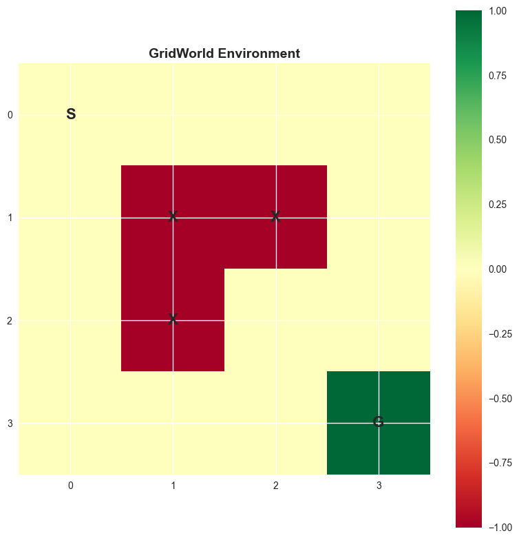
    


## Part 2: Policy Evaluation

### 2.1 Random Policy Evaluation

Let's start by evaluating a random policy in our GridWorld environment.


```python
# Evaluate random policy
random_policy = RandomPolicy(env)
random_values = policy_evaluation(env, random_policy, gamma=0.9)

print(f"✓ Random policy evaluated - V({env.start_state}) = {random_values[env.start_state]:.3f}")
plot_value_function(env, random_values, "Random Policy Value Function")
```

    Policy evaluation converged after 39 iterations
    ✓ Random policy evaluated - V((0, 0)) = -3.141


    ---------------------------------------------------------------------------

    NameError                                 Traceback (most recent call last)

    Cell In[3], line 6
          3 random_values = policy_evaluation(env, random_policy, gamma=0.9)
          5 print(f"✓ Random policy evaluated - V({env.start_state}) = {random_values[env.start_state]:.3f}")
    ----> 6 plot_value_function(env, random_values, "Random Policy Value Function")


    NameError: name 'plot_value_function' is not defined


### 2.2 Custom Policy Evaluation

Now let's evaluate a custom policy that prefers moving right and down.


```python
# Evaluate custom policy
custom_policy = CustomPolicy(env)
custom_values = policy_evaluation(env, custom_policy, gamma=0.9)

print(f"✓ Custom policy evaluated - V({env.start_state}) = {custom_values[env.start_state]:.3f}")
plot_value_function(env, custom_values, "Custom Policy Value Function")
```

    Policy evaluation converged after 111 iterations
    ✓ Custom policy evaluated - V((0, 0)) = -1.000


    
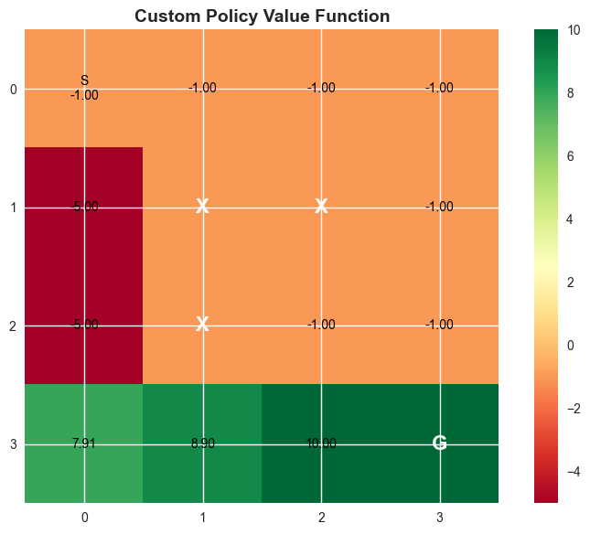
    


### 2.3 Policy Comparison

Let's compare different policies side by side.


```python
# Run policy comparison experiment
experiment_policy_comparison(env, gamma=0.9)
```

    === Experiment: Policy Comparison ===
    Policy evaluation converged after 111 iterations
    Policy evaluation converged after 39 iterations
    Policy evaluation converged after 111 iterations
    Policy evaluation converged after 111 iterations


    
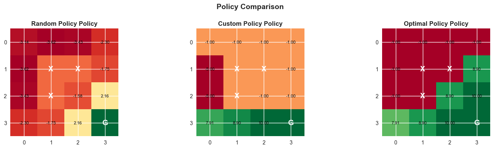
    


    Policy evaluation converged after 39 iterations
    Random Policy: Start state value = -3.141
    Policy evaluation converged after 111 iterations
    Custom Policy: Start state value = -1.000
    Policy evaluation converged after 111 iterations
    Optimal Policy: Start state value = -1.000


## Part 3: Q-Value Functions

### 3.1 Computing Q-Values from V-Values

Let's compute Q-values from the value function of our custom policy.


```python
# Compute Q-values from V-values
Q_from_V = compute_q_from_v(env, custom_values, gamma=0.9)

print("✓ Q-values computed from custom policy V-values")
# Show sample Q-values for key states
for state in [(0,0), (1,0), (2,2)]:
    print(f"State {state}: {[(a, Q_from_V[(state, a)]) for a in env.get_valid_actions(state)]}")

plot_q_values(env, Q_from_V, "Q-Values from Custom Policy")
```


    ---------------------------------------------------------------------------

    NameError                                 Traceback (most recent call last)

    Cell In[4], line 2
          1 # Compute Q-values from V-values
    ----> 2 Q_from_V = compute_q_from_v(env, custom_values, gamma=0.9)
          4 print("✓ Q-values computed from custom policy V-values")
          5 # Show sample Q-values for key states


    NameError: name 'custom_values' is not defined


### 3.2 Computing V-Values from Q-Values

Now let's do the reverse - compute V-values from Q-values.


```python
# Compute V-values from Q-values
V_from_Q = compute_v_from_q(Q_from_V, env)

print("✓ V-values computed from Q-values")
# Verify consistency
max_diff = max(abs(custom_values[s] - V_from_Q[s]) for s in env.states
               if s not in env.obstacles and s != env.goal_state)
print(f"✓ Max difference between original and computed V: {max_diff:.6f}")

plot_value_function(env, V_from_Q, "V-Values from Q-Values")
```


    ---------------------------------------------------------------------------

    NameError                                 Traceback (most recent call last)

    Cell In[5], line 2
          1 # Compute V-values from Q-values
    ----> 2 V_from_Q = compute_v_from_q(Q_from_V, env)
          4 print("✓ V-values computed from Q-values")
          5 # Verify consistency


    NameError: name 'Q_from_V' is not defined


## Part 4: Policy Iteration

### 4.1 Running Policy Iteration

Let's run the policy iteration algorithm to find the optimal policy.


```python
# Run Policy Iteration
optimal_policy, optimal_values, _ = experiment_policy_iteration(env, gamma=0.9)
print(f"✓ Policy Iteration converged - V({env.start_state}) = {optimal_values[env.start_state]:.3f}")
```

    === Experiment: Policy Iteration ===
    Policy Iteration - Iteration 1
    Policy evaluation converged after 39 iterations
    Policy Iteration - Iteration 2
    Policy evaluation converged after 111 iterations
    Policy Iteration - Iteration 3
    Policy evaluation converged after 111 iterations
    Policy Iteration - Iteration 4
    Policy evaluation converged after 7 iterations
    Policy iteration converged after 4 iterations
    
    Policy iteration completed in 4 iterations
    Final value of start state: 5.495


    
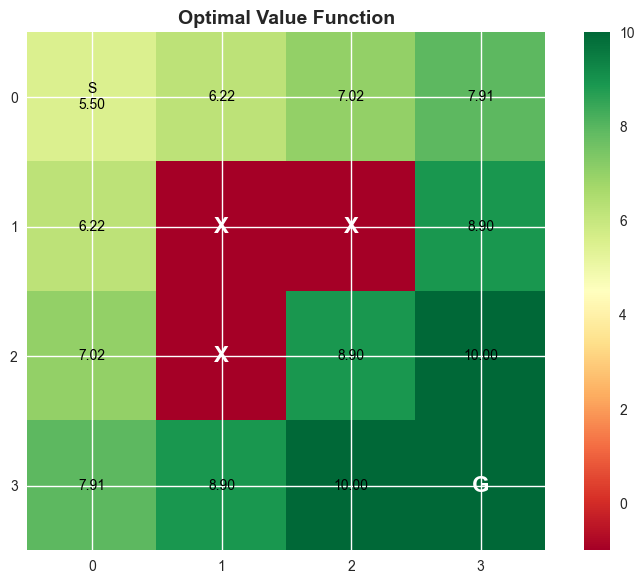
    


    
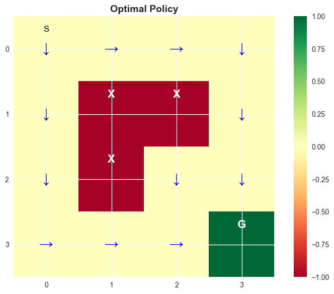
    


    ✓ Policy Iteration converged - V((0, 0)) = 5.495


## Part 5: Value Iteration

### 5.1 Running Value Iteration

Now let's run value iteration to find the optimal value function.


```python
# Run Value Iteration
optimal_values_vi, optimal_policy_vi, _ = experiment_value_iteration(env, gamma=0.9)
print(f"✓ Value Iteration converged - V({env.start_state}) = {optimal_values_vi[env.start_state]:.3f}")
```

    === Experiment: Value Iteration ===
    Value iteration converged after 7 iterations
    
    Value iteration completed in 7 iterations
    Final value of start state: 5.495


    
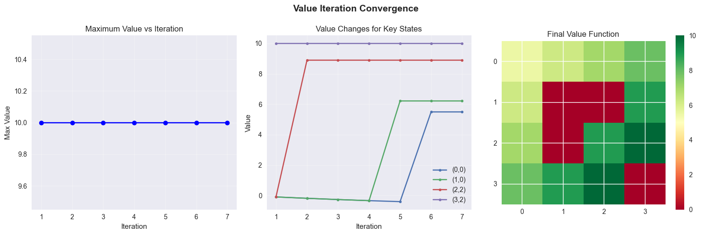
    


    
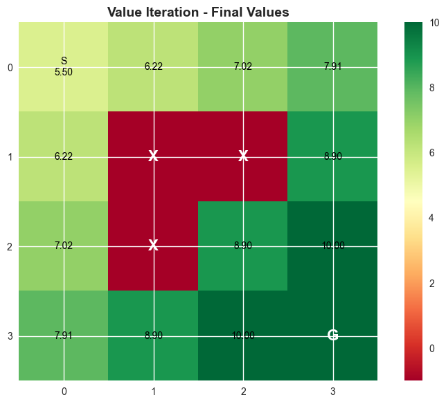
    


    
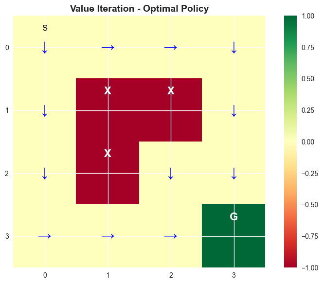
    


    ✓ Value Iteration converged - V((0, 0)) = 5.495


## Part 6: Q-Learning

### 6.1 Running Q-Learning

Let's train an agent using Q-learning.


```python
# Run Q-Learning
Q_learned, values_learned, policy_learned, _ = experiment_q_learning(
    env, num_episodes=1000, alpha=0.1, gamma=0.9, epsilon=0.1
)
print(f"✓ Q-Learning completed - V({env.start_state}) = {values_learned[env.start_state]:.3f}")
```

    === Experiment: Q-Learning ===
    Q-learning completed with 1000 episodes
    .3f


    
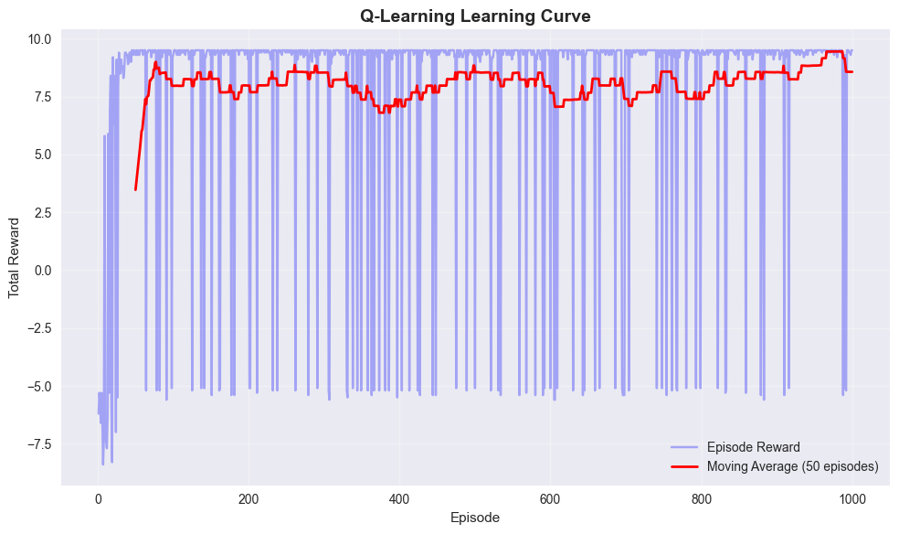
    


    
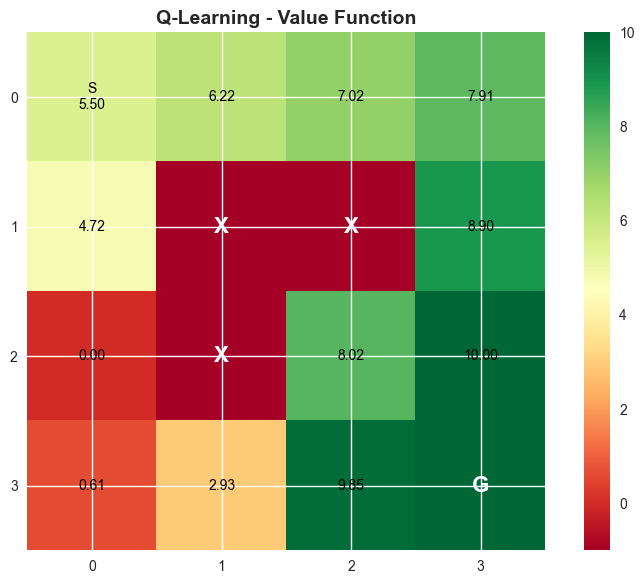
    


    

    


    ✓ Q-Learning completed - V((0, 0)) = 5.495


## Part 7: Effect of Discount Factor

### 7.1 Discount Factor Experiments

Let's see how different discount factors affect the value function.


```python
experiment_discount_factors(env, random_policy, gamma_values=[0.1, 0.5, 0.9, 0.99])
```

    === Experiment: Effect of Discount Factor ===
    
    Evaluating policy with gamma = 0.1
    Policy evaluation converged after 7 iterations
    Value of start state (0,0): -0.179
    Value of state near goal (2,2): -2.430
    
    Evaluating policy with gamma = 0.5
    Policy evaluation converged after 15 iterations
    Value of start state (0,0): -0.764
    Value of state near goal (2,2): -1.973
    
    Evaluating policy with gamma = 0.9
    Policy evaluation converged after 39 iterations
    Value of start state (0,0): -3.141
    Value of state near goal (2,2): -1.576
    
    Evaluating policy with gamma = 0.99
    Policy evaluation converged after 58 iterations
    Value of start state (0,0): -4.997
    Value of state near goal (2,2): -1.585


    
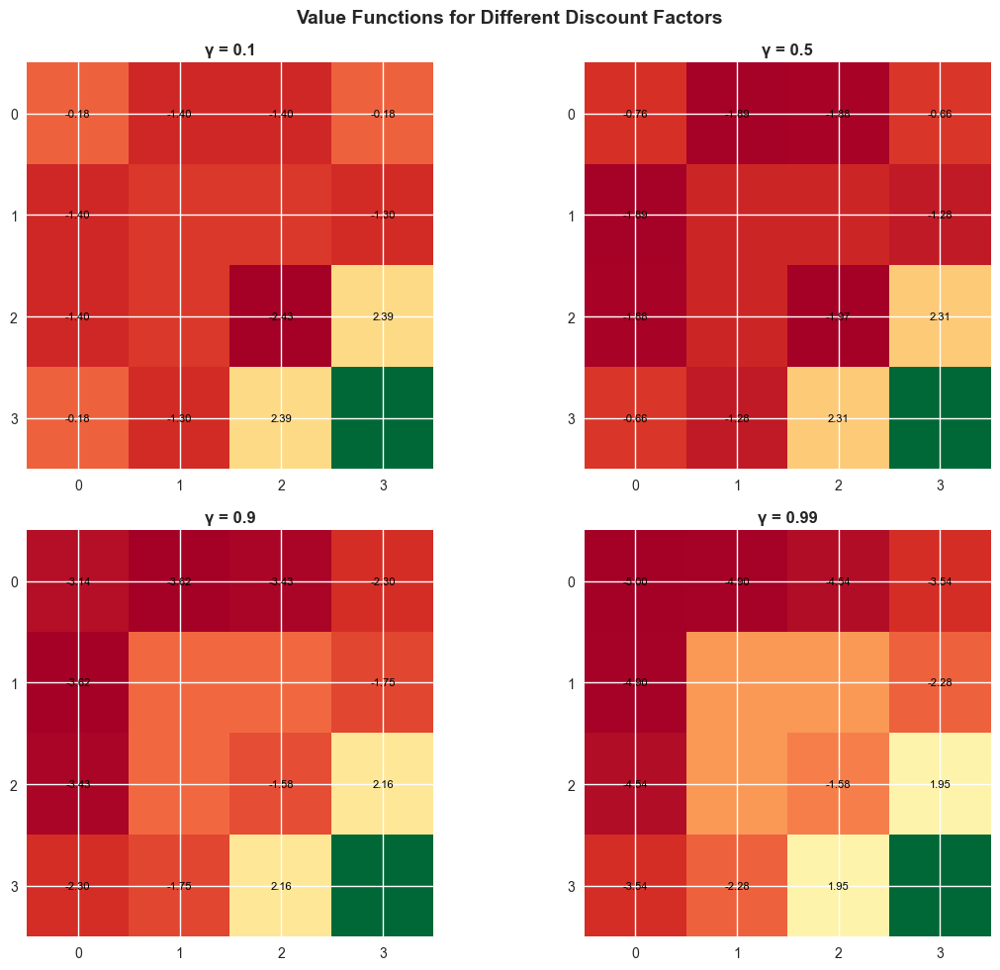
    


    {0.1: defaultdict(float,
                 {(0, 0): -0.17891807401838528,
                  (1, 0): -1.399443527145084,
                  (0, 1): -1.3994435271450842,
                  (1, 1): 0.0,
                  (0, 2): -1.3993794942903994,
                  (1, 2): 0.0,
                  (0, 3): -0.17635673836452403,
                  (1, 3): -1.3021765390928044,
                  (2, 0): -1.3993794942903992,
                  (2, 3): 2.3914717191210992,
                  (3, 0): -0.17635673836452403,
                  (2, 1): 0.0,
                  (2, 2): -2.4304264140982488,
                  (3, 2): 2.3914717191210992,
                  (3, 3): 0.0,
                  (3, 1): -1.3021765390928044}),
     0.5: defaultdict(float,
                 {(0, 0): -0.7639386989538708,
                  (1, 0): -1.8918165579473054,
                  (0, 1): -1.8918165579473054,
                  (1, 1): 0.0,
                  (0, 2): -1.8787773450183005,
                  (1, 2): 0.0,
                  (0, 3): -0.6596249269995034,
                  (1, 3): -1.27897228535229,
                  (2, 0): -1.8787773450183003,
                  (2, 3): 2.306818920979918,
                  (3, 0): -0.6596249269995034,
                  (2, 1): 0.0,
                  (2, 2): -1.9732952693616728,
                  (3, 2): 2.3068189209799184,
                  (3, 3): 0.0,
                  (3, 1): -1.2789722853522898}),
     0.9: defaultdict(float,
                 {(0, 0): -3.140779691835998,
                  (1, 0): -3.6165099138374077,
                  (0, 1): -3.6165099138374073,
                  (1, 1): 0.0,
                  (0, 2): -3.42719973104035,
                  (1, 2): 0.0,
                  (0, 3): -2.299401008685416,
                  (1, 3): -1.749114784782499,
                  (2, 0): -3.42719973104035,
                  (2, 3): 2.163560959494394,
                  (3, 0): -2.299401008685416,
                  (2, 1): 0.0,
                  (2, 2): -1.576397536454543,
                  (3, 2): 2.163560959494394,
                  (3, 3): 0.0,
                  (3, 1): -1.749114784782499}),
     0.99: defaultdict(float,
                 {(0, 0): -4.997207124815242,
                  (1, 0): -4.896142044434136,
                  (0, 1): -4.896142044434136,
                  (1, 1): 0.0,
                  (0, 2): -4.535508510595482,
                  (1, 2): 0.0,
                  (0, 3): -3.540101883929413,
                  (1, 3): -2.283690433727762,
                  (2, 0): -4.535508510595482,
                  (2, 3): 1.950295293059115,
                  (3, 0): -3.5401018839294127,
                  (2, 1): 0.0,
                  (2, 2): -1.5846037787200855,
                  (3, 2): 1.950295293059115,
                  (3, 3): 0.0,
                  (3, 1): -2.2836904337277617})}


## Part 8: Environment Modifications

### 8.1 Testing Different Environments

Let's test how the optimal policy changes with different obstacle configurations.


```python
experiment_environment_modifications()
```

    === Experiment: Environment Modifications ===
    
    Testing environment: Standard
    Policy Iteration - Iteration 1
    Policy evaluation converged after 39 iterations
    Policy Iteration - Iteration 2
    Policy evaluation converged after 111 iterations
    Policy Iteration - Iteration 3
    Policy evaluation converged after 111 iterations
    Policy Iteration - Iteration 4
    Policy evaluation converged after 7 iterations
    Policy iteration converged after 4 iterations
    Start state value: 5.495
    
    Testing environment: Easy (Few Obstacles)
    Policy Iteration - Iteration 1
    Policy evaluation converged after 36 iterations
    Policy Iteration - Iteration 2
    Policy evaluation converged after 111 iterations
    Policy Iteration - Iteration 3
    Policy evaluation converged after 7 iterations
    Policy iteration converged after 3 iterations
    Start state value: 5.495
    
    Testing environment: Hard (Many Obstacles)
    Policy Iteration - Iteration 1
    Policy evaluation converged after 40 iterations
    Policy Iteration - Iteration 2
    Policy evaluation converged after 111 iterations
    Policy Iteration - Iteration 3
    Policy evaluation converged after 111 iterations
    Policy Iteration - Iteration 4
    Policy evaluation converged after 7 iterations
    Policy iteration converged after 4 iterations
    Start state value: 5.495
    
    Testing environment: No Obstacles
    Policy Iteration - Iteration 1
    Policy evaluation converged after 39 iterations
    Policy Iteration - Iteration 2
    Policy evaluation converged after 111 iterations
    Policy Iteration - Iteration 3
    Policy evaluation converged after 111 iterations
    Policy Iteration - Iteration 4
    Policy evaluation converged after 7 iterations
    Policy iteration converged after 4 iterations
    Start state value: 5.495


    
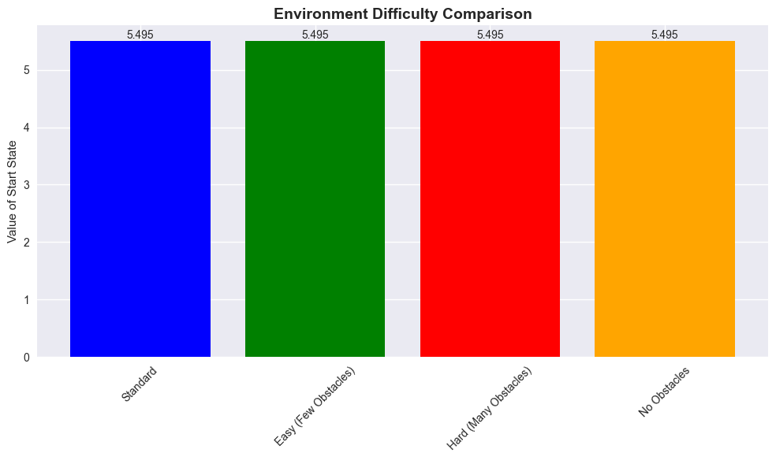
    


    {'Standard': 5.495390000000001,
     'Easy (Few Obstacles)': 5.495390000000001,
     'Hard (Many Obstacles)': 5.495390000000001,
     'No Obstacles': 5.495390000000001}


## Part 9: Summary and Conclusions

### 9.1 Key Takeaways

In this exercise, we have:

1. **Implemented a complete GridWorld environment** with customizable rewards and obstacles
2. **Created various policy classes** including random, greedy, and custom policies
3. **Implemented core RL algorithms** including policy evaluation, policy iteration, value iteration, and Q-learning
4. **Built comprehensive visualization tools** for value functions, policies, and learning curves
5. **Conducted systematic experiments** to understand the effects of different parameters

### 9.2 What We Learned

- **Value functions** quantify how good it is to be in a particular state or take a particular action
- **Policy evaluation** computes the value function for a given policy
- **Policy improvement** finds better policies given value functions
- **Policy iteration** alternates between evaluation and improvement to find optimal policies
- **Value iteration** directly computes optimal value functions
- **Q-learning** can learn optimal policies through interaction with the environment
- **Discount factors** control the importance of future rewards
- **Environment design** significantly affects the difficulty and optimal strategies

### 9.3 Next Steps

This foundation prepares us for more advanced RL topics including:
- Function approximation for large state spaces
- Deep reinforcement learning with neural networks
- Multi-agent reinforcement learning
- Real-world applications and challenges
