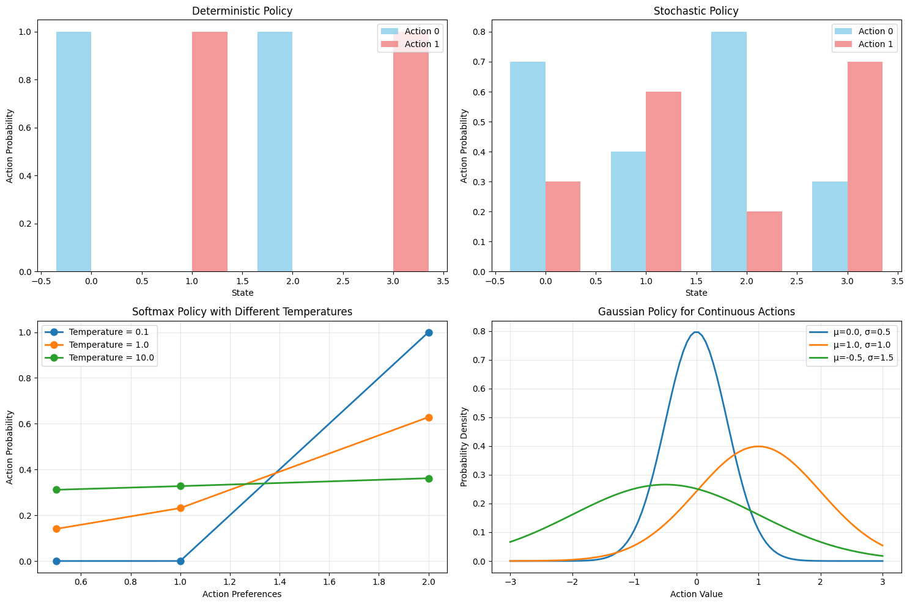

# CA4: Policy Gradient Methods and Neural Networks in RL
# Table of Contents

- [CA4: Policy Gradient Methods and Neural Networks in RL](#ca4-policy-gradient-methods-and-neural-networks-in-rl)
  - [Direct Policy Optimization and Actor-Critic Architectures](#direct-policy-optimization-and-actor-critic-architectures)
    - [Learning Objectives](#learning-objectives)
    - [Prerequisites](#prerequisites)
    - [Roadmap](#roadmap)
- [Part 1: Policy Representations and Theory](#part-1-policy-representations-and-theory)
  - [1.1 Policy Parameterization](#11-policy-parameterization)
  - [1.2 Policy Gradient Mathematics](#12-policy-gradient-mathematics)
- [Part 2: REINFORCE Algorithm](#part-2-reinforce-algorithm)
  - [2.1 REINFORCE Implementation](#21-reinforce-implementation)
- [Part 3: Actor-Critic Methods](#part-3-actor-critic-methods)
  - [3.1 Actor-Critic Architecture](#31-actor-critic-architecture)
- [Part 4: Algorithm Comparison](#part-4-algorithm-comparison)
  - [4.1 Side-by-Side Comparison](#41-side-by-side-comparison)
- [Part 5: Neural Network Architecture Analysis](#part-5-neural-network-architecture-analysis)
  - [5.1 Network Architecture Comparison](#51-network-architecture-comparison)
- [Part 6: Advanced Topics and Applications](#part-6-advanced-topics-and-applications)
  - [6.1 Real-World Applications](#61-real-world-applications)


## Direct Policy Optimization and Actor-Critic Architectures

Welcome to Computer Assignment 4, where we explore policy gradient methods that directly optimize policy parameters using gradient ascent. This assignment introduces neural network-based policies, the fundamental policy gradient theorem, and advanced actor-critic architectures that combine the strengths of policy and value-based methods.

### Learning Objectives
By the end of this assignment, you will master:

1. **Policy Gradient Theorem** - The mathematical foundation for direct policy optimization
2. **REINFORCE Algorithm** - Monte Carlo policy gradient method with variance reduction techniques
3. **Actor-Critic Methods** - Combining policy gradients with value function approximation
4. **Neural Network Policies** - Parameterizing policies with deep neural networks
5. **Continuous Action Spaces** - Gaussian policies for continuous control problems
6. **Baseline Subtraction** - Variance reduction techniques for stable policy learning
7. **Advantage Functions** - Using temporal difference errors for policy updates

### Prerequisites
- Strong understanding of reinforcement learning fundamentals (CA1-CA3)
- Familiarity with PyTorch and neural network implementation
- Knowledge of probability distributions and stochastic processes
- Understanding of temporal difference learning and Q-learning
- Completion of CA1-CA3 or equivalent RL background

### Roadmap
This comprehensive assignment builds progressively from theory to advanced implementations:

- **Section 1**: Policy Representations (Deterministic vs Stochastic, Parameterization)
- **Section 2**: Policy Gradient Mathematics (Score Functions, Log-derivatives, Baselines)
- **Section 3**: REINFORCE Algorithm (Monte Carlo Policy Gradients, Baseline Methods)
- **Section 4**: Actor-Critic Architectures (Separate Networks, Shared Features, TD Actors)
- **Section 5**: Neural Network Design (Architecture Choices, Parameter Sharing, Optimization)
- **Section 6**: Continuous Control (Gaussian Policies, Action Bounds, Exploration)
- **Section 7**: Advanced Topics (PPO, TRPO, Multi-agent Policy Gradients)

Let's begin our exploration of direct policy optimization and discover how neural networks can learn sophisticated control policies!


```python
import sys
import os

ca4_path = os.path.join(os.getcwd(), "CA4_modular")
sys.path.insert(0, ca4_path)

import numpy as np
import torch
import matplotlib.pyplot as plt


from environments import EnvironmentWrapper, create_environment
from agents.policies import PolicyNetwork, ValueNetwork, create_policy_network
from agents.algorithms import REINFORCEAgent, ActorCriticAgent
from utils.visualization import (
    PolicyVisualizer,
    PolicyGradientMathVisualizer,
    TrainingVisualizer,
)
from experiments import PolicyGradientExperiment, run_quick_test

print("✓ All modular components imported successfully")
print(f"PyTorch version: {torch.__version__}")
print(f"CUDA available: {torch.cuda.is_available()}")
```

    ✓ All modular components imported successfully
    PyTorch version: 2.8.0
    CUDA available: False


# Part 1: Policy Representations and Theory

## 1.1 Policy Parameterization

Policies can be represented in different ways:
- **Deterministic**: Single action per state
- **Stochastic**: Probability distribution over actions
- **Parameterized**: Neural networks with learnable parameters θ


```python
visualizer = PolicyVisualizer()
visualizer.visualize_policies()

print("Policy Representation Analysis:")
print("✓ Deterministic policies: Single action per state")
print("✓ Stochastic policies: Probability distribution over actions")
print("✓ Softmax temperature controls exploration vs exploitation")
print("✓ Gaussian policies handle continuous action spaces naturally")
```


    

    


    Policy Representation Analysis:
    ✓ Deterministic policies: Single action per state
    ✓ Stochastic policies: Probability distribution over actions
    ✓ Softmax temperature controls exploration vs exploitation
    ✓ Gaussian policies handle continuous action spaces naturally


## 1.2 Policy Gradient Mathematics

The policy gradient theorem provides the theoretical foundation:

**∇_θ J(θ) = E[∇_θ log π(a|s,θ) * G_t]**

Key insights:
- Score function ∇_θ log π(a|s,θ) guides parameter updates
- Returns G_t provide the learning signal
- Baseline subtraction reduces variance


```python
math_viz = PolicyGradientMathVisualizer()
math_viz.demonstrate_score_function()

print("Policy Gradient Mathematics Analysis:")
print("✓ Score function guides parameter updates")
print("✓ Higher preference → higher probability → lower score")
print("✓ Baseline subtraction reduces variance without bias")
print("✓ Optimal baseline is the expected return")
```


    

    


    Policy Gradient Mathematics Analysis:
    ✓ Score function guides parameter updates
    ✓ Higher preference → higher probability → lower score
    ✓ Baseline subtraction reduces variance without bias
    ✓ Optimal baseline is the expected return


# Part 2: REINFORCE Algorithm

## 2.1 REINFORCE Implementation

REINFORCE uses Monte Carlo returns to estimate the policy gradient:

**θ ← θ + α ∇_θ log π(a_t|s_t,θ) G_t**

Where G_t is the return from time step t.


```python
env = create_environment("CartPole-v1")
print(f"Environment: {env.env_name}")
print(f"State size: {env.state_size}")
print(f"Action size: {env.action_size}")


reinforce_agent = REINFORCEAgent(
    state_size=env.state_size,
    action_size=env.action_size,
    lr=0.001,
    gamma=0.99,
    baseline=True,
)

print("✓ REINFORCE agent created with baseline")
```

    Environment: CartPole-v1
    State size: 4
    Action size: 2
    ✓ REINFORCE agent created with baseline


```python
print("Training REINFORCE Agent on CartPole...")
print("=" * 50)

reinforce_results = reinforce_agent.train(env.env, num_episodes=10, print_every=5)

print("\nTraining completed!")
print(f"Final average score: {np.mean(reinforce_results['scores'][-5:]):.2f}")
print(f"Best episode: {max(reinforce_results['scores']):.2f}")
```

    Training REINFORCE Agent on CartPole...
    ==================================================
    Episode    5 | Avg Score:   15.80
    Episode   10 | Avg Score:   25.00
    
    Training completed!
    Final average score: 25.00
    Best episode: 36.00


```python
viz = TrainingVisualizer()
viz.plot_learning_curves(reinforce_results["scores"], "REINFORCE Learning Curve")

if reinforce_results.get("policy_losses"):
    viz.plot_losses(
        reinforce_results["policy_losses"],
        reinforce_results.get("value_losses"),
        "REINFORCE Training Losses",
    )
```


    

    


    

    


# Part 3: Actor-Critic Methods

## 3.1 Actor-Critic Architecture

Actor-Critic methods combine policy and value estimation:
- **Actor**: Learns the policy π(a|s,θ)
- **Critic**: Learns the value function V(s,w)
- **Advantage**: A(s,a) = Q(s,a) - V(s) or A(s,a) = δ_t

**Update Rules:**
- Critic: w ← w + α_w δ_t ∇_w V(s,w)
- Actor: θ ← θ + α_θ δ_t ∇_θ log π(a|s,θ)


```python
ac_agent = ActorCriticAgent(
    state_size=env.state_size,
    action_size=env.action_size,
    lr_actor=0.001,
    lr_critic=0.005,
    gamma=0.99,
)

print("✓ Actor-Critic agent created")
print(f"Actor learning rate: {ac_agent.lr_actor}")
print(f"Critic learning rate: {ac_agent.lr_critic}")
```

    ✓ Actor-Critic agent created
    Actor learning rate: 0.001
    Critic learning rate: 0.005


```python
print("Training Actor-Critic Agent on CartPole...")
print("=" * 50)

ac_results = ac_agent.train(env.env, num_episodes=50, print_every=10)

print("\nTraining completed!")
print(f"Final average score: {np.mean(ac_results['scores'][-10:]):.2f}")
print(f"Best episode: {max(ac_results['scores']):.2f}")
```

    Training Actor-Critic Agent on CartPole...
    ==================================================
    Episode   10 | Avg Score:    9.20 | Actor Loss:   0.0010 | Critic Loss: 2570671.8582 | TD Error: 756.180
    Episode   20 | Avg Score:    9.40 | Actor Loss:   0.0007 | Critic Loss: 31335441.9060 | TD Error: 2873.180
    Episode   30 | Avg Score:    9.10 | Actor Loss:  -0.0002 | Critic Loss: 201474156.2397 | TD Error: 6750.264
    Episode   20 | Avg Score:    9.40 | Actor Loss:   0.0007 | Critic Loss: 31335441.9060 | TD Error: 2873.180
    Episode   30 | Avg Score:    9.10 | Actor Loss:  -0.0002 | Critic Loss: 201474156.2397 | TD Error: 6750.264
    Episode   40 | Avg Score:    9.10 | Actor Loss:   0.0001 | Critic Loss: 711184994.3403 | TD Error: 15472.701
    Episode   50 | Avg Score:    9.50 | Actor Loss:  -0.0003 | Critic Loss: 2770366361.8000 | TD Error: 29732.091
    
    Training completed!
    Final average score: 9.50
    Best episode: 10.00
    Episode   40 | Avg Score:    9.10 | Actor Loss:   0.0001 | Critic Loss: 711184994.3403 | TD Error: 15472.701
    Episode   50 | Avg Score:    9.50 | Actor Loss:  -0.0003 | Critic Loss: 2770366361.8000 | TD Error: 29732.091
    
    Training completed!
    Final average score: 9.50
    Best episode: 10.00


```python
viz.plot_learning_curves(ac_results["scores"], "Actor-Critic Learning Curve")

if ac_results.get("actor_losses") and ac_results.get("critic_losses"):
    viz.plot_losses(
        ac_results["actor_losses"],
        ac_results["critic_losses"],
        "Actor-Critic Training Losses",
    )
```


    

    


    

    


# Part 4: Algorithm Comparison

## 4.1 Side-by-Side Comparison

Let's compare REINFORCE vs Actor-Critic performance on the same environment.


```python
experiment = PolicyGradientExperiment("CartPole-v1")
comparison_results = experiment.run_comparison_experiment(
    algorithms=["reinforce", "actor_critic"], num_episodes=200
)


viz.plot_multiple_curves(
    {alg: results["scores"] for alg, results in comparison_results.items()},
    "REINFORCE vs Actor-Critic Comparison",
)
```

    Running Algorithm Comparison on CartPole-v1
    Algorithms: ['reinforce', 'actor_critic']
    Episodes per algorithm: 200
    ============================================================
    Training reinforce...
    Episode   50 | Avg Score:   26.40
    Episode   50 | Avg Score:   26.40
    Episode  100 | Avg Score:   55.26
    Episode  100 | Avg Score:   55.26
    Episode  150 | Avg Score:  123.22
    Episode  150 | Avg Score:  123.22
    Episode  200 | Avg Score:  151.40
    ✓ reinforce training completed
    Training actor_critic...
    Episode  200 | Avg Score:  151.40
    ✓ reinforce training completed
    Training actor_critic...
    Episode   50 | Avg Score:   10.24 | Actor Loss:  -0.0005 | Critic Loss: 506948077.7778 | TD Error: 11446.611
    Episode   50 | Avg Score:   10.24 | Actor Loss:  -0.0005 | Critic Loss: 506948077.7778 | TD Error: 11446.611
    Episode  100 | Avg Score:    9.32 | Actor Loss:  -0.0012 | Critic Loss: 28829787840.0000 | TD Error: 98259.958
    Episode  100 | Avg Score:    9.32 | Actor Loss:  -0.0012 | Critic Loss: 28829787840.0000 | TD Error: 98259.958
    Episode  150 | Avg Score:    9.26 | Actor Loss:  -0.0053 | Critic Loss: 348820163404.8000 | TD Error: 316575.500
    Episode  150 | Avg Score:    9.26 | Actor Loss:  -0.0053 | Critic Loss: 348820163404.8000 | TD Error: 316575.500
    Episode  200 | Avg Score:    9.24 | Actor Loss:  -0.0167 | Critic Loss: 1635238351360.0000 | TD Error: 731016.125
    ✓ actor_critic training completed
    Episode  200 | Avg Score:    9.24 | Actor Loss:  -0.0167 | Critic Loss: 1635238351360.0000 | TD Error: 731016.125
    ✓ actor_critic training completed


    

    


```python
from visualization import print_training_comparison

print_training_comparison(comparison_results)
```

    Training Results Comparison:
    ==================================================
    
    reinforce:
      Final Average Score: 151.40
      Best Episode: 364.00
      Mean Score: 89.07 ± 79.46
      Converged at Episode: 147
    
    actor_critic:
      Final Average Score: 9.24
      Best Episode: 32.00
      Mean Score: 9.52 ± 2.12
      Converged at Episode: 20
    
    Best Performing Algorithm: reinforce
    Final Score: 151.40


# Part 5: Neural Network Architecture Analysis

## 5.1 Network Architecture Comparison

Different neural network architectures have different properties:
- **Separate Networks**: Independent actor and critic
- **Shared Features**: Common feature extraction
- **Continuous Policies**: Gaussian distributions for continuous actions


```python
viz.plot_network_analysis()

print("\nNetwork Architecture Comparison:")
print("✓ Separate networks: High parameter count, independent learning")
print("✓ Shared features: Parameter efficient, joint feature learning")
print("✓ Sample efficiency improves with better architectures")
print("✓ Parameter count scales with state space size")
```


    

    


    
    Network Architecture Comparison:
    ✓ Separate networks: High parameter count, independent learning
    ✓ Shared features: Parameter efficient, joint feature learning
    ✓ Sample efficiency improves with better architectures
    ✓ Parameter count scales with state space size


# Part 6: Advanced Topics and Applications

## 6.1 Real-World Applications

Policy gradient methods have been successfully applied to:
- **Robotics**: Manipulation, autonomous vehicles, drone control
- **Games**: AlphaGo/Zero, OpenAI Five, AlphaStar
- **NLP**: Text generation, dialogue systems, machine translation
- **Finance**: Portfolio optimization, algorithmic trading


```python
from experiments import BenchmarkSuite

print("Policy Gradient Workshop Structure:")
print("=" * 40)
print("\nBeginner Level:")
print("• Implement basic REINFORCE")
print("• Policy vs value methods comparison")
print("\nIntermediate Level:")
print("• Actor-Critic implementation")
print("• Continuous control challenges")
print("\nAdvanced Level:")
print("• PPO implementation")
print("• Multi-agent policy gradients")

print("\n✓ Workshop provides comprehensive learning path")
print("✓ Exercises build from basic to advanced concepts")
print("✓ Real-world applications demonstrate practical value")
```

    Policy Gradient Workshop Structure:
    ========================================
    
    Beginner Level:
    • Implement basic REINFORCE
    • Policy vs value methods comparison
    
    Intermediate Level:
    • Actor-Critic implementation
    • Continuous control challenges
    
    Advanced Level:
    • PPO implementation
    • Multi-agent policy gradients
    
    ✓ Workshop provides comprehensive learning path
    ✓ Exercises build from basic to advanced concepts
    ✓ Real-world applications demonstrate practical value

