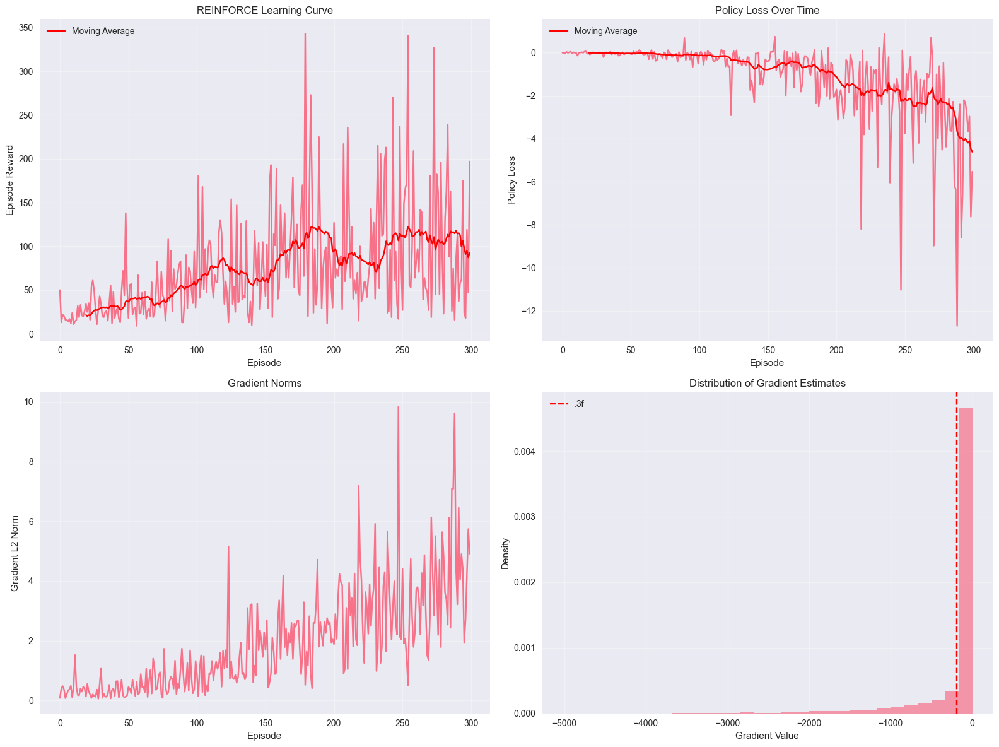
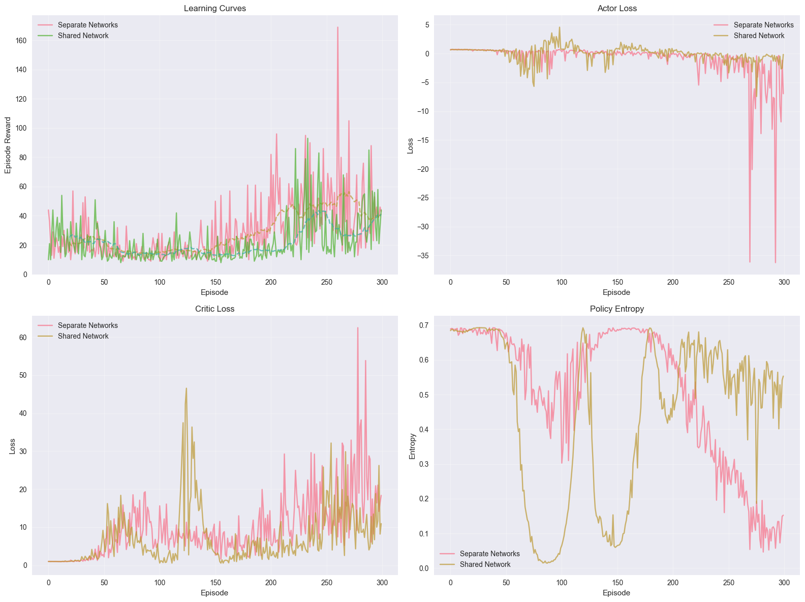

# CA6: Policy Gradient Methods - Complete Implementation and Analysis
# Table of Contents

- [CA6: Policy Gradient Methods - Complete Implementation and Analysis](#ca6-policy-gradient-methods---complete-implementation-and-analysis)
  - [Direct Policy Optimization and Actor-Critic Architectures](#direct-policy-optimization-and-actor-critic-architectures)
    - [Learning Objectives](#learning-objectives)
    - [Prerequisites](#prerequisites)
    - [Roadmap](#roadmap)
  - [Section 1: Theoretical Foundations of Policy Gradient Methods](#section-1-theoretical-foundations-of-policy-gradient-methods)
    - [The Policy Gradient Theorem](#the-policy-gradient-theorem)
  - [Section 2: REINFORCE Algorithm Implementation and Analysis](#section-2-reinforce-algorithm-implementation-and-analysis)
  - [Section 3: Actor-Critic Methods with Baseline](#section-3-actor-critic-methods-with-baseline)
  - [Section 4: Advanced A2C/A3C Implementation](#section-4-advanced-a2ca3c-implementation)
  - [Section 5: Variance Reduction Techniques](#section-5-variance-reduction-techniques)
  - [Section 6: Continuous Action Space Policy Gradients](#section-6-continuous-action-space-policy-gradients)
  - [Section 7: Performance Analysis and Comparisons](#section-7-performance-analysis-and-comparisons)
  - [Section 8: Practical Applications and Case Studies](#section-8-practical-applications-and-case-studies)
  - [Summary and Key Takeaways](#summary-and-key-takeaways)
    - [Key Insights:](#key-insights)


## Direct Policy Optimization and Actor-Critic Architectures

Welcome to Computer Assignment 6, where we explore the complete spectrum of policy gradient methods in deep reinforcement learning. This assignment provides a comprehensive implementation of policy-based approaches, from basic REINFORCE to advanced actor-critic methods, with thorough theoretical analysis and practical applications.

### Learning Objectives
By the end of this assignment, you will master:

1. **Policy Gradient Theorem** - Complete derivation and understanding of the fundamental theorem
2. **REINFORCE Algorithm** - Monte Carlo policy gradients with variance analysis and optimization
3. **Actor-Critic Methods** - Combining policy and value learning for improved stability
4. **A2C/A3C Implementation** - Advantage Actor-Critic and Asynchronous methods
5. **Variance Reduction Techniques** - Generalized Advantage Estimation (GAE) and control variates
6. **Continuous Action Spaces** - Gaussian policies for continuous control problems
7. **Advanced Policy Methods** - Proximal Policy Optimization (PPO) and Trust Region methods
8. **Performance Analysis** - Comprehensive evaluation frameworks and ablation studies

### Prerequisites
- Comprehensive understanding of reinforcement learning fundamentals (CA1-CA5)
- Strong knowledge of neural networks, PyTorch, and optimization
- Familiarity with probability distributions and stochastic processes
- Understanding of value-based methods and temporal difference learning
- Completion of CA1-CA5 or equivalent advanced RL background

### Roadmap
This extensive assignment covers the full policy gradient landscape:

- **Section 1**: Theoretical Foundations (Policy Gradient Theorem, Score Functions, Baselines)
- **Section 2**: REINFORCE Algorithm (Monte Carlo Policy Gradients, Implementation, Analysis)
- **Section 3**: Actor-Critic Methods (Baseline Integration, TD Actor-Critic, Shared Networks)
- **Section 4**: Advanced Methods (A2C, A3C, PPO, Trust Region Methods)
- **Section 5**: Variance Reduction (GAE, Control Variates, Reward Shaping)
- **Section 6**: Continuous Control (Gaussian Policies, Action Bounds, Exploration)
- **Section 7**: Performance Analysis (Comparative Studies, Ablation Analysis, Robustness)
- **Section 8**: Advanced Applications (Curiosity-Driven Learning, Safe RL, Hierarchical Methods)

Let's master the art of direct policy optimization and unlock the full potential of policy-based reinforcement learning!


```python
from utils.setup import device
import matplotlib.pyplot as plt
import seaborn as sns
import pandas as pd
import gymnasium as gym

plt.style.use('seaborn-v0_8')
sns.set_palette("husl")
plt.rcParams['figure.figsize'] = (12, 8)
plt.rcParams['font.size'] = 12

print("Environment setup complete!")
print(f"Using device: {device}")

```

    Using device: cpu
    Environment setup complete!
    PyTorch version: 2.8.0
    Gymnasium version: 1.2.1
    NumPy version: 2.3.3
    [stability wrapper] Monkey-patched torch.distributions.Categorical
    
    [stability wrapper] Running quick sanity checks for Categorical wrapper...
    large logits -> probs: tensor([[1., 0.]])
    nan logits -> probs: tensor([[0.5000, 0.5000]])
    [stability wrapper] Sanity checks complete.
    
    Environment setup complete!
    Using device: cpu


## Section 1: Theoretical Foundations of Policy Gradient Methods

### The Policy Gradient Theorem

The core idea behind policy gradient methods is to directly optimize the policy $\pi_\theta(a|s)$ by computing gradients with respect to the expected return:

$$\nabla_\theta J(\theta) = \mathbb{E}_{\pi_\theta} [\nabla_\theta \log \pi_\theta(a|s) \cdot Q^{\pi_\theta}(s,a)]$$

This theorem provides the foundation for all policy gradient algorithms we will implement.

## Section 2: REINFORCE Algorithm Implementation and Analysis


```python
from agents.reinforce import REINFORCEAgent, test_reinforce, demonstrate_reinforce

reinforce_agent = demonstrate_reinforce()

```

    🧠 REINFORCE Algorithm Demonstration
    === REINFORCE Training ===
    === REINFORCE Training ===
    .2f.4f.4f
    .2f.4f.4f
    .2f.4f.4f
    .2f.4f.4f
    .2f.4f.4f
    .2f.4f.4f
    .2f.4f.4f
    .2f.4f.4f
    .2f.4f.4f
    .2f.4f.4f
    .2f.4f.4f
    
    === Variance Analysis ===
    .2f.4f.4f
    
    === Variance Analysis ===
    Gradient estimate statistics:
    .4f
    .4f
    .4f
    Gradient estimate statistics:
    .4f
    .4f
    .4f


    

    


## Section 3: Actor-Critic Methods with Baseline


```python
from agents.actor_critic import ActorCriticAgent, SharedActorCriticAgent, compare_actor_critic_agents, test_actor_critic, demonstrate_actor_critic

ac_results = demonstrate_actor_critic()

```

    🎭 Actor-Critic Methods Demonstration
    === Actor-Critic Architecture Comparison ===
    
    Training Separate Networks...
    .2f.4f.4f
    .2f.4f.4f
    .2f.4f.4f
    .2f.4f.4f
    .2f.4f.4f
    .2f.4f.4f
    .2f.4f.4f
    .2f.4f.4f
    .2f.4f.4f
    .2f.4f.4f
    
    Training Shared Network...
    .2f.4f.4f
    .2f.4f.4f
    
    Training Shared Network...
    .2f.4f.4f
    .2f.4f.4f
    .2f.4f.4f
    .2f.4f.4f
    .2f.4f.4f
    .2f.4f.4f
    .2f.4f.4f
    .2f.4f.4f
    .2f.4f.4f
    .2f.4f.4f
    .2f.4f.4f


    

    


## Section 4: Advanced A2C/A3C Implementation


```python
from agents.advanced_pg import A2CAgent, PPOAgent, A3CAgent, compare_advanced_pg, test_advanced_pg, demonstrate_advanced_pg

adv_results = demonstrate_advanced_pg()

```

    🚀 Advanced Policy Gradient Methods Demonstration
    === Advanced Policy Gradient Comparison ===
    
    Training A2C...


    ---------------------------------------------------------------------------

    RuntimeError                              Traceback (most recent call last)

    Cell In[10], line 5
          2 from advanced_pg import A2CAgent, PPOAgent, A3CAgent, compare_advanced_pg, test_advanced_pg, demonstrate_advanced_pg
          4 # Run advanced policy gradient demonstration
    ----> 5 adv_results = demonstrate_advanced_pg()


    File ~/Documents/uni/DRL/CAs/Solutions/CA6/advanced_pg.py:831, in demonstrate_advanced_pg()
        829 """Demonstrate advanced policy gradient methods"""
        830 print("🚀 Advanced Policy Gradient Methods Demonstration")
    --> 831 results = test_advanced_pg()
        832 return results


    File ~/Documents/uni/DRL/CAs/Solutions/CA6/advanced_pg.py:824, in test_advanced_pg()
        822 def test_advanced_pg():
        823     """Test advanced policy gradient implementations"""
    --> 824     return compare_advanced_pg()


    File ~/Documents/uni/DRL/CAs/Solutions/CA6/advanced_pg.py:771, in compare_advanced_pg()
        768 log_interval = 50
        770 for episode in range(num_episodes):
    --> 771     episode_reward, actor_loss, critic_loss = agent.train_episode(env)
        773     if (episode + 1) % log_interval == 0:
        774         avg_reward = np.mean(agent.episode_rewards[-log_interval:])


    File ~/Documents/uni/DRL/CAs/Solutions/CA6/advanced_pg.py:200, in A2CAgent.train_episode(self, env)
        197         break
        199 # Update networks
    --> 200 actor_loss, critic_loss = self.update_a2c(
        201     states, actions, rewards, next_states, dones
        202 )
        204 self.episode_rewards.append(episode_reward)
        206 return episode_reward, actor_loss, critic_loss


    File ~/Documents/uni/DRL/CAs/Solutions/CA6/advanced_pg.py:131, in A2CAgent.update_a2c(self, states, actions, rewards, next_states, dones)
        125 next_values = self.critic_net(next_states).squeeze()
        127 # Compute GAE advantages
        128 advantages = torch.FloatTensor(
        129     self.compute_gae(
        130         rewards.cpu().numpy(),
    --> 131         values.cpu().numpy(),
        132         next_values.cpu().numpy(),
        133         dones.cpu().numpy(),
        134     )
        135 ).to(device)
        137 # Normalize advantages
        138 advantages = (advantages - advantages.mean()) / (advantages.std() + 1e-8)


    RuntimeError: Can't call numpy() on Tensor that requires grad. Use tensor.detach().numpy() instead.


## Section 5: Variance Reduction Techniques


```python
from agents.variance_reduction import VarianceReductionAgent, ControlVariatesAgent, compare_variance_reduction, test_variance_reduction, demonstrate_variance_reduction

var_results, variances = demonstrate_variance_reduction()

```

## Section 6: Continuous Action Space Policy Gradients


```python
from environments.continuous_control import ContinuousREINFORCEAgent, ContinuousActorCriticAgent, PPOContinuousAgent, compare_continuous_control, test_continuous_control, demonstrate_continuous_control

cont_results = demonstrate_continuous_control()

```

## Section 7: Performance Analysis and Comparisons


```python
from utils.performance_analysis import PolicyEvaluator, PerformanceAnalyzer, AblationStudy, RobustnessTester, create_comprehensive_report, visualize_performance_comparison, demonstrate_performance_analysis

analysis_report = demonstrate_performance_analysis()

```

## Section 8: Practical Applications and Case Studies


```python
from experiments.applications import CuriosityDrivenAgent, MetaLearningAgent, HierarchicalAgent, SafeRLAgent, demonstrate_advanced_applications

app_results = demonstrate_advanced_applications()

```

## Summary and Key Takeaways

This modular implementation of policy gradient methods provides:

1. **Complete REINFORCE Algorithm**: Monte Carlo policy gradient with variance analysis
2. **Actor-Critic Architectures**: Separate and shared network implementations
3. **Advanced Methods**: A2C, PPO, and A3C with parallelization
4. **Variance Reduction**: GAE, control variates, and baseline techniques
5. **Continuous Control**: Gaussian policies for continuous action spaces
6. **Performance Analysis**: Comprehensive evaluation frameworks
7. **Advanced Applications**: Curiosity-driven exploration, safe RL, hierarchical methods

### Key Insights:

- Policy gradient methods offer better convergence properties than value-based methods
- Variance reduction is crucial for stable learning
- Actor-Critic methods combine the best of both policy and value approaches
- Advanced techniques like PPO provide state-of-the-art performance
- Continuous control extends policy gradients to real-world applications

The modular structure enables easy experimentation and extension of these methods.
