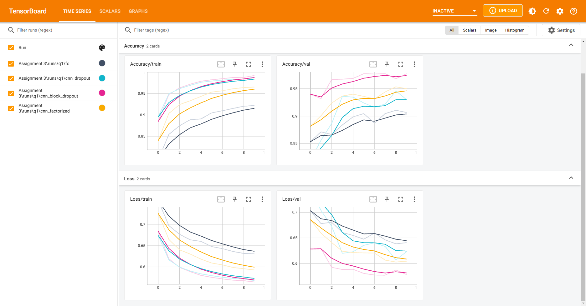
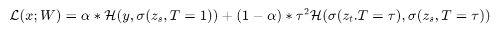
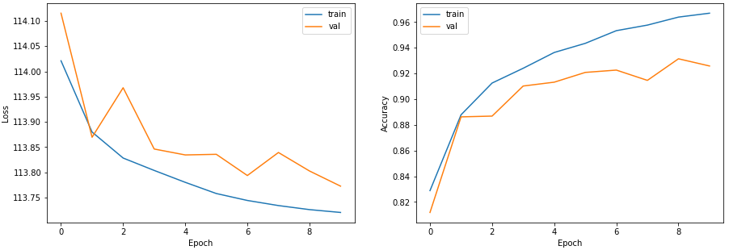
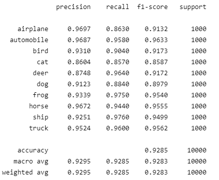
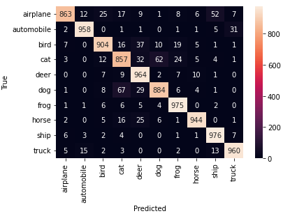

# Assignment 3

Author: Mohammad taha majlesi - 810101504, University of Tehran

This folder contains two notebook questions and supporting files. See the per-question READMEs for details:

- `README_q1.md` — Question 1 (MLP vs CNN comparison)
- `README_q2.md` — Question 2 (Knowledge distillation on CIFAR-10)

Question summaries and figures are available in this README and in `Figures/`. Theoretical writeups are stored under `Theoretical/`.

## Question 1
This question focuses on the performance comparison between MLP and CNN with the same number of parameters. 
It was seen that using simple dropout after convolutional layers does't improve the performance of the model. The problem with simple dropout after convolutional layers is that it randomly drops out some of the neurons in the convolutional layers which means that the model is not able to learn the features of the images. Since convolutional layers have few parameters, they need less regularization to begin with. Furthermore, because of the spatial relationships encoded in feature maps, activations can become highly correlated. This renders dropout ineffective. For this reason, we use BlockDropout which is a more effective way of regularizing convolutional layers.
We also used factorized kernels in the convolutional layers.
Generally speaking, factorized kernels reduce the number of parameters in the model, which makes the training faster and the model to take less memory. In this problem however, because we wanted to compare the performance of MLP with CNN, we used the same number of parameters. Therefore, the reduced number of parameters in the CNN model didn't show up.

### Tensorboard results:

## Question 2

This question focuses on knowledge distillation on CIFAR-10 dataset. At first a pretrained ResNet50 was linear-tuned on CIFAR-10 dataset. Then, the linear-tuned model was used as a teacher model to train a student model. The student model was a pretrained ResNet18. The student model was trained using the knowledge distillation loss function from the paper "Distilling the Knowledge in a Neural Network" by Geoffrey Hinton et al. The knowledge distillation loss function is defined as follows:

The temperature parameter is used to control the sharpness of the probability distribution. The higher the temperature, the more the probability distribution is smoothed out. 
Using hyperparameter search we found that the best hyperparameters are as follows:
* $\alpha = 0.5$
* $T = 10$

The loss and accuracy curves of the student model after training are as follows:

The classification report of the student model after training is as follows:

The confusion matrix of the student model after training is as follows:

Comparing the results of the knowledge distillation ResNet18 model with the fine-tuned ResNet18 model without distillation, we can see that the accuracy of the model with distillation is slightly higher than the model without distillation. This is because the knowledge distillation model is able to learn from the mistakes of the linear-tuned ResNet50 model. Also, the knowledge distillation model starts off with a much better accuracy than the model without distillation. This means that it can converge to a higher accuracy faster than the model without distillation. 

Fine-tuning ResNet50 on CIFAR-10 achieves a very high accuracy because the model is complex enough to learn the features of the CIFAR-10 dataset. However, as the accuracy and loss plots show, the model is prone to overfitting.

We will also learn a knowledge distillation model from the fine-tuned ResNet50 model. The knowledge distillation model will be a ResNet18 model. In this case, the model achieves a slighlty better accuracy compared to the case where the teacher model was a linear-tuned ResNet50 model.