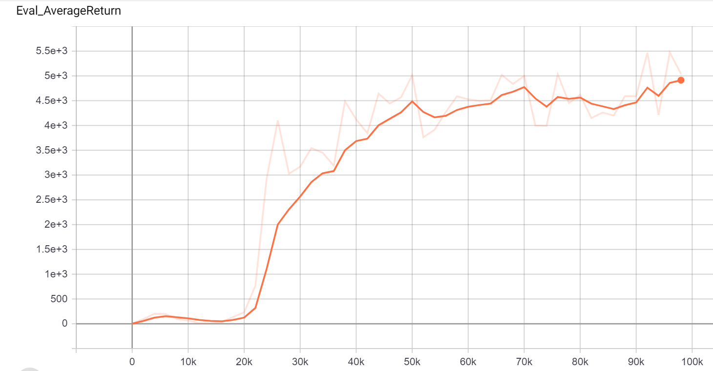
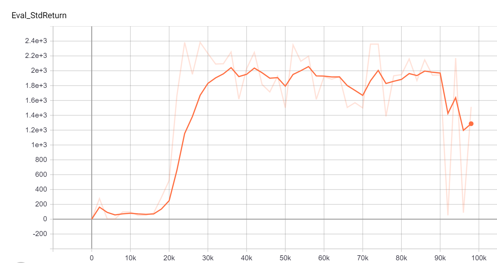
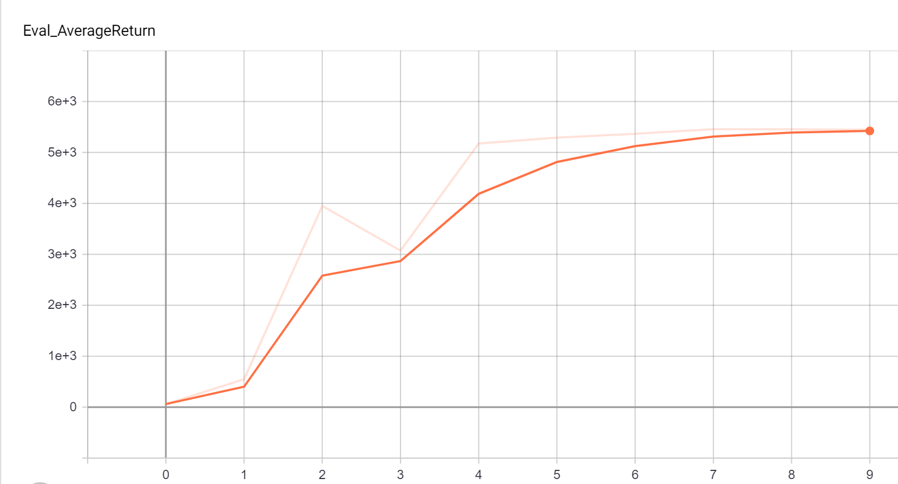
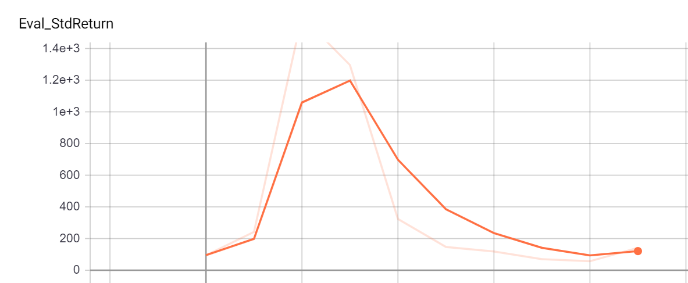

# HW1: Behavior Cloning

**Created by Taha Majlesi from University of Tehran**

## Concepts Explanation

### Behavior Cloning (BC)

Behavior Cloning is a supervised learning approach to imitation learning where an agent learns to mimic expert behavior by training on demonstrations. The core idea is to treat the problem as a supervised learning task where:

- **Input**: Current state observations
- **Output**: Expert actions
- **Model**: A neural network (typically MLP) that maps states to actions

**Mathematical Formulation**:
Given expert trajectories \(\tau = \{s*1, a_1, s_2, a_2, ..., s_T, a_T\}\), we minimize the loss:
\[
\mathcal{L}(\theta) = \sum*{t=1}^T \ell(\pi*\theta(s_t), a_t)
\]
where \(\pi*\theta\) is the policy network and \(\ell\) is typically mean squared error for continuous actions or cross-entropy for discrete actions.

**Advantages**:

- Simple and straightforward to implement
- Works well when expert data is abundant and high-quality
- No need for environment interactions during training

**Limitations**:

- Distribution shift: The agent may encounter states not seen in expert demonstrations
- Compounding errors: Small mistakes can lead to unseen states, causing cascading failures
- Requires large amounts of expert data

### Dataset Aggregation (DAgger)

DAgger addresses BC's limitations by iteratively collecting new data from the current policy and retraining on a dataset aggregated from all iterations.

**Algorithm**:

1. Train initial policy \(\pi_1\) on expert demonstrations \(\mathcal{D}\_1\)
2. For iteration \(i = 1\) to \(N\):
   - Run \(\pi_i\) in environment to collect trajectories
   - Query expert for actions on states from these trajectories
   - Add expert-labeled data to dataset: \(\mathcal{D}_{i+1} = \mathcal{D}\_i \cup \{(s, \pi_{expert}(s)) \mid s \sim \pi_i\}\)
   - Train \(\pi*{i+1}\) on \(\mathcal{D}*{i+1}\)

**Key Insight**: By querying the expert on states actually encountered by the current policy, DAgger ensures the training distribution matches the test distribution.

**Benefits over BC**:

- Robust to distribution shift
- Can learn from fewer expert demonstrations
- Maintains performance even when deviating from expert trajectories

### Evaluation Metrics

- **Mean Return**: Average cumulative reward over evaluation episodes
- **Success Rate**: Percentage of episodes achieving the task goal
- **Performance Relative to Expert**: How close the cloned policy gets to expert performance

## Setup

1. Install dependencies:

```bash
pip install -r requirements.txt
```

2. Set PYTHONPATH:

```bash
export PYTHONPATH=$PWD:$PYTHONPATH
```

## Running the Code

### Question 1.2: Behavioral Cloning on Multiple Environments

Train BC agents on expert data:

```bash
python cs285/scripts/run_hw1_behavior_cloning.py --expert_policy_file cs285/policies/experts/Ant.pkl --env_name Ant-v2 --exp_name bc_ant --n_iter 1 --expert_data cs285/expert_data/expert_data_Ant-v2.pkl
python cs285/scripts/run_hw1_behavior_cloning.py --expert_policy_file cs285/policies/experts/HalfCheetah.pkl --env_name HalfCheetah-v2 --exp_name bc_cheetah --n_iter 1 --expert_data cs285/expert_data/expert_data_HalfCheetah-v2.pkl
python cs285/scripts/run_hw1_behavior_cloning.py --expert_policy_file cs285/policies/experts/Hopper.pkl --env_name Hopper-v2 --exp_name bc_hopper --n_iter 1 --expert_data cs285/expert_data/expert_data_Hopper-v2.pkl
python cs285/scripts/run_hw1_behavior_cloning.py --expert_policy_file cs285/policies/experts/Humanoid.pkl --env_name Humanoid-v2 --exp_name bc_humanoid --n_iter 1 --expert_data cs285/expert_data/expert_data_Humanoid-v2.pkl
python cs285/scripts/run_hw1_behavior_cloning.py --expert_policy_file cs285/policies/experts/Walker2d.pkl --env_name Walker2d-v2 --exp_name bc_walker --n_iter 1 --expert_data cs285/expert_data/expert_data_Walker2d-v2.pkl
```

### Question 1.3: BC Training Curve on Walker2d

```bash
python cs285/scripts/run_hw1_behavior_cloning.py --expert_policy_file cs285/policies/experts/Walker2d.pkl --env_name Walker2d-v2 --exp_name bc_walker_curve --n_iter 5 --expert_data cs285/expert_data/expert_data_Walker2d-v2.pkl
```

### Question 2.2: DAgger on Walker2d

```bash
python cs285/scripts/run_hw1_dagger.py --expert_policy_file cs285/policies/experts/Walker2d.pkl --env_name Walker2d-v2 --exp_name dagger_walker --n_iter 10 --do_dagger --expert_data cs285/expert_data/expert_data_Walker2d-v2.pkl
```

## Viewing Results

Navigate to results folder and run:

```bash
tensorboard --logdir .
```

---

# Section 1 Behavior Cloning

Below is the HW1 report. All data used can be found in the results folder - videos aren't included to save space. To view the tensorboard for a specific part navigate to that part's folder (not the subfolders) and run

```commandline
tensorboard --logdir .
```

## Question 1.2

The agent was trained on 10,000 steps of expert behavior in each environment. It was then evaluated for >10,000 steps to get an accurate mean performance. The agent itself had an MLP policy consisting of 2 hidden layers of 64 neurons each.

| Environment |      Expert      | Behavioral Cloning | Mean Percent Performance |
| ----------- | :--------------: | :----------------: | :----------------------: |
| Ant         |  4713.65 ± 12.2  |  4696.46 ± 90.39   |          99.64%          |
| HalfCheetah | 4205.78 ± 83.04  |  3521.82 ± 181.00  |          83.74%          |
| Hopper      |  3772.67 ± 1.95  |   660.8 ± 348.67   |          17.52%          |
| Humanoid    | 10344.52 ± 20.98 |  414.05 ± 105.71   |          4.00%           |
| Walker2d    |  5566.84 ± 9.24  |   60.96 ± 94.77    |          1.10%           |

It can be seen that the agent achieved >30% performance in both the ant and the half chettah environment. It failed to reach this benchmark in the other three environments. These environments seem to be harder for behavioral cloning, requiring more training to reach a comparable level of performance.

## Question 1.3

The agent in the Walker2d environment was only able to achieve 1.1% expert performance after 10,000 steps. It seems likely that it could do better with more training. For this question we will graph evaluation performance as a function of training steps. A data point was taken every 2000 training steps, and it was trained for a total of 100,000 steps. The mean returns throughout training are shown below:



It can be seen that the agent was able to improve greatly with more training updates, reaching almost 90 percent of the expert performance. Also notable is the significant initial time it took to actually begin performing.



While average performance seems to be quite good, the standard deviation over the course of training is a bit more telling, as is the min/max returns. The agent continues to have trials where it makes a mistake and is unable to recover, resulting in a terrible rollout and a large standard deviation. If the agent was really learning to perform well in the environment we would see the standard deviation fall as it begins to consistently do well. This perfectly illustrates the weaknesses of behavioral cloning, and leads into question 2.2.

## Question 2.2

For this question dagger learning was done on the Walker2d environment used in question 1.3. In the first 10k steps behavioral cloning was done, after which 9 iterations of dagger were carried out. Thus a total of 100k training steps were done, just like in question 1.3. All other things were kept the same. This allows the usage of dagger to be fairly tested. The average returns are below:



It can be seen that using dagger instead of training behavioral cloning further yielded better average returns. This is good but the real test is the standard deviation:



Unlike in question 1.3 the standard deviation drops dramatically as more dagger iterations are done. This shows that dagger has taught the agent to actually correct its mistakes, instead of failing as soon as it deviates slightly from the experts path. Thus dagger is shown to provide agent robustness that pure behavioral cloning fails to give.
