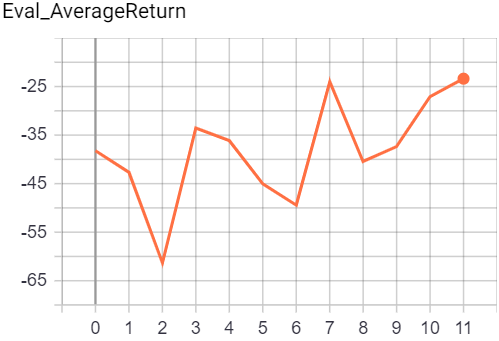
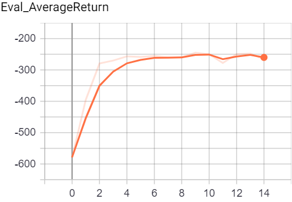
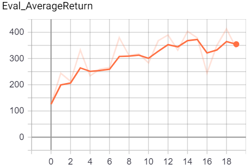
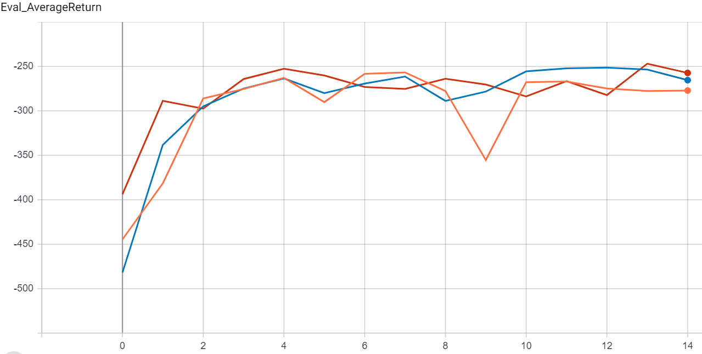
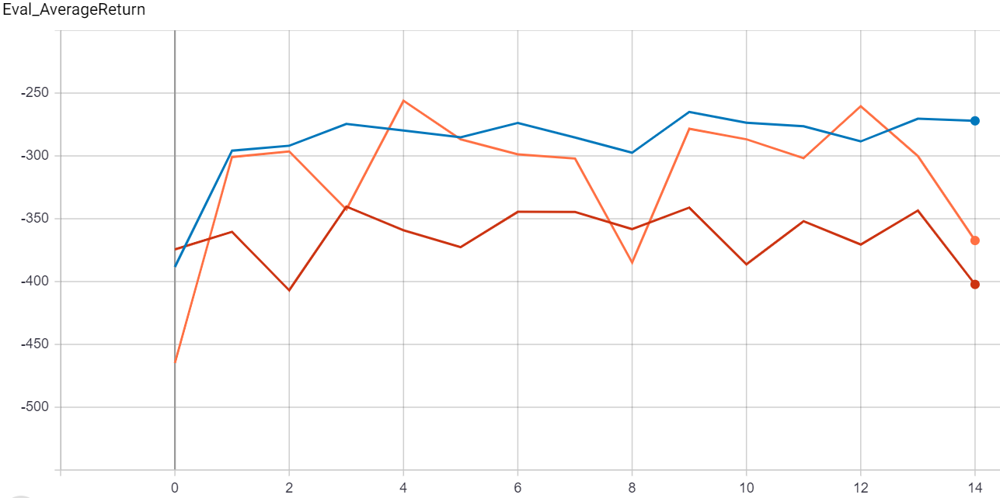

# HW4: Model-Based Reinforcement Learning

**Created by Taha Majlesi from University of Tehran**

## Concepts Explanation

### Model-Based vs Model-Free RL

- **Model-Free**: Learns value functions or policies directly from experience
- **Model-Based**: Learns a model of the environment dynamics, then plans using this model

**Advantages of Model-Based**:

- Sample efficient: Can simulate trajectories without real environment interaction
- Interpretable: Learned model provides insight into environment dynamics
- Generalizable: Model can be used for multiple tasks

**Challenges**:

- Model inaccuracy: Learned models are approximations
- Computational complexity: Planning requires optimization
- Model bias: Errors compound over long horizons

### Dynamics Model Learning

Learn transition function \(\hat{p}(s'|s,a)\) and reward function \(\hat{r}(s,a)\).

**Supervised Learning Approach**:

- Collect dataset \(\mathcal{D} = \{(s*t, a_t, r_t, s*{t+1})\}\)
- Train neural network to predict next state and reward
- Add noise to actions during training for robustness

**Ensemble Models**: Train multiple models and average predictions to reduce uncertainty.

### Model Predictive Control (MPC)

Use learned model for planning by optimizing action sequences.

**Basic MPC**:

1. From current state \(s\), sample random action sequences
2. Simulate trajectories using learned model
3. Select action sequence with highest predicted return
4. Execute first action, repeat

**Horizon**: Length of action sequences to optimize (trade-off between computation and foresight)

### Iterative Model Learning

Alternate between model training and policy improvement:

**Algorithm**:

1. Initialize dataset \(\mathcal{D}\) with random exploration
2. For iteration \(i\):
   - Train dynamics model \(\hat{p}\_i\) on \(\mathcal{D}\)
   - Use MPC with \(\hat{p}\_i\) to collect new trajectories
   - Add new data to \(\mathcal{D}\)
   - Evaluate performance

**Benefits**:

- Model improves with more data
- Policy becomes more sample-efficient
- Handles non-stationary dynamics

### Hyperparameter Analysis

Key hyperparameters affecting performance:

**Ensemble Size**: More models reduce prediction variance but increase computation

- Larger ensembles: Better uncertainty estimation, more robust planning

**Planning Horizon**: Length of action sequences

- Short horizon: Fast computation, myopic decisions
- Long horizon: Better foresight, compounding model errors

**Number of Action Sequences**: How many sequences to sample per planning step

- More sequences: Better optimization, higher computation cost

**Model Architecture**: Network size and depth

- Larger models: Better expressivity, risk of overfitting
- Training steps per iteration: Balance between model accuracy and data collection

### Evaluation Metrics

- **Model Accuracy**: How well learned model predicts real transitions
- **Planning Performance**: Return achieved by MPC vs random policy
- **Sample Efficiency**: Performance vs amount of environment interaction
- **Computational Cost**: Time per planning step

## Setup

1. Install dependencies:

```bash
pip install -r requirements.txt
```

2. Set PYTHONPATH:

```bash
export PYTHONPATH=$PWD:$PYTHONPATH
```

## Running the Code

### Problem 1: Model-Based RL (Obstacles)

```bash
python cs285/scripts/run_hw4_mb.py --exp_name q1_obstacles --env_name obstacles-cs285-v0 --add_sl_noise --num_agent_train_steps_per_iter 20 --batch_size_initial 5000 --batch_size 1000 --mpc_horizon 10 --n_iter 12 --video_log_freq -1
```

### Problem 2: Model-Based RL (Reacher)

```bash
python cs285/scripts/run_hw4_mb.py --exp_name q2_reacher --env_name reacher-cs285-v0 --add_sl_noise --num_agent_train_steps_per_iter 20 --batch_size_initial 5000 --batch_size 1000 --mpc_horizon 10 --n_iter 12 --video_log_freq -1
```

### Problem 3: Model-Based RL (Cheetah)

```bash
python cs285/scripts/run_hw4_mb.py --exp_name q3_cheetah --env_name cheetah-cs285-v0 --mpc_horizon 15 --add_sl_noise --num_agent_train_steps_per_iter 1500 --batch_size_initial 5000 --batch_size 5000 --n_iter 20 --video_log_freq -1
```

### Problem 4: Model-Based RL (Ant)

```bash
python cs285/scripts/run_hw4_mb.py --exp_name q4_ant --env_name ant-cs285-v0 --mpc_horizon 15 --add_sl_noise --num_agent_train_steps_per_iter 1500 --batch_size_initial 5000 --batch_size 5000 --n_iter 20 --video_log_freq -1
```

## Viewing Results

Navigate to results folder and run:

```bash
tensorboard --logdir .
```

---

# Section 4 Model Based RL

Below is the report for HW4. All data used can be found in the results folder. To view the tensorboard for a specific part navigate to that part's folder and run

```commandline
tensorboard --logdir .
```

## Problem 1

In the first problem model accuracy is tested for multiple different architectures and training steps per iteration with the following commands:

```commandline
$ python cs285/scripts/run_hw4_mb.py --exp_name cheetah_n500_arch1x32 --env_name cheetah-cs285-v0 --add_sl_noise --n_iter 1 --batch_size_initial 20000 --num_agent_train_steps_per_iter 500 --n_layers 1 --size 32 --scalar_log_freq -1 --video_log_freq -1
$ python cs285/scripts/run_hw4_mb.py --exp_name cheetah_n5_arch2x250 --env_name cheetah-cs285-v0 --add_sl_noise --n_iter 1 --batch_size_initial 20000 --num_agent_train_steps_per_iter 5 --n_layers 2 --size 250 --scalar_log_freq -1 --video_log_freq -1
$ python cs285/scripts/run_hw4_mb.py --exp_name cheetah_n500_arch2x250 --env_name cheetah-cs285-v0 --add_sl_noise --n_iter 1 --batch_size_initial 20000 --num_agent_train_steps_per_iter 500 --n_layers 2 --size 250 --scalar_log_freq -1 --video_log_freq -1
```

PNGs of the loss over time and sample predictions for each of the above commands can be found in the results/problem-1 folder. Overall more training steps per iteration and larger architectures seem to produce better results, although there is definitely a point where a larger architecture or more training steps would not be worth it.

## Problem 2

Now the model is used to select better actions in the obstacles env with the following command:

```commandline
$ python cs285/scripts/run_hw4_mb.py --exp_name obstacles_singleiteration --env_name obstacles-cs285-v0 --add_sl_noise --num_agent_train_steps_per_iter 20 --n_iter 1 --batch_size_initial 5000 --batch_size 1000 --mpc_horizon 10
```

Once again all data can be found in results/problem-2. The evaluation return with the model-based method was -38.2, a big improvement over the random average training return of -167.1.

## Problem 3

Now the MBRL algorithm is tested with iterative training and a replay buffer in the obstacles, reacher, and cheetah environments.

### Obstacles Environment

```commandline
$ python cs285/scripts/run_hw4_mb.py --exp_name obstacles --env_name obstacles-cs285-v0 --add_sl_noise --num_agent_train_steps_per_iter 20 --batch_size_initial 5000 --batch_size 1000 --mpc_horizon 10 --n_iter 12 --video_log -1
```



### Reacher Environment

```commandline
$ python cs285/scripts/run_hw4_mb.py --exp_name reacher --env_name reacher-cs285-v0 --add_sl_noise --mpc_horizon 10 --num_agent_train_steps_per_iter 1000 --batch_size_initial 5000 --batch_size 5000 --n_iter 15 --video_log -1
```



### Cheetah Environment

```commandline
$ python cs285/scripts/run_hw4_mb.py --exp_name cheetah --env_name cheetah-cs285-v0 --mpc_horizon 15 --add_sl_noise --num_agent_train_steps_per_iter 1500 --batch_size_initial 5000 --batch_size 5000 --n_iter 20 --video_log -1
```



In all three environments a very large amount of the performance was gained in the initial iteration (not seen in graph since evaluation is done after). Predictions after the first iteration are quite impressive for all three environments (seen in itr_0_predictions.png in respective folder). Overall the model-based method performed quite well considering it was testing action sequences completely randomly.

## Problem 4

Now the effects of various hyperparameters are tested in the reacher environment

### Ensemble Size

```commandline
python cs285/scripts/run_hw4_mb.py --exp_name q5_reacher_ensemble1 --env_name reacher-cs285-v0 --ensemble_size 1 --add_sl_noise --mpc_horizon 10 --num_agent_train_steps_per_iter 1000 --batch_size 800 --n_iter 15 --video_log -1
python cs285/scripts/run_hw4_mb.py --exp_name q5_reacher_ensemble3 --env_name reacher-cs285-v0 --ensemble_size 3 --add_sl_noise --mpc_horizon 10 --num_agent_train_steps_per_iter 1000 --batch_size 800 --n_iter 15 --video_log -1
python cs285/scripts/run_hw4_mb.py --exp_name q5_reacher_ensemble5 --env_name reacher-cs285-v0 --ensemble_size 5 --add_sl_noise --mpc_horizon 10 --num_agent_train_steps_per_iter 1000 --batch_size 800 --n_iter 15 --video_log -1
```



Red ----- 5  
Blue ---- 3  
Orange -- 1

Ensemble size does not seem to have a very large effect on performance, although larger ensembles do seem to help slightly in both performance and stability. Larger ensembles would most likely be much more helpful if they were used to estimate model accuracy instead of just averaging thier results.

### Planning Horizon

```commandline
python cs285/scripts/run_hw4_mb.py --exp_name q5_reacher_horizon5 --env_name reacher-cs285-v0 --add_sl_noise --mpc_horizon 5 --num_agent_train_steps_per_iter 1000 --batch_size 800 --n_iter 15 --video_log -1
python cs285/scripts/run_hw4_mb.py --exp_name q5_reacher_horizon15 --env_name reacher-cs285-v0 --add_sl_noise --mpc_horizon 15 --num_agent_train_steps_per_iter 1000 --batch_size 800 --n_iter 15 --video_log -1
python cs285/scripts/run_hw4_mb.py --exp_name q5_reacher_horizon30 --env_name reacher-cs285-v0 --add_sl_noise --mpc_horizon 30 --num_agent_train_steps_per_iter 1000 --batch_size 800 --n_iter 15 --video_log -1
```



Blue ---- 15  
Orange -- 5  
Red ----- 30

The effects of horizon length on performance seems to be the most significant of the three, and also the most interesting. The middle setting of 15 ended up performing the best, with the horizon of 5 being very unstable and 30 performing far worse. Short horizons seem to make the model far too short-sighted while longer horizons compound the model errors too much to be helpful. A balance between these too issues is needed in order to get the best performance.

### Number of Planning Sequences Considered

```commandline
python cs285/scripts/run_hw4_mb.py --exp_name q5_reacher_numseq100 --env_name reacher-cs285-v0 --add_sl_noise --mpc_horizon 10 --num_agent_train_steps_per_iter 1000 --batch_size 800 --n_iter 15 --mpc_num_action_sequences 100 --video_log -1
python cs285/scripts/run_hw4_mb.py --exp_name q5_reacher_numseq1000 --env_name reacher-cs285-v0 --add_sl_noise --mpc_horizon 10 --num_agent_train_steps_per_iter 1000 --batch_size 800 --n_iter 15 --mpc_num_action_sequences 1000 --video_log -1
```


Blue ---- 1000  
Orange -- 100

The effect of planning sequences considered is pretty straightforward - more sequences considered lead to better performance. This is a simple effect of there being less variance in larger sample sizes of sequences.
