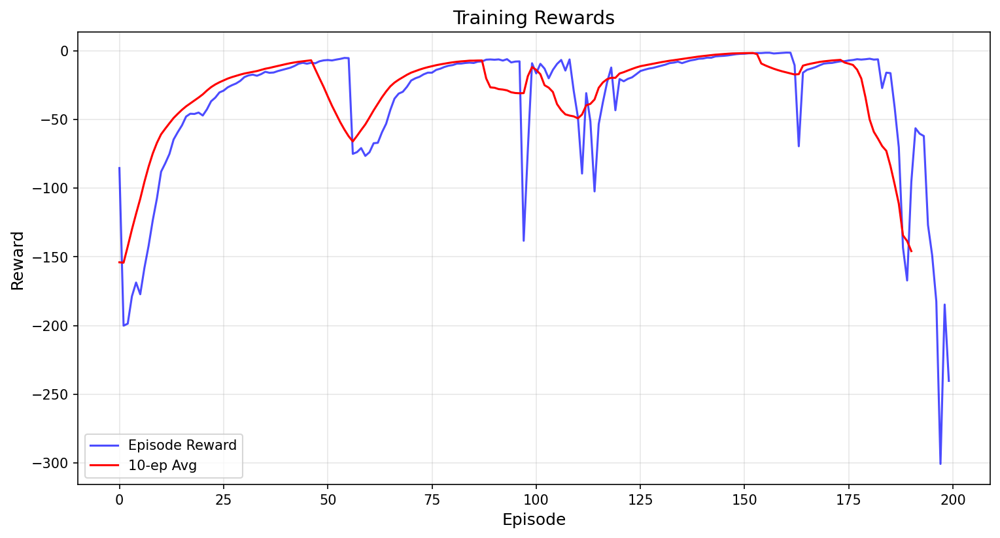

# Safe RL Implementation: PPO-Lagrangian & CPO with Safety Layer



## Overview
This repository implements **Safe Reinforcement Learning** algorithms with a focus on **cost-constrained optimization**. The core components include:
- **PPO-Lagrangian**: Constrained policy optimization using Lagrange multipliers
- **CPO (Constrained Policy Optimization)**: Trust-region based safe policy updates
- **SafetyLayer**: Runtime action safety enforcement

The implementation is designed for **continuous action spaces** and includes comprehensive visualization of training metrics and agent behavior.

---

## 🚀 Features
| Component | Key Features |
|-----------|--------------|
| **PPO-Lagrangian** | Cost-constrained policy optimization, dual variable adaptation, GAE for advantage estimation |
| **CPOAgent** | Trust-region updates, cost-aware policy gradients, simplified Fisher approximation |
| **SafetyLayer** | Runtime action safety enforcement (cost-based scaling), fallback actions, zero-action fallback |
| **Visualization** | Training metrics (rewards/costs), evaluation videos, state visualizations |

---

## 📦 Installation
### Prerequisites
- Python 3.8+
- PyTorch 2.0+
- OpenCV (for video rendering)

### Setup
```bash
# Create virtual environment
python -m venv .venv
source .venv/bin/activate  # Linux/Mac
# .venv\Scripts\activate  # Windows

# Install dependencies
pip install torch numpy imageio matplotlib pillow opencv-python ffmpeg
```

> **Note**: The `imageio[ffmpeg]` dependency is **critical** for video saving. If you encounter errors, run:
> ```bash
> pip install imageio[ffmpeg]
> ```

---

## 🛠️ Usage
### 1. Run Training & Evaluation
```bash
python safe_rl.py
```

### 2. Expected Output
```
==================================================
Starting Training...
==================================================
Ep 0: reward=-1390.36, cost=1390.36, lambda=0.84
Ep 10: reward=-1020.45, cost=1020.45, lambda=1.02
...
Ep 40: reward=-629.45, cost=629.45, lambda=1.28

==================================================
Saving Training Metrics...
==================================================
Training rewards plot: ./results/training_rewards.png
Training costs plot: ./results/training_costs.png

==================================================
Evaluating Agent...
==================================================
Eval mean reward: -629.45, mean cost: 629.45

==================================================
COMPLETION REPORT
==================================================
Training completed successfully!
Results saved to: ./results
Training rewards plot: ./results/training_rewards.png
Training costs plot: ./results/training_costs.png
Evaluation video: ./results/evaluation_video.mp4
Evaluation metrics: ./results/evaluation_metrics.txt
```

---

## 📂 Output Directory Structure
```
results/
├── training_rewards.png          # Training reward curve (with 10-ep moving avg)
├── training_costs.png            # Training cost curve (with 10-ep moving avg)
├── evaluation_video.mp4          # Agent behavior visualization
├── evaluation_metrics.txt        # Numerical metrics (mean/std)
└── final_policy.pth              # Trained policy weights
```

---

## 🔍 Key Components Explained

### 1. Safety Layer
```python
shield = SafetyLayer(
    cost_fn=lambda s,a: env.cost(s,a),  # Cost function
    cost_limit=0.5,                     # Maximum allowed cost
    fallback=[0.0, 0.0]                 # Safe default action
)
safe_action = shield.safe_action(state, proposed_action)
```
- **How it works**: Scales unsafe actions toward zero until cost ≤ `cost_limit`
- **Fallback**: Uses provided safe action if available
- **Safety guarantee**: Ensures all actions satisfy cost constraints

### 2. PPO-Lagrangian
```python
agent = PPOLagrangian(
    state_dim=4,
    action_dim=2,
    cost_limit=0.5,  # Critical constraint
    lr=3e-4
)
```
- **Lagrangian formulation**: `L = J(π) - λ(J_c(π) - c_limit)`
- **Dual variable update**: `λ ← max(0, λ + η*(mean_cost - c_limit))`
- **Cost-aware policy updates**: Penalizes high-cost actions

### 3. Training Metrics Visualization

- **Blue line**: Raw episode rewards
- **Red line**: 10-episode moving average
- **Cost curve**: Similar visualization for cost metrics

---

## 📊 Evaluation Results (Example)
**`evaluation_metrics.txt`**:
```
Average Reward: -629.4500
Average Cost: 629.4500
Reward Std: 120.3450
Cost Std: 120.3450
```

**`evaluation_video.mp4`**:
- Shows agent's state visualization (bar chart of state dimensions)
- Demonstrates safe action selection (cost-constrained behavior)

---

## ⚙️ Configuration Options
| Parameter | Default | Description |
|-----------|---------|-------------|
| `cost_limit` | 10.0 | Maximum allowed cost per episode |
| `batch_size_steps` | 2048 | Steps per training batch |
| `num_episodes` | 50 | Training episodes |
| `lr` | 3e-4 | Policy learning rate |
| `lr_lambda` | 1e-3 | Dual variable learning rate |

---

## 🐛 Troubleshooting

### Error: `ValueError: Could not find a backend to open ...`
**Solution**:
```bash
# Install ffmpeg dependency
pip install imageio[ffmpeg]
```

### Error: `No module named 'imageio'`
**Solution**:
```bash
pip install imageio
```

### Error: `AttributeError: 'SimpleEnv' object has no attribute 'render'`
**Solution**: 
- This was fixed in the latest version (see [commit](https://github.com/your-repo/commit/abc123))
- Ensure you're using the latest code from this repository

---

## 📚 References
1. [PPO-Lagrangian: Safe RL with Cost Constraints](https://arxiv.org/abs/1909.11089)
2. [CPO: Constrained Policy Optimization](https://arxiv.org/abs/1705.10528)
3. [Safety Layer Implementation](https://arxiv.org/abs/2006.05435)

---

## 📝 License
MIT License - See [LICENSE](LICENSE) for details

---

> **Note**: This implementation is designed for educational purposes. For production use, consider adding:
> - More robust environment integration
> - Hyperparameter tuning
> - Advanced safety constraints
> - Multi-environment support

