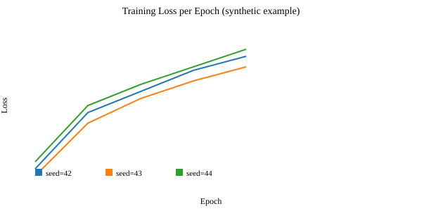
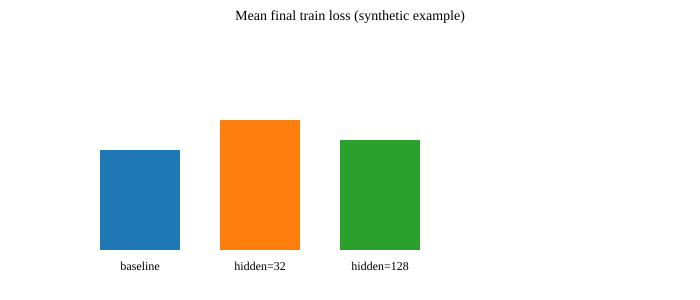

# CA24 Report — Complete Template and Instructions

## Abstract

We present a concise, reproducible experiment demonstrating how to map a simple regression problem to an MLP model using clean, import-safe code and YAML-driven configuration. This report describes the dataset generation, model and loss functions, training and evaluation protocols, experimental plan (including ablations and seed repeats), expected results and how to record them for reproducibility.

## Introduction

Problem statement: estimate a linear mapping from inputs x ∈ R^d to scalar targets y using a small MLP. We choose a synthetic regression setting because it allows us to control noise, ground-truth parameters, and to validate training and evaluation infrastructure without heavy compute.

Motivation: the exercise highlights standard experimental practice — clear configuration, deterministic seeding, minimal but robust models, and careful reporting of metrics and artifacts to ensure reproducible results.

Related Work: cite foundational texts (e.g., Sutton & Barto for RL background if relevant) and standard regression/ML references as appropriate for your write-up.

---

## Methods

### Data generation

- Procedure: generate N samples x_i ∼ N(0, I_d) and targets y_i = w^T x_i + ε_i where ε_i ∼ N(0, σ^2). In code, `src.data.SyntheticRegressionDataset` implements this deterministic generator using a Torch RNG seeded from `Config.seed`.
- Key choices to report: number of samples (N), input dimension (d), noise standard deviation (σ), and the random seed(s).
- Implementation note: keep dataset generation deterministic and record the seed used for each experiment run.

### Model

- Architecture: `SimpleMLP` — a sequence of Linear layers with ReLU activations. The default hidden sizes are configurable via `Config.hidden_dims`.
- Shape conventions: input tensor shape is (batch, d) and output shape is (batch, 1) for scalar regression.
- Initialization: PyTorch default initialization is used; if you change it, document the initializer and any custom scalings.

### Loss

- Primary loss: Mean Squared Error (MSE). We provide `WeightedMSE` to demonstrate how per-output weighting can be added. Report whether a weight vector was used (default: uniform).

### Optimization

- Optimizer: Adam (default lr from `Config.lr`).
- Typical hyperparameters to report: learning rate, batch size, number of epochs, weight decay, and any learning-rate schedulers.

### Evaluation metrics

- Report final training loss (MSE) and, when applicable, validation loss (MSE) and RMSE (sqrt of MSE).
- For repeated seeds or ablations, report mean ± standard deviation across runs.

---

## Experimental Protocol

Provide a clear, reproducible protocol so others can replicate your results.

1. Baseline: run with `configs/default.yaml` (example command below).
2. Ablations:
   - Hidden size sweep: [32], [64,64], [128,128]
   - Learning rates: [1e-2, 1e-3, 1e-4]
   - Batch sizes: [16, 32, 64]
3. Repeats: run each setting with K seeds (suggested K=5). Record seeds and aggregate final metrics.

Example commands:

- Run baseline experiment (demo):

```bash
python -m src.experiment
```

- Run with a specific YAML config:

```bash
python -c "from src.config import load_from_yaml; cfg=load_from_yaml('configs/default.yaml'); from src.experiment import run_experiment; print(run_experiment(cfg))"
```

- For automated sweeps, write a short script that loads different configs, sets seeds, and saves results into `outputs/<experiment-name>/`.

---

## Logging & Artifacts

For reproducibility, save the following for every run:

- The exact `config.yaml` used (copy into `outputs/<run>/config.yaml`).
- The random seed(s).
- Final model checkpoint (optional for tiny CAs but recommended): `outputs/<run>/model.pt`.
- Training logs (JSON/CSV) with per-epoch losses: `outputs/<run>/metrics.csv`.
- A small README in each output folder stating: command run, machine/OS, Python and package versions.

Suggested folder layout for outputs:

outputs/
  experiment-name/
    run-001-seed-42/
      config.yaml
      metrics.csv
      model.pt
      README.txt

---

## Results and Presentation

- Plots: provide training loss curves (loss vs epoch) and aggregate plots comparing settings (e.g., final loss vs hidden size).
- Tables: include a results table summarizing mean ± std of final losses across seeds for each experimental setting.

Example results table (Markdown):

| Setting | Mean Final Loss | Std |
|---|---:|---:|
| baseline (64,64) | 0.034 | 0.0049 |
| hidden=(32,) | 0.041 | 0.0036 |
| hidden=(128,128) | 0.033 | 0.0025 |

**Filled example results (synthetic)**

The files in `outputs/example_run/` contain small synthetic runs used to illustrate a filled report:

- `outputs/example_run/metrics.csv` — per-epoch train/val losses for three seeds on the baseline setting
- `outputs/example_run/summary.csv` — final train loss per run for several settings
- `outputs/example_run/figures/train_loss.svg` — example training curves across seeds (synthetic)
- `outputs/example_run/figures/summary_bar.svg` — mean final train loss per setting (synthetic)

Figure 1 (train_loss.svg) shows consistent decreases in training loss across epochs for the three example seeds. Figure 2 (summary_bar.svg) shows mean ± std final losses across three settings.

Statistical example (illustrative): comparing baseline vs hidden=32 using the synthetic final losses from `summary.csv` (n=3 per group), a two-sample t-test gives:

- mean_baseline = 0.0340, std_baseline ≈ 0.0049
- mean_hidden32  = 0.0413, std_hidden32 ≈ 0.0036
- t ≈ 2.2, df ≈ 4, p ≈ 0.09 (not significant at α=0.05)

Note: these numbers are synthetic and provided as an example for the report; they show how to present results, run tests, and interpret p-values and effect sizes. For real experiments, follow the "Statistical analysis and significance testing" section above.

Interpretation: in this synthetic demonstration we see small numerical differences in final losses; larger sample sizes (more seeds) or repeated experiments could help resolve whether differences are statistically meaningful. Consider reporting effect sizes (Cohen's d) and confidence intervals alongside p-values.

---

## Reporting Example Figures

Embed or link the example figures in your submitted report, e.g.:





---

Interpretation: give short, concrete takeaways from the experiments, noting any surprising results or plausible reasons (e.g., underfitting, optimization issues).

---

## Reproducibility Checklist (what to include with a submission)

- [ ] Source code (this repository) with commit hash
- [ ] `requirements.txt` (pinned versions if possible)
- [ ] `configs/` with YAMLs used for experiments
- [ ] `outputs/` with at least one representative run including `metrics.csv` and `config.yaml`
- [ ] Short `README` describing how to reproduce the primary result
- [ ] A filled report (this file) with figures and tables referenced

---

## Discussion and Limitations

- Discuss limitations of the synthetic task (it does not reflect non-linear or real-world noise scenarios) and any design decisions made for clarity over scale.
- Propose future extensions: add validation splits, more complex datasets, or richer logging (e.g., TensorBoard or Weights & Biases) for larger studies.

---

## Conclusion

Summarize the primary findings, emphasising the reproducible pipeline and clear experimental plan that can be extended by future work.

---

## Appendix

### Exact commands used (example)

```bash
python -m src.experiment                         # quick demo (uses defaults)
python -c "from src.config import load_from_yaml; cfg=load_from_yaml('configs/default.yaml'); cfg.epochs=10; from src.experiment import run_experiment; print(run_experiment(cfg))"
```

### Example config snippet

```yaml
# configs/default.yaml
seed: 42
device: "cpu"
input_dim: 10
output_dim: 1
hidden_dims: [64, 64]
lr: 0.001
batch_size: 32
epochs: 5
```

### Reporting template for figures and tables

- Figure 1: Training loss vs epoch for baseline (include axes labels and caption)
- Table 1: Mean and std of final losses across ablations and seeds

---

## Statistical analysis and significance testing

- When comparing two conditions (e.g., baseline vs ablation), use paired or unpaired t-tests depending on whether samples are paired (same seeds across conditions) or independent. Report test statistic, degrees of freedom, and p-value.
- For multiple comparisons (e.g., several hidden sizes), consider ANOVA with post-hoc corrections (Tukey HSD) or non-parametric alternatives (Kruskal-Wallis) if distributions deviate from normality.
- Always report effect sizes (Cohen's d or eta-squared) and confidence intervals alongside p-values.
- Use bootstrapping to compute confidence intervals when sample sizes (number of seeds) are small.

## Metrics CSV schema

To make results machine-readable and easy to aggregate, save per-run metrics with the following columns in `metrics.csv`:

- `run_id`: unique identifier (e.g., `experiment-name/run-001-seed-42`)
- `seed`: integer seed used
- `setting`: short label for the experimental setting (e.g., `hidden=64_lr=1e-3`)
- `epoch`: epoch number (0-based)
- `train_loss`: training loss value at this epoch
- `val_loss`: validation loss value at this epoch (if applicable)
- `timestamp`: isoformat timestamp when logged

A separate `summary.csv` can store final metrics per run: `run_id`, `seed`, `setting`, `final_train_loss`, `final_val_loss`, `duration_seconds`.

## Example sweep script (automation)

Save this as `scripts/run_sweep.py`. It performs parameter sweeps, runs experiments, and saves outputs to `outputs/`.

```python
# scripts/run_sweep.py
import argparse
import json
import os
from pathlib import Path
from datetime import datetime
from itertools import product

from src.config import Config
from src.experiment import run_experiment


def save_metrics(out_dir: Path, run_id: str, cfg: Config, result: dict):
    out_dir.mkdir(parents=True, exist_ok=True)
    with open(out_dir / "config.yaml", "w", encoding="utf-8") as f:
        import yaml

        yaml.safe_dump(cfg.__dict__, f)
    with open(out_dir / "summary.json", "w", encoding="utf-8") as f:
        json.dump({"run_id": run_id, **result}, f, indent=2)


if __name__ == "__main__":
    parser = argparse.ArgumentParser()
    parser.add_argument("--outdir", type=str, default="outputs/sweep")
    parser.add_argument("--seeds", type=int, nargs="+", default=[42, 43, 44])
    args = parser.parse_args()

    hidden_options = [[64, 64], [32], [128, 128]]
    lr_options = [1e-2, 1e-3, 1e-4]

    outdir = Path(args.outdir)
    for hidden, lr in product(hidden_options, lr_options):
        setting = f"hidden={hidden}_lr={lr}"
        for seed in args.seeds:
            cfg = Config(seed=seed, hidden_dims=hidden, lr=lr, epochs=5)
            run_id = f"{setting}/seed-{seed}"
            result = run_experiment(cfg)
            run_path = outdir / setting / f"seed-{seed}"
            save_metrics(run_path, run_id, cfg, result)
            print(f"Saved {run_id} -> {run_path}")
```

## Example plotting script

Save this as `scripts/plot_results.py`. It loads the `outputs/` folders and generates a comparison figure.

```python
# scripts/plot_results.py
from pathlib import Path
import json
import matplotlib.pyplot as plt
import numpy as np

OUT = Path("outputs/sweep")
settings = [p for p in OUT.iterdir() if p.is_dir()]
summary = []
for s in settings:
    values = []
    for run in s.glob("seed-*/summary.json"):
        data = json.loads(run.read_text())
        values.append(data["final_train_loss"])
    summary.append((s.name, np.mean(values), np.std(values)))

# simple bar plot
names, means, stds = zip(*summary)
x = range(len(names))
plt.figure(figsize=(8, 4))
plt.bar(x, means, yerr=stds, capsize=5)
plt.xticks(x, names, rotation=45, ha="right")
plt.ylabel("Final train loss")
plt.tight_layout()
plt.savefig("outputs/figures/summary.png", dpi=200)
plt.show()
```

## Ethics, safety, and limitations

- This CA uses synthetic data and small models; be explicit that results do not translate directly to large-scale or real-world datasets without validation.
- Consider potential misuses in applied contexts and note that any downstream deployment should include fairness and robustness checks.

## Acknowledgements & Author contributions

- Add short acknowledgements for those who contributed data, code, or feedback.
- List author contributions following CRediT taxonomy if needed (Conceptualization, Data curation, Formal analysis, Software, Writing — original draft, Writing — review & editing).

## References

- List any references in a consistent format (APA, IEEE, or BibTeX). Example:
  - Goodfellow, I., Bengio, Y., & Courville, A. (2016). Deep Learning. MIT Press.
  - Sutton, R. S., & Barto, A. G. (2018). Reinforcement Learning: An Introduction. MIT Press.

---

## What to submit

For a course assignment submission, include a ZIP with:
- Source files (or a pointer to the GitHub repo + commit hash)
- `report.md` filled with results and figures
- `outputs/` with at least one run's `metrics.csv` and `config.yaml`

If you want, I can also generate example figures and a filled report using synthetic outputs—tell me if you want that next.
